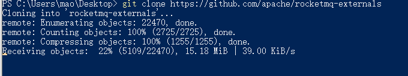

# MQ介绍

## 为什么要用MQ

消息队列是一种“先进先出”的数据结构


其应用场景主要包含以下3个方面


### 应用解耦

系统的耦合性越高，容错性就越低。以电商应用为例，用户创建订单后，如果耦合调用库存系统、物流系统、支付系统，任何一个子系统出了故障或者因为升级等原因暂时不可用，都会造成下单操作异常，影响用户使用体验。

使用消息队列解耦合，系统的耦合性就会提高了。比如物流系统发生故障，需要几分钟才能来修复，在这段时间内，物流系统要处理的数据被缓存到消息队列中，用户的下单操作正常完成。当物流系统回复后，补充处理存在消息队列中的订单消息即可，终端系统感知不到物流系统发生过几分钟故障。


### 流量削峰

应用系统如果遇到系统请求流量的瞬间猛增，有可能会将系统压垮。有了消息队列可以将大量请求缓存起来，分散到很长一段时间处理，这样可以大大提到系统的稳定性和用户体验。

一般情况，为了保证系统的稳定性，如果系统负载超过阈值，就会阻止用户请求，这会影响用户体验，而如果使用消息队列将请求缓存起来，等待系统处理完毕后通知用户下单完毕，这样总不能下单体验要好。

业务系统正常时段的QPS如果是1000，流量最高峰是10000，为了应对流量高峰配置高性能的服务器显然不划算，这时可以使用消息队列对峰值流量削峰


### 数据分发

通过消息队列可以让数据在多个系统更加之间进行流通。数据的产生方不需要关心谁来使用数据，只需要将数据发送到消息队列，数据使用方直接在消息队列中直接获取数据即可


## MQ的优点和缺点

优点：

* 应用解耦
* 流量削峰
* 数据分发


缺点：

* 系统可用性降低：系统引入的外部依赖越多，系统稳定性越差。一旦MQ宕机，就会对业务造成影响
* 系统复杂度提高：MQ的加入大大增加了系统的复杂度，以前系统间是同步的远程调用，现在是通过MQ进行异步调用
* 一致性问题：A系统处理完业务，通过MQ给B、C、D三个系统发消息数据，如果B系统、C系统处理成功，D系统处理失败


# RocketMQ快速入门

## 下载RocketMQ


[下载地址](https://www.apache.org/dyn/closer.cgi?path=rocketmq/4.5.1/rocketmq-all-4.5.1-bin-release.zip)


## 安装

解压版，需要解压到某一个文件夹里


```sh
PS H:\opensoft> ls


    目录: H:\opensoft


Mode                 LastWriteTime         Length Name
----                 -------------         ------ ----
d-----          2022/5/5     18:34                apache-jmeter-5.4.3
d-----          2022/6/2     13:25                cerebro-0.9.4
d-----         2022/5/26     20:37                elasticsearch-analysis-ik-8.2.0
d-----          2022/6/1     23:19                elasticsearch-cluster
d-----          2022/5/3     10:55                kibana-8.1.3
d-----         2022/5/30     23:02                logstash-8.1.3
d-----        2022/11/22     14:58                MongoDB
d-----         2022/7/20     12:25                mycat
d-----         2022/6/15     12:23                mycat-1.6
d-----         2022/7/19     15:35                nacos
d-----         2022/7/16     14:30                naocs-cluster
d-----         2022/7/16     21:38                nginx-1.21.6
d-----          2022/5/6     23:16                pvzpak-master.git
d-----        2022/11/29     21:21                rocketmq
d-----         2021/4/25     16:01                seata-server-1.4.2
d-----         2022/7/28     20:20                seata-server-cluster
d-----         2022/7/23     16:36                Sentinel
d-----         2022/8/11     20:14                浏览器主页


PS H:\opensoft> cd .\rocketmq\
PS H:\opensoft\rocketmq> ls


    目录: H:\opensoft\rocketmq


Mode                 LastWriteTime         Length Name
----                 -------------         ------ ----
d-----        2022/11/29     21:21                benchmark
d-----        2022/11/29     21:21                bin
d-----        2022/11/29     21:21                conf
d-----        2022/11/29     21:21                lib
-a----         2019/3/28     17:08          17336 LICENSE
-a----         2019/5/21     10:44           1337 NOTICE
-a----        2022/11/29     21:19           2523 README.md


PS H:\opensoft\rocketmq> cd .\bin\
PS H:\opensoft\rocketmq\bin> ls


    目录: H:\opensoft\rocketmq\bin


Mode                 LastWriteTime         Length Name
----                 -------------         ------ ----
d-----        2022/11/29     21:21                dledger
-a----         2019/3/28     17:08           1654 cachedog.sh
-a----         2019/3/28     17:08            845 cleancache.sh
-a----         2019/3/28     17:08           1116 cleancache.v1.sh
-a----         2019/3/28     17:08           1398 mqadmin
-a----         2019/3/28     17:08           1029 mqadmin.cmd
-a----         2019/3/28     17:08           1422 mqadmin.xml
-a----         2019/3/28     17:08           1394 mqbroker
-a----         2019/3/28     17:08           1084 mqbroker.cmd
-a----         2019/3/28     17:08           1373 mqbroker.numanode0
-a----         2019/3/28     17:08           1373 mqbroker.numanode1
-a----         2019/3/28     17:08           1373 mqbroker.numanode2
-a----         2019/3/28     17:08           1373 mqbroker.numanode3
-a----         2019/3/28     17:08           1388 mqbroker.xml
-a----         2019/3/28     17:08           1396 mqnamesrv
-a----         2019/3/28     17:08           1088 mqnamesrv.cmd
-a----         2019/3/28     17:08           1390 mqnamesrv.xml
-a----         2019/3/28     17:08           1571 mqshutdown
-a----         2019/3/28     17:08           1398 mqshutdown.cmd
-a----         2019/3/28     17:08           2222 os.sh
-a----         2019/3/28     17:08           1148 play.cmd
-a----         2019/3/28     17:08           1008 play.sh
-a----         2019/3/28     17:08            772 README.md
-a----         2019/3/28     17:08           2206 runbroker.cmd
-a----         2019/3/28     17:08           2849 runbroker.sh
-a----         2019/3/28     17:08           1816 runserver.cmd
-a----         2019/3/28     17:08           2443 runserver.sh
-a----         2019/3/28     17:08           1156 setcache.sh
-a----         2019/3/28     17:08           1408 startfsrv.sh
-a----         2019/3/28     17:08           1601 tools.cmd
-a----         2019/3/28     17:08           1870 tools.sh


PS H:\opensoft\rocketmq\bin>
```


## 目录介绍

* bin：启动脚本，包括shell脚本和CMD脚本
* conf：实例配置文件 ，包括broker配置文件、logback配置文件等
* lib：依赖jar包，包括Netty、commons-lang、FastJSON等


## 配置环境变量


## 启动RocketMQ

### 启动NameServer

```sh
PS H:\opensoft\rocketmq\bin> .\mqnamesrv
OpenJDK 64-Bit Server VM warning: Using the DefNew young collector with the CMS collector is deprecated and will likely be removed in a future release
OpenJDK 64-Bit Server VM warning: UseCMSCompactAtFullCollection is deprecated and will likely be removed in a future release.
The Name Server boot success. serializeType=JSON
```


### 启动Broker

配置环境变量


```sh
PS H:\opensoft\rocketmq\bin> .\mqbroker
The broker[mao, 172.27.80.1:10911] boot success. serializeType=JSON and name server is 127.0.0.1:9876
```


## 测试RocketMQ

### 发送消息


```sh
.\tools org.apache.rocketmq.example.quickstart.Producer
```


```sh
PS H:\opensoft\rocketmq\bin> .\tools org.apache.rocketmq.example.quickstart.Producer
OpenJDK 64-Bit Server VM warning: ignoring option PermSize=128m; support was removed in 8.0
OpenJDK 64-Bit Server VM warning: ignoring option MaxPermSize=128m; support was removed in 8.0
21:52:00.739 [main] DEBUG i.n.u.i.l.InternalLoggerFactory - Using SLF4J as the default logging framework
SendResult [sendStatus=SEND_OK, msgId=76FBC10A4DDC60E53B9394E342180000, offsetMsgId=AC1B500100002A9F0000000000000000, messageQueue=MessageQueue [topic=TopicTest, brokerName=mao, queueId=3], queueOffset=0]
SendResult [sendStatus=SEND_OK, msgId=76FBC10A4DDC60E53B9394E342380001, offsetMsgId=AC1B500100002A9F00000000000000B2, messageQueue=MessageQueue [topic=TopicTest, brokerName=mao, queueId=0], queueOffset=0]
SendResult [sendStatus=SEND_OK, msgId=76FBC10A4DDC60E53B9394E3423B0002, offsetMsgId=AC1B500100002A9F0000000000000164, messageQueue=MessageQueue [topic=TopicTest, brokerName=mao, queueId=1], queueOffset=0]
......
......
......
SendResult [sendStatus=SEND_OK, msgId=76FBC10A4DDC60E53B9394E3482103D6, offsetMsgId=AC1B500100002A9F000000000002B20A, messageQueue=MessageQueue [topic=TopicTest, brokerName=mao, queueId=1], queueOffset=245]
SendResult [sendStatus=SEND_OK, msgId=76FBC10A4DDC60E53B9394E3482203D7, offsetMsgId=AC1B500100002A9F000000000002B2BE, messageQueue=MessageQueue [topic=TopicTest, brokerName=mao, queueId=2], queueOffset=245]
SendResult [sendStatus=SEND_OK, msgId=76FBC10A4DDC60E53B9394E3482303D8, offsetMsgId=AC1B500100002A9F000000000002B372, messageQueue=MessageQueue [topic=TopicTest, brokerName=mao, queueId=3], queueOffset=246]
SendResult [sendStatus=SEND_OK, msgId=76FBC10A4DDC60E53B9394E3482303D9, offsetMsgId=AC1B500100002A9F000000000002B426, messageQueue=MessageQueue [topic=TopicTest, brokerName=mao, queueId=0], queueOffset=246]
SendResult [sendStatus=SEND_OK, msgId=76FBC10A4DDC60E53B9394E3482803DA, offsetMsgId=AC1B500100002A9F000000000002B4DA, messageQueue=MessageQueue [topic=TopicTest, brokerName=mao, queueId=1], queueOffset=246]
SendResult [sendStatus=SEND_OK, msgId=76FBC10A4DDC60E53B9394E3482903DB, offsetMsgId=AC1B500100002A9F000000000002B58E, messageQueue=MessageQueue [topic=TopicTest, brokerName=mao, queueId=2], queueOffset=246]
SendResult [sendStatus=SEND_OK, msgId=76FBC10A4DDC60E53B9394E3482A03DC, offsetMsgId=AC1B500100002A9F000000000002B642, messageQueue=MessageQueue [topic=TopicTest, brokerName=mao, queueId=3], queueOffset=247]
SendResult [sendStatus=SEND_OK, msgId=76FBC10A4DDC60E53B9394E3482B03DD, offsetMsgId=AC1B500100002A9F000000000002B6F6, messageQueue=MessageQueue [topic=TopicTest, brokerName=mao, queueId=0], queueOffset=247]
SendResult [sendStatus=SEND_OK, msgId=76FBC10A4DDC60E53B9394E3482C03DE, offsetMsgId=AC1B500100002A9F000000000002B7AA, messageQueue=MessageQueue [topic=TopicTest, brokerName=mao, queueId=1], queueOffset=247]
SendResult [sendStatus=SEND_OK, msgId=76FBC10A4DDC60E53B9394E3482C03DF, offsetMsgId=AC1B500100002A9F000000000002B85E, messageQueue=MessageQueue [topic=TopicTest, brokerName=mao, queueId=2], queueOffset=247]
SendResult [sendStatus=SEND_OK, msgId=76FBC10A4DDC60E53B9394E3482D03E0, offsetMsgId=AC1B500100002A9F000000000002B912, messageQueue=MessageQueue [topic=TopicTest, brokerName=mao, queueId=3], queueOffset=248]
SendResult [sendStatus=SEND_OK, msgId=76FBC10A4DDC60E53B9394E3482E03E1, offsetMsgId=AC1B500100002A9F000000000002B9C6, messageQueue=MessageQueue [topic=TopicTest, brokerName=mao, queueId=0], queueOffset=248]
SendResult [sendStatus=SEND_OK, msgId=76FBC10A4DDC60E53B9394E3482F03E2, offsetMsgId=AC1B500100002A9F000000000002BA7A, messageQueue=MessageQueue [topic=TopicTest, brokerName=mao, queueId=1], queueOffset=248]
SendResult [sendStatus=SEND_OK, msgId=76FBC10A4DDC60E53B9394E3483003E3, offsetMsgId=AC1B500100002A9F000000000002BB2E, messageQueue=MessageQueue [topic=TopicTest, brokerName=mao, queueId=2], queueOffset=248]
SendResult [sendStatus=SEND_OK, msgId=76FBC10A4DDC60E53B9394E3483103E4, offsetMsgId=AC1B500100002A9F000000000002BBE2, messageQueue=MessageQueue [topic=TopicTest, brokerName=mao, queueId=3], queueOffset=249]
SendResult [sendStatus=SEND_OK, msgId=76FBC10A4DDC60E53B9394E3483203E5, offsetMsgId=AC1B500100002A9F000000000002BC96, messageQueue=MessageQueue [topic=TopicTest, brokerName=mao, queueId=0], queueOffset=249]
SendResult [sendStatus=SEND_OK, msgId=76FBC10A4DDC60E53B9394E3483203E6, offsetMsgId=AC1B500100002A9F000000000002BD4A, messageQueue=MessageQueue [topic=TopicTest, brokerName=mao, queueId=1], queueOffset=249]
SendResult [sendStatus=SEND_OK, msgId=76FBC10A4DDC60E53B9394E3483303E7, offsetMsgId=AC1B500100002A9F000000000002BDFE, messageQueue=MessageQueue [topic=TopicTest, brokerName=mao, queueId=2], queueOffset=249]
21:52:03.132 [NettyClientSelector_1] INFO  RocketmqRemoting - closeChannel: close the connection to remote address[127.0.0.1:9876] result: true
21:52:03.133 [NettyClientSelector_1] INFO  RocketmqRemoting - closeChannel: close the connection to remote address[172.27.80.1:10911] result: true
PS H:\opensoft\rocketmq\bin>
```


### 接收消息

```sh
.\tools org.apache.rocketmq.example.quickstart.Consumer
```


```sh
......
......
......
ConsumeMessageThread_13 Receive New Messages: [MessageExt [queueId=0, storeSize=180, queueOffset=113, sysFlag=0, bornTimestamp=1669729922426, bornHost=/172.27.80.1:61263, storeTimestamp=1669729922426, storeHost=/172.27.80.1:10911, msgId=AC1B500100002A9F0000000000013E16, commitLogOffset=81430, bodyCRC=1655802458, reconsumeTimes=0, preparedTransactionOffset=0, toString()=Message{topic='TopicTest', flag=0, properties={MIN_OFFSET=0, MAX_OFFSET=250, CONSUME_START_TIME=1669730050849, UNIQ_KEY=76FBC10A4DDC60E53B9394E3457A01C5, WAIT=true, TAGS=TagA}, body=[72, 101, 108, 108, 111, 32, 82, 111, 99, 107, 101, 116, 77, 81, 32, 52, 53, 51], transactionId='null'}]]
ConsumeMessageThread_10 Receive New Messages: [MessageExt [queueId=0, storeSize=180, queueOffset=112, sysFlag=0, bornTimestamp=1669729922418, bornHost=/172.27.80.1:61263, storeTimestamp=1669729922418, storeHost=/172.27.80.1:10911, msgId=AC1B500100002A9F0000000000013B46, commitLogOffset=80710, bodyCRC=461328901, reconsumeTimes=0, preparedTransactionOffset=0, toString()=Message{topic='TopicTest', flag=0, properties={MIN_OFFSET=0, MAX_OFFSET=250, CONSUME_START_TIME=1669730050849, UNIQ_KEY=76FBC10A4DDC60E53B9394E3457201C1, WAIT=true, TAGS=TagA}, body=[72, 101, 108, 108, 111, 32, 82, 111, 99, 107, 101, 116, 77, 81, 32, 52, 52, 57], transactionId='null'}]]
ConsumeMessageThread_5 Receive New Messages: [MessageExt [queueId=0, storeSize=180, queueOffset=111, sysFlag=0, bornTimestamp=1669729922412, bornHost=/172.27.80.1:61263, storeTimestamp=1669729922412, storeHost=/172.27.80.1:10911, msgId=AC1B500100002A9F0000000000013876, commitLogOffset=79990, bodyCRC=315170350, reconsumeTimes=0, preparedTransactionOffset=0, toString()=Message{topic='TopicTest', flag=0, properties={MIN_OFFSET=0, MAX_OFFSET=250, CONSUME_START_TIME=1669730050848, UNIQ_KEY=76FBC10A4DDC60E53B9394E3456C01BD, WAIT=true, TAGS=TagA}, body=[72, 101, 108, 108, 111, 32, 82, 111, 99, 107, 101, 116, 77, 81, 32, 52, 52, 53], transactionId='null'}]]
ConsumeMessageThread_2 Receive New Messages: [MessageExt [queueId=0, storeSize=180, queueOffset=110, sysFlag=0, bornTimestamp=1669729922404, bornHost=/172.27.80.1:61263, storeTimestamp=1669729922405, storeHost=/172.27.80.1:10911, msgId=AC1B500100002A9F00000000000135A6, commitLogOffset=79270, bodyCRC=363125303, reconsumeTimes=0, preparedTransactionOffset=0, toString()=Message{topic='TopicTest', flag=0, properties={MIN_OFFSET=0, MAX_OFFSET=250, CONSUME_START_TIME=1669730050848, UNIQ_KEY=76FBC10A4DDC60E53B9394E3456401B9, WAIT=true, TAGS=TagA}, body=[72, 101, 108, 108, 111, 32, 82, 111, 99, 107, 101, 116, 77, 81, 32, 52, 52, 49], transactionId='null'}]]
ConsumeMessageThread_9 Receive New Messages: [MessageExt [queueId=0, storeSize=180, queueOffset=109, sysFlag=0, bornTimestamp=1669729922399, bornHost=/172.27.80.1:61263, storeTimestamp=1669729922399, storeHost=/172.27.80.1:10911, msgId=AC1B500100002A9F00000000000132D6, commitLogOffset=78550, bodyCRC=864479685, reconsumeTimes=0, preparedTransactionOffset=0, toString()=Message{topic='TopicTest', flag=0, properties={MIN_OFFSET=0, MAX_OFFSET=250, CONSUME_START_TIME=1669730050848, UNIQ_KEY=76FBC10A4DDC60E53B9394E3455F01B5, WAIT=true, TAGS=TagA}, body=[72, 101, 108, 108, 111, 32, 82, 111, 99, 107, 101, 116, 77, 81, 32, 52, 51, 55], transactionId='null'}]]
......
......
......
```


## 关闭RocketMQ

```sh
.\mqshutdown namesrv
```

```sh
.\mqshutdown broker
```


```sh
PS H:\opensoft\rocketmq\bin> .\mqshutdown namesrv
killing name server
成功: 已终止 PID 为 9444 的进程。
Done!
PS H:\opensoft\rocketmq\bin> .\mqshutdown broker
killing broker
成功: 已终止 PID 为 21088 的进程。
Done!
PS H:\opensoft\rocketmq\bin>
```


# RocketMQ集群搭建

## 各角色介绍

* Producer：消息的发送者；举例：发信者
* Consumer：消息接收者；举例：收信者
* Broker：暂存和传输消息；举例：邮局
* NameServer：管理Broker；举例：各个邮局的管理机构
* Topic：区分消息的种类；一个发送者可以发送消息给一个或者多个Topic；一个消息的接收者可以订阅一个或者多个Topic消息
* Message Queue：相当于是Topic的分区；用于并行发送和接收消息


## 集群搭建方式

### 集群特点

- NameServer是一个几乎无状态节点，可集群部署，节点之间无任何信息同步。
- Broker部署相对复杂，Broker分为Master与Slave，一个Master可以对应多个Slave，但是一个Slave只能对应一个Master，Master与Slave的对应关系通过指定相同的BrokerName，不同的BrokerId来定义，BrokerId为0表示Master，非0表示Slave。Master也可以部署多个。每个Broker与NameServer集群中的所有节点建立长连接，定时注册Topic信息到所有NameServer。
- Producer与NameServer集群中的其中一个节点（随机选择）建立长连接，定期从NameServer取Topic路由信息，并向提供Topic服务的Master建立长连接，且定时向Master发送心跳。Producer完全无状态，可集群部署。
- Consumer与NameServer集群中的其中一个节点（随机选择）建立长连接，定期从NameServer取Topic路由信息，并向提供Topic服务的Master、Slave建立长连接，且定时向Master、Slave发送心跳。Consumer既可以从Master订阅消息，也可以从Slave订阅消息，订阅规则由Broker配置决定。


### 集群模式

#### 单Master模式

这种方式风险较大，一旦Broker重启或者宕机时，会导致整个服务不可用。不建议线上环境使用,可以用于本地测试


#### 多Master模式

一个集群无Slave，全是Master，例如2个Master或者3个Master，这种模式的优缺点如下：

- 优点：配置简单，单个Master宕机或重启维护对应用无影响，在磁盘配置为RAID10时，即使机器宕机不可恢复情况下，由于RAID10磁盘非常可靠，消息也不会丢（异步刷盘丢失少量消息，同步刷盘一条不丢），性能最高；
- 缺点：单台机器宕机期间，这台机器上未被消费的消息在机器恢复之前不可订阅，消息实时性会受到影响。


#### 多Master多Slave模式（异步）

每个Master配置一个Slave，有多对Master-Slave，HA采用异步复制方式，主备有短暂消息延迟（毫秒级），这种模式的优缺点如下：

- 优点：即使磁盘损坏，消息丢失的非常少，且消息实时性不会受影响，同时Master宕机后，消费者仍然可以从Slave消费，而且此过程对应用透明，不需要人工干预，性能同多Master模式几乎一样；
- 缺点：Master宕机，磁盘损坏情况下会丢失少量消息。


#### 多Master多Slave模式（同步）

每个Master配置一个Slave，有多对Master-Slave，HA采用同步双写方式，即只有主备都写成功，才向应用返回成功，这种模式的优缺点如下：

- 优点：数据与服务都无单点故障，Master宕机情况下，消息无延迟，服务可用性与数据可用性都非常高；
- 缺点：性能比异步复制模式略低（大约低10%左右），发送单个消息的RT会略高，且目前版本在主节点宕机后，备机不能自动切换为主机。


## 双主双从集群搭建

### 集群工作流程

1. 启动NameServer，NameServer起来后监听端口，等待Broker、Producer、Consumer连上来，相当于一个路由控制中心。
2. Broker启动，跟所有的NameServer保持长连接，定时发送心跳包。心跳包中包含当前Broker信息(IP+端口等)以及存储所有Topic信息。注册成功后，NameServer集群中就有Topic跟Broker的映射关系。
3. 收发消息前，先创建Topic，创建Topic时需要指定该Topic要存储在哪些Broker上，也可以在发送消息时自动创建Topic。
4. Producer发送消息，启动时先跟NameServer集群中的其中一台建立长连接，并从NameServer中获取当前发送的Topic存在哪些Broker上，轮询从队列列表中选择一个队列，然后与队列所在的Broker建立长连接从而向Broker发消息。
5. Consumer跟Producer类似，跟其中一台NameServer建立长连接，获取当前订阅Topic存在哪些Broker上，然后直接跟Broker建立连接通道，开始消费消息。


### 创建消息存储路径


```sh
mkdir ./data
mkdir ./data/master1/commitlog
mkdir ./data/master1/consumequeue
mkdir ./data/master1/index
mkdir ./data/master2/commitlog
mkdir ./data/master2/consumequeue
mkdir ./data/master2/index
mkdir ./data/slave1/commitlog
mkdir ./data/slave1/consumequeue
mkdir ./data/slave1/index
mkdir ./data/slave2/commitlog
mkdir ./data/slave2/consumequeue
mkdir ./data/slave2/index
```


```sh
PS H:\opensoft\rocketmq> mkdir ./data


    目录: H:\opensoft\rocketmq


Mode                 LastWriteTime         Length Name
----                 -------------         ------ ----
d-----         2022/12/1     20:42                data


PS H:\opensoft\rocketmq> mkdir ./data/master1/commitlog


    目录: H:\opensoft\rocketmq\data\master1


Mode                 LastWriteTime         Length Name
----                 -------------         ------ ----
d-----         2022/12/1     20:42                commitlog


PS H:\opensoft\rocketmq> mkdir ./data/master1/consumequeue


    目录: H:\opensoft\rocketmq\data\master1


Mode                 LastWriteTime         Length Name
----                 -------------         ------ ----
d-----         2022/12/1     20:42                consumequeue


PS H:\opensoft\rocketmq> mkdir ./data/master1/index


    目录: H:\opensoft\rocketmq\data\master1


Mode                 LastWriteTime         Length Name
----                 -------------         ------ ----
d-----         2022/12/1     20:42                index


PS H:\opensoft\rocketmq> mkdir ./data/master2/commitlog


    目录: H:\opensoft\rocketmq\data\master2


Mode                 LastWriteTime         Length Name
----                 -------------         ------ ----
d-----         2022/12/1     20:42                commitlog


PS H:\opensoft\rocketmq> mkdir ./data/master2/consumequeue


    目录: H:\opensoft\rocketmq\data\master2


Mode                 LastWriteTime         Length Name
----                 -------------         ------ ----
d-----         2022/12/1     20:42                consumequeue


PS H:\opensoft\rocketmq> mkdir ./data/master2/index


    目录: H:\opensoft\rocketmq\data\master2


Mode                 LastWriteTime         Length Name
----                 -------------         ------ ----
d-----         2022/12/1     20:42                index


PS H:\opensoft\rocketmq> mkdir ./data/slave1/commitlog


    目录: H:\opensoft\rocketmq\data\slave1


Mode                 LastWriteTime         Length Name
----                 -------------         ------ ----
d-----         2022/12/1     20:42                commitlog


PS H:\opensoft\rocketmq> mkdir ./data/slave1/consumequeue


    目录: H:\opensoft\rocketmq\data\slave1


Mode                 LastWriteTime         Length Name
----                 -------------         ------ ----
d-----         2022/12/1     20:42                consumequeue


PS H:\opensoft\rocketmq> mkdir ./data/slave1/index


    目录: H:\opensoft\rocketmq\data\slave1


Mode                 LastWriteTime         Length Name
----                 -------------         ------ ----
d-----         2022/12/1     20:42                index


PS H:\opensoft\rocketmq> mkdir ./data/slave2/commitlog


    目录: H:\opensoft\rocketmq\data\slave2


Mode                 LastWriteTime         Length Name
----                 -------------         ------ ----
d-----         2022/12/1     20:42                commitlog


PS H:\opensoft\rocketmq> mkdir ./data/slave2/consumequeue


    目录: H:\opensoft\rocketmq\data\slave2


Mode                 LastWriteTime         Length Name
----                 -------------         ------ ----
d-----         2022/12/1     20:42                consumequeue


PS H:\opensoft\rocketmq> mkdir ./data/slave2/index


    目录: H:\opensoft\rocketmq\data\slave2


Mode                 LastWriteTime         Length Name
----                 -------------         ------ ----
d-----         2022/12/1     20:42                index


PS H:\opensoft\rocketmq>
```

```sh
PS H:\opensoft\rocketmq> ls


    目录: H:\opensoft\rocketmq


Mode                 LastWriteTime         Length Name
----                 -------------         ------ ----
d-----        2022/11/29     21:21                benchmark
d-----        2022/11/29     21:21                bin
d-----        2022/11/29     21:21                conf
d-----         2022/12/1     20:42                data
d-----        2022/11/29     21:21                lib
-a----         2019/3/28     17:08          17336 LICENSE
-a----         2019/5/21     10:44           1337 NOTICE
-a----        2022/11/29     21:19           2523 README.md


PS H:\opensoft\rocketmq> cd .\data\
PS H:\opensoft\rocketmq\data> ls


    目录: H:\opensoft\rocketmq\data


Mode                 LastWriteTime         Length Name
----                 -------------         ------ ----
d-----         2022/12/1     20:42                master1
d-----         2022/12/1     20:42                master2
d-----         2022/12/1     20:42                slave1
d-----         2022/12/1     20:42                slave2


PS H:\opensoft\rocketmq\data> cd .\master1\
PS H:\opensoft\rocketmq\data\master1> ls


    目录: H:\opensoft\rocketmq\data\master1


Mode                 LastWriteTime         Length Name
----                 -------------         ------ ----
d-----         2022/12/1     20:42                commitlog
d-----         2022/12/1     20:42                consumequeue
d-----         2022/12/1     20:42                index


PS H:\opensoft\rocketmq\data\master1>
```


### broker配置文件

配置文件使用的是软件目录下\conf\2m-2s-sync的配置文件


```sh
PS H:\opensoft\rocketmq> ls


    目录: H:\opensoft\rocketmq


Mode                 LastWriteTime         Length Name
----                 -------------         ------ ----
d-----        2022/11/29     21:21                benchmark
d-----        2022/11/29     21:21                bin
d-----        2022/11/29     21:21                conf
d-----        2022/11/30     18:37                data
d-----        2022/11/29     21:21                lib
-a----         2019/3/28     17:08          17336 LICENSE
-a----         2019/5/21     10:44           1337 NOTICE
-a----        2022/11/29     21:19           2523 README.md


PS H:\opensoft\rocketmq> cd conf
PS H:\opensoft\rocketmq\conf> ls


    目录: H:\opensoft\rocketmq\conf


Mode                 LastWriteTime         Length Name
----                 -------------         ------ ----
d-----        2022/11/29     21:21                2m-2s-async
d-----        2022/11/29     21:21                2m-2s-sync
d-----        2022/11/29     21:21                2m-noslave
d-----        2022/11/29     21:21                dledger
-a----         2019/3/28     17:08            949 broker.conf
-a----         2019/3/28     17:08          14978 logback_broker.xml
-a----         2019/3/28     17:08           3836 logback_namesrv.xml
-a----         2019/3/28     17:08           3761 logback_tools.xml
-a----         2019/5/21     10:44           1305 plain_acl.yml
-a----         2019/5/21     10:44            834 tools.yml


PS H:\opensoft\rocketmq\conf> cd .\2m-2s-sync\
PS H:\opensoft\rocketmq\conf\2m-2s-sync> ls


    目录: H:\opensoft\rocketmq\conf\2m-2s-sync


Mode                 LastWriteTime         Length Name
----                 -------------         ------ ----
-a----         2019/3/28     17:08            922 broker-a-s.properties
-a----         2019/3/28     17:08            928 broker-a.properties
-a----         2019/3/28     17:08            922 broker-b-s.properties
-a----         2019/3/28     17:08            928 broker-b.properties


PS H:\opensoft\rocketmq\conf\2m-2s-sync> cat .\broker-a.properties
# Licensed to the Apache Software Foundation (ASF) under one or more
# contributor license agreements.  See the NOTICE file distributed with
# this work for additional information regarding copyright ownership.
# The ASF licenses this file to You under the Apache License, Version 2.0
# (the "License"); you may not use this file except in compliance with
# the License.  You may obtain a copy of the License at
#
#     http://www.apache.org/licenses/LICENSE-2.0
#
# Unless required by applicable law or agreed to in writing, software
# distributed under the License is distributed on an "AS IS" BASIS,
# WITHOUT WARRANTIES OR CONDITIONS OF ANY KIND, either express or implied.
# See the License for the specific language governing permissions and
# limitations under the License.
brokerClusterName=DefaultCluster
brokerName=broker-a
brokerId=0
deleteWhen=04
fileReservedTime=48
brokerRole=SYNC_MASTER
flushDiskType=ASYNC_FLUSH
PS H:\opensoft\rocketmq\conf\2m-2s-sync>
```


#### master1

配置文件名称：broker-a.properties

修改配置如下：

```sh
#所属集群名字
brokerClusterName=rocketmq-cluster
#broker名字，注意此处不同的配置文件填写的不一样
brokerName=broker-a
#0 表示 Master，>0 表示 Slave
brokerId=0
#nameServer地址，分号分割
namesrvAddr=127.0.0.1:9876
#在发送消息时，自动创建服务器不存在的topic，默认创建的队列数
defaultTopicQueueNums=4
#是否允许 Broker 自动创建Topic，建议线下开启，线上关闭
autoCreateTopicEnable=true
#是否允许 Broker 自动创建订阅组，建议线下开启，线上关闭
autoCreateSubscriptionGroup=true
#Broker 对外服务的监听端口
listenPort=10911
#删除文件时间点，默认凌晨 4点
deleteWhen=04
#文件保留时间，默认 48 小时
fileReservedTime=120
#commitLog每个文件的大小默认1G
mapedFileSizeCommitLog=1073741824
#ConsumeQueue每个文件默认存30W条，根据业务情况调整
mapedFileSizeConsumeQueue=300000
#destroyMapedFileIntervalForcibly=120000
#redeleteHangedFileInterval=120000
#检测物理文件磁盘空间
diskMaxUsedSpaceRatio=88
#存储路径
storePathRootDir=./../data/master1
#commitLog 存储路径
storePathCommitLog=./../data/master1/commitlog
#消费队列存储路径存储路径
storePathConsumeQueue=./../data/master1/consumequeue
#消息索引存储路径
storePathIndex=./../data/master1/index
#checkpoint 文件存储路径
storeCheckpoint=./../data/master1/checkpoint
#abort 文件存储路径
abortFile=./../data/master1/abort
#限制的消息大小
maxMessageSize=65536
#flushCommitLogLeastPages=4
#flushConsumeQueueLeastPages=2
#flushCommitLogThoroughInterval=10000
#flushConsumeQueueThoroughInterval=60000
#Broker 的角色
#- ASYNC_MASTER 异步复制Master
#- SYNC_MASTER 同步双写Master
#- SLAVE
brokerRole=SYNC_MASTER
#刷盘方式
#- ASYNC_FLUSH 异步刷盘
#- SYNC_FLUSH 同步刷盘
flushDiskType=SYNC_FLUSH
#checkTransactionMessageEnable=false
#发消息线程池数量
#sendMessageThreadPoolNums=128
#拉消息线程池数量
#pullMessageThreadPoolNums=128
```


#### slave2

配置文件名称：broker-b-s.properties

```sh
#所属集群名字
brokerClusterName=rocketmq-cluster
#broker名字，注意此处不同的配置文件填写的不一样
brokerName=broker-b
#0 表示 Master，>0 表示 Slave
brokerId=1
#nameServer地址，分号分割
namesrvAddr=127.0.0.1:9876
#在发送消息时，自动创建服务器不存在的topic，默认创建的队列数
defaultTopicQueueNums=4
#是否允许 Broker 自动创建Topic，建议线下开启，线上关闭
autoCreateTopicEnable=true
#是否允许 Broker 自动创建订阅组，建议线下开启，线上关闭
autoCreateSubscriptionGroup=true
#Broker 对外服务的监听端口
listenPort=10941
#删除文件时间点，默认凌晨 4点
deleteWhen=04
#文件保留时间，默认 48 小时
fileReservedTime=120
#commitLog每个文件的大小默认1G
mapedFileSizeCommitLog=1073741824
#ConsumeQueue每个文件默认存30W条，根据业务情况调整
mapedFileSizeConsumeQueue=300000
#destroyMapedFileIntervalForcibly=120000
#redeleteHangedFileInterval=120000
#检测物理文件磁盘空间
diskMaxUsedSpaceRatio=88
#存储路径
storePathRootDir=./../data/slave2
#commitLog 存储路径
storePathCommitLog=./../data/slave2/commitlog
#消费队列存储路径存储路径
storePathConsumeQueue=./../data/slave2/consumequeue
#消息索引存储路径
storePathIndex=./../data/slave2/index
#checkpoint 文件存储路径
storeCheckpoint=./../data/slave2/checkpoint
#abort 文件存储路径
abortFile=./../data/slave2/abort
#限制的消息大小
maxMessageSize=65536
#flushCommitLogLeastPages=4
#flushConsumeQueueLeastPages=2
#flushCommitLogThoroughInterval=10000
#flushConsumeQueueThoroughInterval=60000
#Broker 的角色
#- ASYNC_MASTER 异步复制Master
#- SYNC_MASTER 同步双写Master
#- SLAVE
brokerRole=SLAVE
#刷盘方式
#- ASYNC_FLUSH 异步刷盘
#- SYNC_FLUSH 同步刷盘
flushDiskType=ASYNC_FLUSH
#checkTransactionMessageEnable=false
#发消息线程池数量
#sendMessageThreadPoolNums=128
#拉消息线程池数量
#pullMessageThreadPoolNums=128
```


#### master2

配置文件名称：broker-b.properties

```sh
#所属集群名字
brokerClusterName=rocketmq-cluster
#broker名字，注意此处不同的配置文件填写的不一样
brokerName=broker-b
#0 表示 Master，>0 表示 Slave
brokerId=0
#nameServer地址，分号分割
namesrvAddr=127.0.0.1:9876
#在发送消息时，自动创建服务器不存在的topic，默认创建的队列数
defaultTopicQueueNums=4
#是否允许 Broker 自动创建Topic，建议线下开启，线上关闭
autoCreateTopicEnable=true
#是否允许 Broker 自动创建订阅组，建议线下开启，线上关闭
autoCreateSubscriptionGroup=true
#Broker 对外服务的监听端口
listenPort=10921
#删除文件时间点，默认凌晨 4点
deleteWhen=04
#文件保留时间，默认 48 小时
fileReservedTime=120
#commitLog每个文件的大小默认1G
mapedFileSizeCommitLog=1073741824
#ConsumeQueue每个文件默认存30W条，根据业务情况调整
mapedFileSizeConsumeQueue=300000
#destroyMapedFileIntervalForcibly=120000
#redeleteHangedFileInterval=120000
#检测物理文件磁盘空间
diskMaxUsedSpaceRatio=88
#存储路径
storePathRootDir=./../data/master2
#commitLog 存储路径
storePathCommitLog=./../data/master2/commitlog
#消费队列存储路径存储路径
storePathConsumeQueue=./../data/master2/consumequeue
#消息索引存储路径
storePathIndex=./../data/master2/index
#checkpoint 文件存储路径
storeCheckpoint=./../data/master2/checkpoint
#abort 文件存储路径
abortFile=./../data/master2/abort
#限制的消息大小
maxMessageSize=65536
#flushCommitLogLeastPages=4
#flushConsumeQueueLeastPages=2
#flushCommitLogThoroughInterval=10000
#flushConsumeQueueThoroughInterval=60000
#Broker 的角色
#- ASYNC_MASTER 异步复制Master
#- SYNC_MASTER 同步双写Master
#- SLAVE
brokerRole=SYNC_MASTER
#刷盘方式
#- ASYNC_FLUSH 异步刷盘
#- SYNC_FLUSH 同步刷盘
flushDiskType=SYNC_FLUSH
#checkTransactionMessageEnable=false
#发消息线程池数量
#sendMessageThreadPoolNums=128
#拉消息线程池数量
#pullMessageThreadPoolNums=128
```


#### slave1

配置文件名称：broker-a-s.properties

```sh
#所属集群名字
brokerClusterName=rocketmq-cluster
#broker名字，注意此处不同的配置文件填写的不一样
brokerName=broker-a
#0 表示 Master，>0 表示 Slave
brokerId=1
#nameServer地址，分号分割
namesrvAddr=127.0.0.1:9876
#在发送消息时，自动创建服务器不存在的topic，默认创建的队列数
defaultTopicQueueNums=4
#是否允许 Broker 自动创建Topic，建议线下开启，线上关闭
autoCreateTopicEnable=true
#是否允许 Broker 自动创建订阅组，建议线下开启，线上关闭
autoCreateSubscriptionGroup=true
#Broker 对外服务的监听端口
listenPort=10931
#删除文件时间点，默认凌晨 4点
deleteWhen=04
#文件保留时间，默认 48 小时
fileReservedTime=120
#commitLog每个文件的大小默认1G
mapedFileSizeCommitLog=1073741824
#ConsumeQueue每个文件默认存30W条，根据业务情况调整
mapedFileSizeConsumeQueue=300000
#destroyMapedFileIntervalForcibly=120000
#redeleteHangedFileInterval=120000
#检测物理文件磁盘空间
diskMaxUsedSpaceRatio=88
#存储路径
storePathRootDir=./../data/slave1
#commitLog 存储路径
storePathCommitLog=./../data/slave1/commitlog
#消费队列存储路径存储路径
storePathConsumeQueue=./../data/slave1/consumequeue
#消息索引存储路径
storePathIndex=./../data/slave1/index
#checkpoint 文件存储路径
storeCheckpoint=./../data/slave1/checkpoint
#abort 文件存储路径
abortFile=./../data/slave1/abort
#限制的消息大小
maxMessageSize=65536
#flushCommitLogLeastPages=4
#flushConsumeQueueLeastPages=2
#flushCommitLogThoroughInterval=10000
#flushConsumeQueueThoroughInterval=60000
#Broker 的角色
#- ASYNC_MASTER 异步复制Master
#- SYNC_MASTER 同步双写Master
#- SLAVE
brokerRole=SLAVE
#刷盘方式
#- ASYNC_FLUSH 异步刷盘
#- SYNC_FLUSH 同步刷盘
flushDiskType=ASYNC_FLUSH
#checkTransactionMessageEnable=false
#发消息线程池数量
#sendMessageThreadPoolNums=128
#拉消息线程池数量
#pullMessageThreadPoolNums=128
```


### 服务启动

#### 启动NameServer

```sh
.\mqnamesrv
```


```sh
PS H:\opensoft\rocketmq\bin> .\mqnamesrv
OpenJDK 64-Bit Server VM warning: Using the DefNew young collector with the CMS collector is deprecated and will likely be removed in a future release
OpenJDK 64-Bit Server VM warning: UseCMSCompactAtFullCollection is deprecated and will likely be removed in a future release.
The Name Server boot success. serializeType=JSON
```


#### 启动Broker集群

master1：

```sh
.\mqbroker -c ./../conf/2m-2s-sync/broker-a.properties
```


slave1：

```sh
.\mqbroker -c ./../conf/2m-2s-sync/broker-a-s.properties
```


master2：

```sh
.\mqbroker -c ./../conf/2m-2s-sync/broker-b.properties
```


slave2：

```sh
.\mqbroker -c ./../conf/2m-2s-sync/broker-b-s.properties
```


```sh
PS H:\opensoft\rocketmq\bin> .\mqbroker -c ./../conf/2m-2s-sync/broker-a.properties
The broker[broker-a, 172.27.80.1:10911] boot success. serializeType=JSON and name server is 127.0.0.1:9876
```

```sh
PS H:\opensoft\rocketmq\bin> .\mqbroker -c ./../conf/2m-2s-sync/broker-a-s.properties
The broker[broker-a, 172.27.80.1:10931] boot success. serializeType=JSON and name server is 127.0.0.1:9876
```

```sh
PS H:\opensoft\rocketmq\bin> .\mqbroker -c ./../conf/2m-2s-sync/broker-b.properties
The broker[broker-b, 172.27.80.1:10921] boot success. serializeType=JSON and name server is 127.0.0.1:9876
```

```sh
PS H:\opensoft\rocketmq\bin> .\mqbroker -c ./../conf/2m-2s-sync/broker-b-s.properties
The broker[broker-b, 172.27.80.1:10941] boot success. serializeType=JSON and name server is 127.0.0.1:9876
```


### 启动脚本

多窗口模式

```sh
cd bin
start "RocketMQ-nameServer-9876" mqnamesrv
start "RocketMQ-broker-master1-10911" mqbroker -c ./../conf/2m-2s-sync/broker-a.properties
start "RocketMQ-broker-slave1-10931" mqbroker -c ./../conf/2m-2s-sync/broker-a-s.properties
start "RocketMQ-broker-master2-10921" mqbroker -c ./../conf/2m-2s-sync/broker-b.properties
start "RocketMQ-broker-slave2-10941" mqbroker -c ./../conf/2m-2s-sync/broker-b-s.properties
```


单窗口模式

```sh
cd bin
start /b "RocketMQ-nameServer-9876" mqnamesrv
start /b "RocketMQ-broker-master1-10911" mqbroker -c ./../conf/2m-2s-sync/broker-a.properties
start /b "RocketMQ-broker-slave1-10931" mqbroker -c ./../conf/2m-2s-sync/broker-a-s.properties
start /b "RocketMQ-broker-master2-10921" mqbroker -c ./../conf/2m-2s-sync/broker-b.properties
start /b "RocketMQ-broker-slave2-10941" mqbroker -c ./../conf/2m-2s-sync/broker-b-s.properties
```


```sh
PS H:\opensoft\rocketmq> ls


    目录: H:\opensoft\rocketmq


Mode                 LastWriteTime         Length Name
----                 -------------         ------ ----
d-----        2022/11/29     21:21                benchmark
d-----        2022/11/29     21:21                bin
d-----        2022/11/29     21:21                conf
d-----         2022/12/1     20:42                data
d-----        2022/11/29     21:21                lib
-a----         2019/3/28     17:08          17336 LICENSE
-a----         2019/5/21     10:44           1337 NOTICE
-a----        2022/11/29     21:19           2523 README.md
-a----         2022/12/2     10:57            424 集群启动-2m-2s-sync.bat
-a----         2022/12/2     10:59            439 集群启动-单窗口-2m-2s-sync.bat


PS H:\opensoft\rocketmq> cat .\集群启动-2m-2s-sync.bat
cd bin
start "RocketMQ-nameServer-9876" mqnamesrv
start "RocketMQ-broker-master1-10911" mqbroker -c ./../conf/2m-2s-sync/broker-a.properties
start "RocketMQ-broker-slave1-10931" mqbroker -c ./../conf/2m-2s-sync/broker-a-s.properties
start "RocketMQ-broker-master2-10921" mqbroker -c ./../conf/2m-2s-sync/broker-b.properties
start "RocketMQ-broker-slave2-10941" mqbroker -c ./../conf/2m-2s-sync/broker-b-s.properties

PS H:\opensoft\rocketmq> cat .\集群启动-单窗口-2m-2s-sync.bat
cd bin
start /b "RocketMQ-nameServer-9876" mqnamesrv
start /b "RocketMQ-broker-master1-10911" mqbroker -c ./../conf/2m-2s-sync/broker-a.properties
start /b "RocketMQ-broker-slave1-10931" mqbroker -c ./../conf/2m-2s-sync/broker-a-s.properties
start /b "RocketMQ-broker-master2-10921" mqbroker -c ./../conf/2m-2s-sync/broker-b.properties
start /b "RocketMQ-broker-slave2-10941" mqbroker -c ./../conf/2m-2s-sync/broker-b-s.properties

PS H:\opensoft\rocketmq>
```


### 查看进程状态

```sh
PS H:\opensoft\rocketmq> jps
10848 NamesrvStartup
11856 BrokerStartup
23268 BrokerStartup
14568 BrokerStartup
11788 Jps
14300 BrokerStartup
PS H:\opensoft\rocketmq>
```


# mqadmin管理工具

## 集群监控平台搭建

### 克隆开源项目

项目地址：https://github.com/apache/rocketmq-externals


```sh
git clone https://github.com/apache/rocketmq-externals
```





如果没有rocketmq-console

可以使用以下地址下载

https://gitcode.net/mirrors/apache/rocketmq-externals/-/tree/rocketmq-console-1.0.0


### 配置集群地址

打包前在```rocketmq-console```中配置```namesrv```集群地址

```sh
rocketmq.config.namesrvAddr=127.0.0.1:9876
```


```sh
server.contextPath=
server.port=8080
#spring.application.index=true
spring.application.name=rocketmq-console
spring.http.encoding.charset=UTF-8
spring.http.encoding.enabled=true
spring.http.encoding.force=true
logging.config=classpath:logback.xml
#if this value is empty,use env value rocketmq.config.namesrvAddr  NAMESRV_ADDR | now, you can set it in ops page.default localhost:9876
rocketmq.config.namesrvAddr=127.0.0.1:9876
#if you use rocketmq version < 3.5.8, rocketmq.config.isVIPChannel should be false.default true
rocketmq.config.isVIPChannel=
#rocketmq-console's data path:dashboard/monitor
rocketmq.config.dataPath=/tmp/rocketmq-console/data
#set it false if you don't want use dashboard.default true
rocketmq.config.enableDashBoardCollect=true
```


### 打包

```sh
mvn clean package -DskipTests
```


```sh
PS C:\Users\mao\Desktop\rocketmq-externals-rocketmq-console-1.0.0\rocketmq-console> ls


    目录: C:\Users\mao\Desktop\rocketmq-externals-rocketmq-console-1.0.0\rocketmq-console


Mode                 LastWriteTime         Length Name
----                 -------------         ------ ----
d-----         2017/6/15     10:47                doc
d-----         2017/6/15     10:47                src
d-----         2017/6/15     10:47                style
d-----         2022/12/3     16:24                target
------         2017/6/15     10:47             23 .gitignore
------         2017/6/15     10:47            322 .travis.yml
------         2017/6/15     10:47          29843 LICENSE
------         2017/6/15     10:47            176 NOTICE
------         2017/6/15     10:47          11424 pom.xml
------         2017/6/15     10:47           2169 README.md


PS C:\Users\mao\Desktop\rocketmq-externals-rocketmq-console-1.0.0\rocketmq-console> mvn clean package -DskipTests
[INFO] Scanning for projects...
[INFO]
[INFO] -------------------< org.apache:rocketmq-console-ng >-------------------
[INFO] Building rocketmq-console-ng 1.0.0
[INFO] --------------------------------[ jar ]---------------------------------
[INFO]
[INFO] --- maven-clean-plugin:2.6.1:clean (default-clean) @ rocketmq-console-ng ---
[INFO] Deleting C:\Users\mao\Desktop\rocketmq-externals-rocketmq-console-1.0.0\rocketmq-console\target
[INFO]
[INFO] --- maven-checkstyle-plugin:2.17:check (validate) @ rocketmq-console-ng ---
[INFO] Starting audit...
Audit done.
[INFO]
[INFO] --- jacoco-maven-plugin:0.7.9:prepare-agent (default-prepare-agent) @ rocketmq-console-ng ---
[INFO] argLine set to -javaagent:C:\\Users\\mao\\.m2\\repository\\org\\jacoco\\org.jacoco.agent\\0.7.9\\org.jacoco.agent-0.7.9-runtime.jar=destfile=C:\\Users\\mao\\Desktop\\rocketmq-externals-rocketmq-console-1.0.0\\rocketmq-console\\target\\jacoco.exec
[INFO]
[INFO] --- maven-resources-plugin:2.6:resources (default-resources) @ rocketmq-console-ng ---
[INFO] Using 'UTF-8' encoding to copy filtered resources.
[INFO] Copying 1 resource
[INFO] Copying 960 resources
[INFO]
[INFO] --- maven-compiler-plugin:3.1:compile (default-compile) @ rocketmq-console-ng ---
[INFO] Changes detected - recompiling the module!
[INFO] Compiling 59 source files to C:\Users\mao\Desktop\rocketmq-externals-rocketmq-console-1.0.0\rocketmq-console\target\classes
[WARNING] /C:/Users/mao/Desktop/rocketmq-externals-rocketmq-console-1.0.0/rocketmq-console/src/main/java/org/apache/rocketmq/console/task/DashboardCollectTask.java: 某些输入文件使用或覆盖了已过时的 API。
[WARNING] /C:/Users/mao/Desktop/rocketmq-externals-rocketmq-console-1.0.0/rocketmq-console/src/main/java/org/apache/rocketmq/console/task/DashboardCollectTask.java: 有关详细信息, 请使用 -Xlint:deprecation 重新编译。
[WARNING] /C:/Users/mao/Desktop/rocketmq-externals-rocketmq-console-1.0.0/rocketmq-console/src/main/java/org/apache/rocketmq/console/support/GlobalRestfulResponseBodyAdvice.java: C:\Users\mao\Desktop\rocketmq-externals-rocketmq-console-1.0.0\rocketmq-console\src\main\java\org\apache\rocketmq\console\support\GlobalRestfulResponseBodyAdvice.java使用了未经检查或不安全的操作。
[WARNING] /C:/Users/mao/Desktop/rocketmq-externals-rocketmq-console-1.0.0/rocketmq-console/src/main/java/org/apache/rocketmq/console/support/GlobalRestfulResponseBodyAdvice.java: 有关详细信息, 请使用 -Xlint:unchecked 重新编译。
[INFO]
[INFO] --- maven-resources-plugin:2.6:testResources (default-testResources) @ rocketmq-console-ng ---
[INFO] Using 'UTF-8' encoding to copy filtered resources.
[INFO] Copying 3 resources
[INFO]
[INFO] --- maven-compiler-plugin:3.1:testCompile (default-testCompile) @ rocketmq-console-ng ---
[INFO] Changes detected - recompiling the module!
[INFO] Compiling 15 source files to C:\Users\mao\Desktop\rocketmq-externals-rocketmq-console-1.0.0\rocketmq-console\target\test-classes
[INFO]
[INFO] --- maven-surefire-plugin:2.19.1:test (default-test) @ rocketmq-console-ng ---
[INFO] Tests are skipped.
[INFO]
[INFO] --- maven-jar-plugin:2.6:jar (default-jar) @ rocketmq-console-ng ---
Downloading from alimaven: http://maven.aliyun.com/nexus/content/repositories/central/org/codehaus/plexus/plexus-archiver/2.9/plexus-archiver-2.9.pom
Downloaded from alimaven: http://maven.aliyun.com/nexus/content/repositories/central/org/codehaus/plexus/plexus-archiver/2.9/plexus-archiver-2.9.pom (4.4 kB at 5.4 kB/s)
Downloading from alimaven: http://maven.aliyun.com/nexus/content/repositories/central/org/codehaus/plexus/plexus-io/2.4/plexus-io-2.4.pom
Downloaded from alimaven: http://maven.aliyun.com/nexus/content/repositories/central/org/codehaus/plexus/plexus-io/2.4/plexus-io-2.4.pom (3.7 kB at 9.8 kB/s)
Downloading from alimaven: http://maven.aliyun.com/nexus/content/repositories/central/org/codehaus/plexus/plexus-archiver/2.9/plexus-archiver-2.9.jar
Downloading from alimaven: http://maven.aliyun.com/nexus/content/repositories/central/org/apache/commons/commons-compress/1.9/commons-compress-1.9.jar
Downloading from alimaven: http://maven.aliyun.com/nexus/content/repositories/central/org/codehaus/plexus/plexus-io/2.4/plexus-io-2.4.jar
Downloaded from alimaven: http://maven.aliyun.com/nexus/content/repositories/central/org/codehaus/plexus/plexus-archiver/2.9/plexus-archiver-2.9.jar (145 kB at 276 kB/s)
Downloaded from alimaven: http://maven.aliyun.com/nexus/content/repositories/central/org/codehaus/plexus/plexus-io/2.4/plexus-io-2.4.jar (81 kB at 146 kB/s)
Downloaded from alimaven: http://maven.aliyun.com/nexus/content/repositories/central/org/apache/commons/commons-compress/1.9/commons-compress-1.9.jar (378 kB at 491 kB/s)
[INFO] Building jar: C:\Users\mao\Desktop\rocketmq-externals-rocketmq-console-1.0.0\rocketmq-console\target\rocketmq-console-ng-1.0.0.jar
[INFO]
[INFO] --- spring-boot-maven-plugin:1.4.3.RELEASE:repackage (default) @ rocketmq-console-ng ---
Downloading from alimaven: http://maven.aliyun.com/nexus/content/repositories/central/org/springframework/boot/spring-boot-loader-tools/1.4.3.RELEASE/spring-boot-loader-tools-1.4.3.RELEASE.pom
Downloaded from alimaven: http://maven.aliyun.com/nexus/content/repositories/central/org/springframework/boot/spring-boot-loader-tools/1.4.3.RELEASE/spring-boot-loader-tools-1.4.3.RELEASE.pom (3.8 kB at 9.9 kB/s)
Downloading from alimaven: http://maven.aliyun.com/nexus/content/repositories/central/org/apache/maven/maven-aether-provider/3.2.1/maven-aether-provider-3.2.1.pom
Downloaded from alimaven: http://maven.aliyun.com/nexus/content/repositories/central/org/apache/maven/maven-aether-provider/3.2.1/maven-aether-provider-3.2.1.pom (4.1 kB at 9.8 kB/s)
Downloading from alimaven: http://maven.aliyun.com/nexus/content/repositories/central/org/apache/maven/maven-model-builder/3.2.1/maven-model-builder-3.2.1.pom
Downloaded from alimaven: http://maven.aliyun.com/nexus/content/repositories/central/org/apache/maven/maven-model-builder/3.2.1/maven-model-builder-3.2.1.pom (2.8 kB at 9.4 kB/s)
Downloading from alimaven: http://maven.aliyun.com/nexus/content/repositories/central/org/apache/maven/maven-repository-metadata/3.2.1/maven-repository-metadata-3.2.1.pom
Downloaded from alimaven: http://maven.aliyun.com/nexus/content/repositories/central/org/apache/maven/maven-repository-metadata/3.2.1/maven-repository-metadata-3.2.1.pom (2.2 kB at 5.4 kB/s)
Downloading from alimaven: http://maven.aliyun.com/nexus/content/repositories/central/org/springframework/boot/spring-boot-loader-tools/1.4.3.RELEASE/spring-boot-loader-tools-1.4.3.RELEASE.jar
Downloading from alimaven: http://maven.aliyun.com/nexus/content/repositories/central/org/apache/maven/maven-aether-provider/3.2.1/maven-aether-provider-3.2.1.jar
Downloaded from alimaven: http://maven.aliyun.com/nexus/content/repositories/central/org/apache/maven/maven-aether-provider/3.2.1/maven-aether-provider-3.2.1.jar (61 kB at 161 kB/s)
Downloaded from alimaven: http://maven.aliyun.com/nexus/content/repositories/central/org/springframework/boot/spring-boot-loader-tools/1.4.3.RELEASE/spring-boot-loader-tools-1.4.3.RELEASE.jar (145 kB at 237 kB/s)
[INFO]
[INFO] >>> maven-source-plugin:3.0.1:jar (attach-sources) > generate-sources @ rocketmq-console-ng >>>
[INFO]
[INFO] --- maven-checkstyle-plugin:2.17:check (validate) @ rocketmq-console-ng ---
[INFO] Starting audit...
Audit done.
[INFO]
[INFO] --- jacoco-maven-plugin:0.7.9:prepare-agent (default-prepare-agent) @ rocketmq-console-ng ---
[INFO] argLine set to -javaagent:C:\\Users\\mao\\.m2\\repository\\org\\jacoco\\org.jacoco.agent\\0.7.9\\org.jacoco.agent-0.7.9-runtime.jar=destfile=C:\\Users\\mao\\Desktop\\rocketmq-externals-rocketmq-console-1.0.0\\rocketmq-console\\target\\jacoco.exec
[INFO]
[INFO] <<< maven-source-plugin:3.0.1:jar (attach-sources) < generate-sources @ rocketmq-console-ng <<<
[INFO]
[INFO]
[INFO] --- maven-source-plugin:3.0.1:jar (attach-sources) @ rocketmq-console-ng ---
[INFO] Building jar: C:\Users\mao\Desktop\rocketmq-externals-rocketmq-console-1.0.0\rocketmq-console\target\rocketmq-console-ng-1.0.0-sources.jar
[INFO] ------------------------------------------------------------------------
[INFO] BUILD SUCCESS
[INFO] ------------------------------------------------------------------------
[INFO] Total time:  21.584 s
[INFO] Finished at: 2022-12-03T16:26:22+08:00
[INFO] ------------------------------------------------------------------------
PS C:\Users\mao\Desktop\rocketmq-externals-rocketmq-console-1.0.0\rocketmq-console>
```


### 启动

```sh
java -jar rocketmq-console-ng-1.0.0.jar
```


```sh
PS C:\Users\mao\Desktop\rocketmq-externals-rocketmq-console-1.0.0\rocketmq-console> ls


    目录: C:\Users\mao\Desktop\rocketmq-externals-rocketmq-console-1.0.0\rocketmq-console


Mode                 LastWriteTime         Length Name
----                 -------------         ------ ----
d-----         2017/6/15     10:47                doc
d-----         2017/6/15     10:47                src
d-----         2017/6/15     10:47                style
d-----         2022/12/3     16:26                target
------         2017/6/15     10:47             23 .gitignore
------         2017/6/15     10:47            322 .travis.yml
------         2017/6/15     10:47          29843 LICENSE
------         2017/6/15     10:47            176 NOTICE
------         2017/6/15     10:47          11424 pom.xml
------         2017/6/15     10:47           2169 README.md


PS C:\Users\mao\Desktop\rocketmq-externals-rocketmq-console-1.0.0\rocketmq-console> cd .\target\
PS C:\Users\mao\Desktop\rocketmq-externals-rocketmq-console-1.0.0\rocketmq-console\target> ls


    目录: C:\Users\mao\Desktop\rocketmq-externals-rocketmq-console-1.0.0\rocketmq-console\target


Mode                 LastWriteTime         Length Name
----                 -------------         ------ ----
d-----         2022/12/3     16:26                classes
d-----         2022/12/3     16:26                generated-sources
d-----         2022/12/3     16:26                generated-test-sources
d-----         2022/12/3     16:26                maven-archiver
d-----         2022/12/3     16:26                maven-status
d-----         2022/12/3     16:26                test-classes
-a----         2022/12/3     16:26          11081 checkstyle-cachefile
-a----         2022/12/3     16:26           5852 checkstyle-checker.xml
-a----         2022/12/3     16:26          10990 checkstyle-result.xml
-a----         2022/12/3     16:26        3740409 rocketmq-console-ng-1.0.0-sources.jar
-a----         2022/12/3     16:26       29611766 rocketmq-console-ng-1.0.0.jar
-a----         2022/12/3     16:26        3765861 rocketmq-console-ng-1.0.0.jar.original


PS C:\Users\mao\Desktop\rocketmq-externals-rocketmq-console-1.0.0\rocketmq-console\target> java8 -jar .\rocketmq-console-ng-1.0.0.jar
16:29:39,433 |-INFO in ch.qos.logback.classic.LoggerContext[default] - Could NOT find resource [logback.groovy]
16:29:39,433 |-INFO in ch.qos.logback.classic.LoggerContext[default] - Could NOT find resource [logback-test.xml]
16:29:39,433 |-INFO in ch.qos.logback.classic.LoggerContext[default] - Found resource [logback.xml] at [jar:file:/C:/Users/mao/Desktop/rocketmq-externals-rocketmq-console-1.0.0/rocketmq-console/target/rocketmq-console-ng-1.0.0.jar!/BOOT-INF/classes!/logback.xml]
16:29:39,458 |-INFO in ch.qos.logback.core.joran.spi.ConfigurationWatchList@b1bc7ed - URL [jar:file:/C:/Users/mao/Desktop/rocketmq-externals-rocketmq-console-1.0.0/rocketmq-console/target/rocketmq-console-ng-1.0.0.jar!/BOOT-INF/classes!/logback.xml] is not of type file
16:29:39,513 |-INFO in ch.qos.logback.classic.joran.action.ConfigurationAction - debug attribute not set
16:29:39,524 |-INFO in ch.qos.logback.core.joran.action.AppenderAction - About to instantiate appender of type [ch.qos.logback.core.ConsoleAppender]
16:29:39,533 |-INFO in ch.qos.logback.core.joran.action.AppenderAction - Naming appender as [STDOUT]
16:29:39,541 |-INFO in ch.qos.logback.core.joran.action.NestedComplexPropertyIA - Assuming default type [ch.qos.logback.classic.encoder.PatternLayoutEncoder] for [encoder] property
16:29:39,592 |-INFO in ch.qos.logback.core.joran.action.AppenderAction - About to instantiate appender of type [ch.qos.logback.core.rolling.RollingFileAppender]
16:29:39,595 |-INFO in ch.qos.logback.core.joran.action.AppenderAction - Naming appender as [FILE]
16:29:39,616 |-INFO in c.q.l.core.rolling.TimeBasedRollingPolicy@2094548358 - No compression will be used
16:29:39,618 |-INFO in c.q.l.core.rolling.TimeBasedRollingPolicy@2094548358 - Will use the pattern C:/Users/mao/logs/consolelogs/rocketmq-console-%d{yyyy-MM-dd}.%i.log for the active file
16:29:39,621 |-INFO in ch.qos.logback.core.rolling.SizeAndTimeBasedFNATP@30dae81 - The date pattern is 'yyyy-MM-dd' from file name pattern 'C:/Users/mao/logs/consolelogs/rocketmq-console-%d{yyyy-MM-dd}.%i.log'.
16:29:39,621 |-INFO in ch.qos.logback.core.rolling.SizeAndTimeBasedFNATP@30dae81 - Roll-over at midnight.
16:29:39,624 |-INFO in ch.qos.logback.core.rolling.SizeAndTimeBasedFNATP@30dae81 - Setting initial period to Sat Dec 03 16:29:03 CST 2022
16:29:39,625 |-WARN in ch.qos.logback.core.rolling.SizeAndTimeBasedFNATP@30dae81 - SizeAndTimeBasedFNATP is deprecated. Use SizeAndTimeBasedRollingPolicy instead
16:29:39,628 |-INFO in ch.qos.logback.core.joran.action.NestedComplexPropertyIA - Assuming default type [ch.qos.logback.classic.encoder.PatternLayoutEncoder] for [encoder] property
16:29:39,630 |-INFO in ch.qos.logback.core.rolling.RollingFileAppender[FILE] - Active log file name: C:\Users\mao/logs/consolelogs/rocketmq-console.log
16:29:39,630 |-INFO in ch.qos.logback.core.rolling.RollingFileAppender[FILE] - File property is set to [C:\Users\mao/logs/consolelogs/rocketmq-console.log]
16:29:39,631 |-INFO in ch.qos.logback.classic.joran.action.RootLoggerAction - Setting level of ROOT logger to INFO
16:29:39,631 |-INFO in ch.qos.logback.core.joran.action.AppenderRefAction - Attaching appender named [STDOUT] to Logger[ROOT]
16:29:39,632 |-INFO in ch.qos.logback.core.joran.action.AppenderRefAction - Attaching appender named [FILE] to Logger[ROOT]
16:29:39,632 |-INFO in ch.qos.logback.classic.joran.action.ConfigurationAction - End of configuration.
16:29:39,633 |-INFO in ch.qos.logback.classic.joran.JoranConfigurator@1b2c6ec2 - Registering current configuration as safe fallback point


  .   ____          _            __ _ _
 /\\ / ___'_ __ _ _(_)_ __  __ _ \ \ \ \
( ( )\___ | '_ | '_| | '_ \/ _` | \ \ \ \
 \\/  ___)| |_)| | | | | || (_| |  ) ) ) )
  '  |____| .__|_| |_|_| |_\__, | / / / /
 =========|_|==============|___/=/_/_/_/
 :: Spring Boot ::        (v1.4.3.RELEASE)

[2022-12-03 16:29:40.271]  INFO Starting App v1.0.0 on mao with PID 10420 (C:\Users\mao\Desktop\rocketmq-externals-rocketmq-console-1.0.0\rocketmq-console\target\rocketmq-console-ng-1.0.0.jar started by mao in C:\Users\mao\Desktop\rocketmq-externals-rocketmq-console-1.0.0\rocketmq-console\target)
[2022-12-03 16:29:40.275]  INFO No active profile set, falling back to default profiles: default
[2022-12-03 16:29:40.357]  INFO Refreshing org.springframework.boot.context.embedded.AnnotationConfigEmbeddedWebApplicationContext@6477463f: startup date [Sat Dec 03 16:29:40 CST 2022]; root of context hierarchy
[2022-12-03 16:29:40.408]  INFO HV000001: Hibernate Validator 5.2.4.Final
[2022-12-03 16:29:42.758]  INFO Tomcat initialized with port(s): 8080 (http)
[2022-12-03 16:29:42.773]  INFO Starting service Tomcat
[2022-12-03 16:29:42.775]  INFO Starting Servlet Engine: Apache Tomcat/8.5.6
[2022-12-03 16:29:42.855]  INFO Initializing Spring embedded WebApplicationContext
[2022-12-03 16:29:42.855]  INFO Root WebApplicationContext: initialization completed in 2498 ms
[2022-12-03 16:29:43.224]  INFO Mapping servlet: 'dispatcherServlet' to [/]
[2022-12-03 16:29:43.230]  INFO Mapping filter: 'metricsFilter' to: [/*]
[2022-12-03 16:29:43.230]  INFO Mapping filter: 'characterEncodingFilter' to: [/*]
[2022-12-03 16:29:43.230]  INFO Mapping filter: 'hiddenHttpMethodFilter' to: [/*]
[2022-12-03 16:29:43.231]  INFO Mapping filter: 'httpPutFormContentFilter' to: [/*]
[2022-12-03 16:29:43.231]  INFO Mapping filter: 'requestContextFilter' to: [/*]
[2022-12-03 16:29:43.232]  INFO Mapping filter: 'webRequestLoggingFilter' to: [/*]
[2022-12-03 16:29:43.232]  INFO Mapping filter: 'applicationContextIdFilter' to: [/*]
[2022-12-03 16:29:43.291]  INFO setNameSrvAddrByProperty nameSrvAddr=127.0.0.1:9876
[2022-12-03 16:29:44.285]  INFO Looking for @ControllerAdvice: org.springframework.boot.context.embedded.AnnotationConfigEmbeddedWebApplicationContext@6477463f: startup date [Sat Dec 03 16:29:40 CST 2022]; root of context hierarchy
[2022-12-03 16:29:44.292]  INFO Detected ResponseBodyAdvice bean in globalRestfulResponseBodyAdvice
[2022-12-03 16:29:44.402]  INFO Mapped "{[/cluster/brokerConfig.query],methods=[GET]}" onto public java.lang.Object org.apache.rocketmq.console.controller.ClusterController.brokerConfig(java.lang.String)
[2022-12-03 16:29:44.404]  INFO Mapped "{[/cluster/list.query],methods=[GET]}" onto public java.lang.Object org.apache.rocketmq.console.controller.ClusterController.list()
[2022-12-03 16:29:44.408]  INFO Mapped "{[/consumer/examineSubscriptionGroupConfig.query]}" onto public java.lang.Object org.apache.rocketmq.console.controller.ConsumerController.examineSubscriptionGroupConfig(java.lang.String)
[2022-12-03 16:29:44.409]  INFO Mapped "{[/consumer/createOrUpdate.do],methods=[POST]}" onto public java.lang.Object org.apache.rocketmq.console.controller.ConsumerController.consumerCreateOrUpdateRequest(org.apache.rocketmq.console.model.request.ConsumerConfigInfo)
[2022-12-03 16:29:44.410]  INFO Mapped "{[/consumer/queryTopicByConsumer.query]}" onto public java.lang.Object org.apache.rocketmq.console.controller.ConsumerController.queryConsumerByTopic(java.lang.String)
[2022-12-03 16:29:44.410]  INFO Mapped "{[/consumer/consumerRunningInfo.query]}" onto public java.lang.Object org.apache.rocketmq.console.controller.ConsumerController.getConsumerRunningInfo(java.lang.String,java.lang.String,boolean)
[2022-12-03 16:29:44.411]  INFO Mapped "{[/consumer/fetchBrokerNameList.query],methods=[GET]}" onto public java.lang.Object org.apache.rocketmq.console.controller.ConsumerController.fetchBrokerNameList(java.lang.String)
[2022-12-03 16:29:44.411]  INFO Mapped "{[/consumer/consumerConnection.query]}" onto public java.lang.Object org.apache.rocketmq.console.controller.ConsumerController.consumerConnection(java.lang.String)
[2022-12-03 16:29:44.412]  INFO Mapped "{[/consumer/resetOffset.do],methods=[POST]}" onto public java.lang.Object org.apache.rocketmq.console.controller.ConsumerController.resetOffset(org.apache.rocketmq.console.model.request.ResetOffsetRequest)
[2022-12-03 16:29:44.413]  INFO Mapped "{[/consumer/deleteSubGroup.do],methods=[POST]}" onto public java.lang.Object org.apache.rocketmq.console.controller.ConsumerController.deleteSubGroup(org.apache.rocketmq.console.model.request.DeleteSubGroupRequest)
[2022-12-03 16:29:44.413]  INFO Mapped "{[/consumer/group.query]}" onto public java.lang.Object org.apache.rocketmq.console.controller.ConsumerController.groupQuery(java.lang.String)
[2022-12-03 16:29:44.414]  INFO Mapped "{[/consumer/groupList.query]}" onto public java.lang.Object org.apache.rocketmq.console.controller.ConsumerController.list()
[2022-12-03 16:29:44.415]  INFO Mapped "{[/dashboard/topic.query],methods=[GET]}" onto public java.lang.Object org.apache.rocketmq.console.controller.DashboardController.topic(java.lang.String,java.lang.String)
[2022-12-03 16:29:44.416]  INFO Mapped "{[/dashboard/topicCurrent],methods=[GET]}" onto public java.lang.Object org.apache.rocketmq.console.controller.DashboardController.topicCurrent()
[2022-12-03 16:29:44.416]  INFO Mapped "{[/dashboard/broker.query],methods=[GET]}" onto public java.lang.Object org.apache.rocketmq.console.controller.DashboardController.broker(java.lang.String)
[2022-12-03 16:29:44.420]  INFO Mapped "{[/message/consumeMessageDirectly.do],methods=[POST]}" onto public java.lang.Object org.apache.rocketmq.console.controller.MessageController.consumeMessageDirectly(java.lang.String,java.lang.String,java.lang.String,java.lang.String)
[2022-12-03 16:29:44.420]  INFO Mapped "{[/message/queryMessageByTopicAndKey.query],methods=[GET]}" onto public java.lang.Object org.apache.rocketmq.console.controller.MessageController.queryMessageByTopicAndKey(java.lang.String,java.lang.String)
[2022-12-03 16:29:44.421]  INFO Mapped "{[/message/queryMessageByTopic.query],methods=[GET]}" onto public java.lang.Object org.apache.rocketmq.console.controller.MessageController.queryMessageByTopic(java.lang.String,long,long)
[2022-12-03 16:29:44.421]  INFO Mapped "{[/message/viewMessage.query],methods=[GET]}" onto public java.lang.Object org.apache.rocketmq.console.controller.MessageController.viewMessage(java.lang.String,java.lang.String)
[2022-12-03 16:29:44.422]  INFO Mapped "{[/monitor/deleteConsumerMonitor.do],methods=[POST]}" onto public java.lang.Object org.apache.rocketmq.console.controller.MonitorController.deleteConsumerMonitor(java.lang.String)
[2022-12-03 16:29:44.423]  INFO Mapped "{[/monitor/consumerMonitorConfig.query],methods=[GET]}" onto public java.lang.Object org.apache.rocketmq.console.controller.MonitorController.consumerMonitorConfig()
[2022-12-03 16:29:44.423]  INFO Mapped "{[/monitor/createOrUpdateConsumerMonitor.do],methods=[POST]}" onto public java.lang.Object org.apache.rocketmq.console.controller.MonitorController.createOrUpdateConsumerMonitor(java.lang.String,int,int)
[2022-12-03 16:29:44.423]  INFO Mapped "{[/monitor/consumerMonitorConfigByGroupName.query],methods=[GET]}" onto public java.lang.Object org.apache.rocketmq.console.controller.MonitorController.consumerMonitorConfigByGroupName(java.lang.String)
[2022-12-03 16:29:44.424]  INFO Mapped "{[/rocketmq/nsaddr],methods=[GET]}" onto public java.lang.Object org.apache.rocketmq.console.controller.NamesvrController.nsaddr()
[2022-12-03 16:29:44.425]  INFO Mapped "{[/ops/updateNameSvrAddr.do],methods=[POST]}" onto public java.lang.Object org.apache.rocketmq.console.controller.OpsController.updateNameSvrAddr(java.lang.String)
[2022-12-03 16:29:44.425]  INFO Mapped "{[/ops/updateIsVIPChannel.do],methods=[POST]}" onto public java.lang.Object org.apache.rocketmq.console.controller.OpsController.updateIsVIPChannel(java.lang.String)
[2022-12-03 16:29:44.425]  INFO Mapped "{[/ops/homePage.query],methods=[GET]}" onto public java.lang.Object org.apache.rocketmq.console.controller.OpsController.homePage()
[2022-12-03 16:29:44.426]  INFO Mapped "{[/ops/rocketMqStatus.query],methods=[GET]}" onto public java.lang.Object org.apache.rocketmq.console.controller.OpsController.clusterStatus()
[2022-12-03 16:29:44.427]  INFO Mapped "{[/producer/producerConnection.query],methods=[GET]}" onto public java.lang.Object org.apache.rocketmq.console.controller.ProducerController.producerConnection(java.lang.String,java.lang.String)
[2022-12-03 16:29:44.427]  INFO Mapped "{[/test/runTask.do],methods=[GET]}" onto public java.lang.Object org.apache.rocketmq.console.controller.TestController.list() throws org.apache.rocketmq.client.exception.MQClientException,org.apache.rocketmq.remoting.exception.RemotingException,java.lang.InterruptedException
[2022-12-03 16:29:44.429]  INFO Mapped "{[/topic/queryConsumerByTopic.query]}" onto public java.lang.Object org.apache.rocketmq.console.controller.TopicController.queryConsumerByTopic(java.lang.String)
[2022-12-03 16:29:44.429]  INFO Mapped "{[/topic/queryTopicConsumerInfo.query]}" onto public java.lang.Object org.apache.rocketmq.console.controller.TopicController.queryTopicConsumerInfo(java.lang.String)
[2022-12-03 16:29:44.430]  INFO Mapped "{[/topic/deleteTopicByBroker.do],methods=[POST]}" onto public java.lang.Object org.apache.rocketmq.console.controller.TopicController.deleteTopicByBroker(java.lang.String,java.lang.String)
[2022-12-03 16:29:44.430]  INFO Mapped "{[/topic/examineTopicConfig.query]}" onto public java.lang.Object org.apache.rocketmq.console.controller.TopicController.examineTopicConfig(java.lang.String,java.lang.String) throws org.apache.rocketmq.remoting.exception.RemotingException,org.apache.rocketmq.client.exception.MQClientException,java.lang.InterruptedException
[2022-12-03 16:29:44.430]  INFO Mapped "{[/topic/createOrUpdate.do],methods=[POST]}" onto public java.lang.Object org.apache.rocketmq.console.controller.TopicController.topicCreateOrUpdateRequest(org.apache.rocketmq.console.model.request.TopicConfigInfo)
[2022-12-03 16:29:44.431]  INFO Mapped "{[/topic/stats.query],methods=[GET]}" onto public java.lang.Object org.apache.rocketmq.console.controller.TopicController.stats(java.lang.String)
[2022-12-03 16:29:44.431]  INFO Mapped "{[/topic/route.query],methods=[GET]}" onto public java.lang.Object org.apache.rocketmq.console.controller.TopicController.route(java.lang.String)
[2022-12-03 16:29:44.432]  INFO Mapped "{[/topic/sendTopicMessage.do],methods=[POST]}" onto public java.lang.Object org.apache.rocketmq.console.controller.TopicController.sendTopicMessage(org.apache.rocketmq.console.model.request.SendTopicMessageRequest) throws org.apache.rocketmq.remoting.exception.RemotingException,org.apache.rocketmq.client.exception.MQClientException,java.lang.InterruptedException
[2022-12-03 16:29:44.433]  INFO Mapped "{[/topic/deleteTopic.do],methods=[POST]}" onto public java.lang.Object org.apache.rocketmq.console.controller.TopicController.delete(java.lang.String,java.lang.String)
[2022-12-03 16:29:44.437]  INFO Mapped "{[/topic/list.query],methods=[GET]}" onto public java.lang.Object org.apache.rocketmq.console.controller.TopicController.list() throws org.apache.rocketmq.client.exception.MQClientException,org.apache.rocketmq.remoting.exception.RemotingException,java.lang.InterruptedException
[2022-12-03 16:29:44.438]  INFO Mapped "{[/error],produces=[text/html]}" onto public org.springframework.web.servlet.ModelAndView org.springframework.boot.autoconfigure.web.BasicErrorController.errorHtml(javax.servlet.http.HttpServletRequest,javax.servlet.http.HttpServletResponse)
[2022-12-03 16:29:44.439]  INFO Mapped "{[/error]}" onto public org.springframework.http.ResponseEntity<java.util.Map<java.lang.String, java.lang.Object>> org.springframework.boot.autoconfigure.web.BasicErrorController.error(javax.servlet.http.HttpServletRequest)
[2022-12-03 16:29:44.524]  INFO Mapped URL path [/webjars/**] onto handler of type [class org.springframework.web.servlet.resource.ResourceHttpRequestHandler]
[2022-12-03 16:29:44.525]  INFO Mapped URL path [/**] onto handler of type [class org.springframework.web.servlet.resource.ResourceHttpRequestHandler]
[2022-12-03 16:29:44.550]  INFO Detected @ExceptionHandler methods in globalExceptionHandler
[2022-12-03 16:29:44.550]  INFO Detected ResponseBodyAdvice implementation in globalRestfulResponseBodyAdvice
[2022-12-03 16:29:44.599]  INFO Mapped URL path [/**/favicon.ico] onto handler of type [class org.springframework.web.servlet.resource.ResourceHttpRequestHandler]
[2022-12-03 16:29:44.647]  INFO Adding welcome page: class path resource [static/index.html]
[2022-12-03 16:29:45.174]  INFO Mapped "{[/beans || /beans.json],methods=[GET],produces=[application/json]}" onto public java.lang.Object org.springframework.boot.actuate.endpoint.mvc.EndpointMvcAdapter.invoke()
[2022-12-03 16:29:45.176]  INFO Mapped "{[/heapdump || /heapdump.json],methods=[GET],produces=[application/octet-stream]}" onto public void org.springframework.boot.actuate.endpoint.mvc.HeapdumpMvcEndpoint.invoke(boolean,javax.servlet.http.HttpServletRequest,javax.servlet.http.HttpServletResponse) throws java.io.IOException,javax.servlet.ServletException
[2022-12-03 16:29:45.177]  INFO Mapped "{[/mappings || /mappings.json],methods=[GET],produces=[application/json]}" onto public java.lang.Object org.springframework.boot.actuate.endpoint.mvc.EndpointMvcAdapter.invoke()
[2022-12-03 16:29:45.177]  INFO Mapped "{[/dump || /dump.json],methods=[GET],produces=[application/json]}" onto public java.lang.Object org.springframework.boot.actuate.endpoint.mvc.EndpointMvcAdapter.invoke()
[2022-12-03 16:29:45.178]  INFO Mapped "{[/info || /info.json],methods=[GET],produces=[application/json]}" onto public java.lang.Object org.springframework.boot.actuate.endpoint.mvc.EndpointMvcAdapter.invoke()
[2022-12-03 16:29:45.179]  INFO Mapped "{[/trace || /trace.json],methods=[GET],produces=[application/json]}" onto public java.lang.Object org.springframework.boot.actuate.endpoint.mvc.EndpointMvcAdapter.invoke()
[2022-12-03 16:29:45.180]  INFO Mapped "{[/metrics/{name:.*}],methods=[GET],produces=[application/json]}" onto public java.lang.Object org.springframework.boot.actuate.endpoint.mvc.MetricsMvcEndpoint.value(java.lang.String)
[2022-12-03 16:29:45.181]  INFO Mapped "{[/metrics || /metrics.json],methods=[GET],produces=[application/json]}" onto public java.lang.Object org.springframework.boot.actuate.endpoint.mvc.EndpointMvcAdapter.invoke()
[2022-12-03 16:29:45.182]  INFO Mapped "{[/autoconfig || /autoconfig.json],methods=[GET],produces=[application/json]}" onto public java.lang.Object org.springframework.boot.actuate.endpoint.mvc.EndpointMvcAdapter.invoke()
[2022-12-03 16:29:45.184]  INFO Mapped "{[/env/{name:.*}],methods=[GET],produces=[application/json]}" onto public java.lang.Object org.springframework.boot.actuate.endpoint.mvc.EnvironmentMvcEndpoint.value(java.lang.String)
[2022-12-03 16:29:45.185]  INFO Mapped "{[/env || /env.json],methods=[GET],produces=[application/json]}" onto public java.lang.Object org.springframework.boot.actuate.endpoint.mvc.EndpointMvcAdapter.invoke()
[2022-12-03 16:29:45.185]  INFO Mapped "{[/health || /health.json],produces=[application/json]}" onto public java.lang.Object org.springframework.boot.actuate.endpoint.mvc.HealthMvcEndpoint.invoke(java.security.Principal)
[2022-12-03 16:29:45.186]  INFO Mapped "{[/configprops || /configprops.json],methods=[GET],produces=[application/json]}" onto public java.lang.Object org.springframework.boot.actuate.endpoint.mvc.EndpointMvcAdapter.invoke()
[2022-12-03 16:29:45.325]  INFO Registering beans for JMX exposure on startup
[2022-12-03 16:29:45.333]  INFO Registering beans for JMX exposure on startup
[2022-12-03 16:29:45.340]  INFO Starting beans in phase 0
[2022-12-03 16:29:45.350]  INFO Located managed bean 'requestMappingEndpoint': registering with JMX server as MBean [org.springframework.boot:type=Endpoint,name=requestMappingEndpoint]
[2022-12-03 16:29:45.385]  INFO Located managed bean 'environmentEndpoint': registering with JMX server as MBean [org.springframework.boot:type=Endpoint,name=environmentEndpoint]
[2022-12-03 16:29:45.391]  INFO Located managed bean 'healthEndpoint': registering with JMX server as MBean [org.springframework.boot:type=Endpoint,name=healthEndpoint]
[2022-12-03 16:29:45.394]  INFO Located managed bean 'beansEndpoint': registering with JMX server as MBean [org.springframework.boot:type=Endpoint,name=beansEndpoint]
[2022-12-03 16:29:45.400]  INFO Located managed bean 'infoEndpoint': registering with JMX server as MBean [org.springframework.boot:type=Endpoint,name=infoEndpoint]
[2022-12-03 16:29:45.403]  INFO Located managed bean 'metricsEndpoint': registering with JMX server as MBean [org.springframework.boot:type=Endpoint,name=metricsEndpoint]
[2022-12-03 16:29:45.406]  INFO Located managed bean 'traceEndpoint': registering with JMX server as MBean [org.springframework.boot:type=Endpoint,name=traceEndpoint]
[2022-12-03 16:29:45.408]  INFO Located managed bean 'dumpEndpoint': registering with JMX server as MBean [org.springframework.boot:type=Endpoint,name=dumpEndpoint]
[2022-12-03 16:29:45.414]  INFO Located managed bean 'autoConfigurationReportEndpoint': registering with JMX server as MBean [org.springframework.boot:type=Endpoint,name=autoConfigurationReportEndpoint]
[2022-12-03 16:29:45.417]  INFO Located managed bean 'configurationPropertiesReportEndpoint': registering with JMX server as MBean [org.springframework.boot:type=Endpoint,name=configurationPropertiesReportEndpoint]
[2022-12-03 16:29:45.430]  INFO No TaskScheduler/ScheduledExecutorService bean found for scheduled processing
[2022-12-03 16:29:45.447]  INFO Initializing ProtocolHandler ["http-nio-8080"]
[2022-12-03 16:29:45.462]  INFO Starting ProtocolHandler [http-nio-8080]
[2022-12-03 16:29:45.476]  INFO Using a shared selector for servlet write/read
[2022-12-03 16:29:45.497]  INFO Tomcat started on port(s): 8080 (http)
[2022-12-03 16:29:45.502]  INFO Started App in 5.727 seconds (JVM running for 6.463)
```


### 访问

http://localhost:8080


## 命令介绍

### Topic相关

<table border=0 cellpadding=0 cellspacing=0 width=714>
 <col width=177>
 <col width=175>
 <col width=177>
 <col width=185>
 <tr height=23 style='height:17.0pt'>
  <td height=23 class=xl63 width=177 style='height:17.0pt;width:133pt'>名称</td>
  <td class=xl64 width=175 style='width:131pt'>含义</td>
  <td class=xl64 width=177 style='width:133pt'>命令选项</td>
  <td class=xl64 width=185 style='width:139pt'>说明</td>
 </tr>
 <tr height=132 style='height:99.0pt'>
  <td rowspan=8 height=593 class=xl68 width=163 style='border-bottom:1.0pt;
  height:444.0pt;border-top:none;width:122pt'>updateTopic</td>
  <td rowspan=8 class=xl70 width=135 style='border-bottom:1.0pt;
  border-top:none;width:101pt'>创建更新Topic配置</td>
  <td class=xl65 width=149 style='width:112pt'>-b</td>
  <td class=xl66 width=159 style='width:119pt'>Broker 地址，表示 topic 所在
  Broker，只支持单台Broker，地址为ip:port</td>
 </tr>
 <tr height=132 style='height:99.0pt'>
  <td height=132 class=xl65 width=149 style='height:99.0pt;width:112pt'>-c</td>
  <td class=xl66 width=159 style='width:119pt'>cluster 名称，表示 topic 所在集群（集群可通过
  clusterList 查询）</td>
 </tr>
 <tr height=23 style='height:17.0pt'>
  <td height=23 class=xl65 width=149 style='height:17.0pt;width:112pt'>-h-</td>
  <td class=xl66 width=159 style='width:119pt'>打印帮助</td>
 </tr>
 <tr height=57 style='height:43.0pt'>
  <td height=57 class=xl65 width=149 style='height:43.0pt;width:112pt'>-n</td>
  <td class=xl66 width=159 style='width:119pt'>NameServer服务地址，格式 ip:port</td>
 </tr>
 <tr height=76 style='height:57.0pt'>
  <td height=76 class=xl65 width=149 style='height:57.0pt;width:112pt'>-p</td>
  <td class=xl66 width=159 style='width:119pt'>指定新topic的读写权限( W=2|R=4|WR=6 )</td>
 </tr>
 <tr height=39 style='height:29.0pt'>
  <td height=39 class=xl65 width=149 style='height:29.0pt;width:112pt'>-r</td>
  <td class=xl66 width=159 style='width:119pt'>可读队列数（默认为 8）</td>
 </tr>
 <tr height=39 style='height:29.0pt'>
  <td height=39 class=xl65 width=149 style='height:29.0pt;width:112pt'>-w</td>
  <td class=xl66 width=159 style='width:119pt'>可写队列数（默认为 8）</td>
 </tr>
 <tr height=95 style='height:71.0pt'>
  <td height=95 class=xl65 width=149 style='height:71.0pt;width:112pt'>-t</td>
  <td class=xl66 width=159 style='width:119pt'>topic 名称（名称只能使用字符
  ^[a-zA-Z0-9_-]+$ ）</td>
 </tr>
 <tr height=132 style='height:99.0pt'>
  <td rowspan=4 height=307 class=xl68 width=163 style='border-bottom:1.0pt;
  height:230.0pt;border-top:none;width:122pt'>deleteTopic</td>
  <td rowspan=4 class=xl70 width=135 style='border-bottom:1.0pt;
  border-top:none;width:101pt'>删除Topic</td>
  <td class=xl65 width=149 style='width:112pt'>-c</td>
  <td class=xl66 width=159 style='width:119pt'>cluster 名称，表示删除某集群下的某个 topic （集群
  可通过 clusterList 查询）</td>
 </tr>
 <tr height=23 style='height:17.0pt'>
  <td height=23 class=xl65 width=149 style='height:17.0pt;width:112pt'>-h</td>
  <td class=xl66 width=159 style='width:119pt'>打印帮助</td>
 </tr>
 <tr height=57 style='height:43.0pt'>
  <td height=57 class=xl65 width=149 style='height:43.0pt;width:112pt'>-n</td>
  <td class=xl66 width=159 style='width:119pt'>NameServer 服务地址，格式 ip:port</td>
 </tr>
 <tr height=95 style='height:71.0pt'>
  <td height=95 class=xl65 width=149 style='height:71.0pt;width:112pt'>-t</td>
  <td class=xl66 width=159 style='width:119pt'>topic 名称（名称只能使用字符
  ^[a-zA-Z0-9_-]+$ ）</td>
 </tr>
 <tr height=23 style='height:17.0pt'>
  <td rowspan=3 height=287 class=xl68 width=163 style='border-bottom:1.0pt;
  height:215.0pt;border-top:none;width:122pt'>topicList</td>
  <td rowspan=3 class=xl70 width=135 style='border-bottom:1.0pt;
  border-top:none;width:101pt'>查看 Topic 列表信息</td>
  <td class=xl65 width=149 style='width:112pt'>-h</td>
  <td class=xl66 width=159 style='width:119pt'>打印帮助</td>
 </tr>
 <tr height=207 style='height:155.0pt'>
  <td height=207 class=xl65 width=149 style='height:155.0pt;width:112pt'>-c</td>
  <td class=xl66 width=159 style='width:119pt'>不配置-c只返回topic列表，增加-c返回clusterName,
  topic, consumerGroup信息，即topic的所属集群和订阅关系，没有参数</td>
 </tr>
 <tr height=57 style='height:43.0pt'>
  <td height=57 class=xl65 width=149 style='height:43.0pt;width:112pt'>-n</td>
  <td class=xl66 width=159 style='width:119pt'>NameServer 服务地址，格式 ip:port</td>
 </tr>
 <tr height=23 style='height:17.0pt'>
  <td rowspan=3 height=103 class=xl68 width=163 style='border-bottom:1.0pt;
  height:77.0pt;border-top:none;width:122pt'>topicRoute</td>
  <td rowspan=3 class=xl70 width=135 style='border-bottom:1.0pt;
  border-top:none;width:101pt'>查看 Topic 路由信息</td>
  <td class=xl65 width=149 style='width:112pt'>-t</td>
  <td class=xl66 width=159 style='width:119pt'>topic 名称</td>
 </tr>
 <tr height=23 style='height:17.0pt'>
  <td height=23 class=xl65 width=149 style='height:17.0pt;width:112pt'>-h</td>
  <td class=xl66 width=159 style='width:119pt'>打印帮助</td>
 </tr>
 <tr height=57 style='height:43.0pt'>
  <td height=57 class=xl65 width=149 style='height:43.0pt;width:112pt'>-n</td>
  <td class=xl66 width=159 style='width:119pt'>NameServer 服务地址，格式 ip:port</td>
 </tr>
 <tr height=23 style='height:17.0pt'>
  <td rowspan=3 height=103 class=xl68 width=163 style='border-bottom:1.0pt;
  height:77.0pt;border-top:none;width:122pt'>topicStatus</td>
  <td rowspan=3 class=xl70 width=135 style='border-bottom:1.0pt;
  border-top:none;width:101pt'>查看 Topic 消息队列offset</td>
  <td class=xl65 width=149 style='width:112pt'>-t</td>
  <td class=xl66 width=159 style='width:119pt'>topic 名称</td>
 </tr>
 <tr height=23 style='height:17.0pt'>
  <td height=23 class=xl65 width=149 style='height:17.0pt;width:112pt'>-h</td>
  <td class=xl66 width=159 style='width:119pt'>打印帮助</td>
 </tr>
 <tr height=57 style='height:43.0pt'>
  <td height=57 class=xl65 width=149 style='height:43.0pt;width:112pt'>-n</td>
  <td class=xl66 width=159 style='width:119pt'>NameServer 服务地址，格式 ip:port</td>
 </tr>
 <tr height=23 style='height:17.0pt'>
  <td rowspan=3 height=103 class=xl68 width=163 style='border-bottom:1.0pt;
  height:77.0pt;border-top:none;width:122pt'>topicClusterList</td>
  <td rowspan=3 class=xl70 width=135 style='border-bottom:1.0pt;
  border-top:none;width:101pt'>查看 Topic 所在集群列表</td>
  <td class=xl65 width=149 style='width:112pt'>-t</td>
  <td class=xl66 width=159 style='width:119pt'>topic 名称</td>
 </tr>
 <tr height=23 style='height:17.0pt'>
  <td height=23 class=xl65 width=149 style='height:17.0pt;width:112pt'>-h</td>
  <td class=xl66 width=159 style='width:119pt'>打印帮助</td>
 </tr>
 <tr height=57 style='height:43.0pt'>
  <td height=57 class=xl65 width=149 style='height:43.0pt;width:112pt'>-n</td>
  <td class=xl66 width=159 style='width:119pt'>NameServer 服务地址，格式 ip:port</td>
 </tr>
 <tr height=23 style='height:17.0pt'>
  <td rowspan=6 height=518 class=xl68 width=163 style='border-bottom:1.0pt;
  height:380pt;border-top:none;width:122pt'>updateTopicPerm</td>
  <td rowspan=6 class=xl70 width=135 style='border-bottom:1.0pt;
  border-top:none;width:101pt'>更新 Topic 读写权限</td>
  <td class=xl65 width=149 style='width:112pt'>-t</td>
  <td class=xl66 width=159 style='width:119pt'>topic 名称</td>
 </tr>
 <tr height=23 style='height:17.0pt'>
  <td height=23 class=xl65 width=149 style='height:17.0pt;width:112pt'>-h</td>
  <td class=xl66 width=159 style='width:119pt'>打印帮助</td>
 </tr>
 <tr height=57 style='height:43.0pt'>
  <td height=57 class=xl65 width=149 style='height:43.0pt;width:112pt'>-n</td>
  <td class=xl66 width=159 style='width:119pt'>NameServer 服务地址，格式 ip:port</td>
 </tr>
 <tr height=132 style='height:99.0pt'>
  <td height=132 class=xl65 width=149 style='height:99.0pt;width:112pt'>-b</td>
  <td class=xl66 width=159 style='width:119pt'>Broker 地址，表示 topic 所在
  Broker，只支持单台Broker，地址为ip:port</td>
 </tr>
 <tr height=76 style='height:57.0pt'>
  <td height=76 class=xl65 width=149 style='height:57.0pt;width:112pt'>-p</td>
  <td class=xl66 width=159 style='width:119pt'>指定新 topic 的读写权限( W=2|R=4|WR=6 )</td>
 </tr>
 <tr height=207 style='height:155.0pt'>
  <td height=207 class=xl65 width=149 style='height:155.0pt;width:112pt'>-c</td>
  <td class=xl66 width=159 style='width:119pt'>cluster 名称，表示 topic 所在集群（集群可通过
  clusterList 查询），-b优先，如果没有-b，则对集群中所有Broker执行命令</td>
 </tr>
 <tr height=23 style='height:17.0pt'>
  <td rowspan=5 height=199 class=xl68 width=163 style='border-bottom:1.0pt;
  height:149.0pt;border-top:none;width:122pt'>updateOrderConf</td>
  <td rowspan=5 class=xl70 width=135 style='border-bottom:1.0pt;
  border-top:none;width:101pt'>从NameServer上创建、删除、获取特定命名空间的kv配置，目前还未启用</td>
  <td class=xl65 width=149 style='width:112pt'>-h</td>
  <td class=xl66 width=159 style='width:119pt'>打印帮助</td>
 </tr>
 <tr height=57 style='height:43.0pt'>
  <td height=57 class=xl65 width=149 style='height:43.0pt;width:112pt'>-n</td>
  <td class=xl66 width=159 style='width:119pt'>NameServer 服务地址，格式 ip:port</td>
 </tr>
 <tr height=23 style='height:17.0pt'>
  <td height=23 class=xl65 width=149 style='height:17.0pt;width:112pt'>-t</td>
  <td class=xl66 width=159 style='width:119pt'>topic，键</td>
 </tr>
 <tr height=39 style='height:29.0pt'>
  <td height=39 class=xl65 width=149 style='height:29.0pt;width:112pt'>-v</td>
  <td class=xl66 width=159 style='width:119pt'>orderConf，值</td>
 </tr>
 <tr height=57 style='height:43.0pt'>
  <td height=57 class=xl65 width=149 style='height:43.0pt;width:112pt'>-m</td>
  <td class=xl66 width=159 style='width:119pt'>method，可选get、put、delete</td>
 </tr>
 <tr height=23 style='height:17.0pt'>
  <td rowspan=4 height=198 class=xl68 width=163 style='border-bottom:1.0pt;
  height:140pt;border-top:none;width:122pt'>allocateMQ</td>
  <td rowspan=4 class=xl70 width=135 style='border-bottom:1.0pt;
  border-top:none;width:101pt'>以平均负载算法计算消费者列表负载消息队列的负载结果</td>
  <td class=xl65 width=149 style='width:112pt'>-t</td>
  <td class=xl66 width=159 style='width:119pt'>topic 名称</td>
 </tr>
 <tr height=23 style='height:17.0pt'>
  <td height=23 class=xl65 width=149 style='height:17.0pt;width:112pt'>-h</td>
  <td class=xl66 width=159 style='width:119pt'>打印帮助</td>
 </tr>
 <tr height=57 style='height:43.0pt'>
  <td height=57 class=xl65 width=149 style='height:43.0pt;width:112pt'>-n</td>
  <td class=xl66 width=159 style='width:119pt'>NameServer 服务地址，格式 ip:port</td>
 </tr>
 <tr height=95 style='height:71.0pt'>
  <td height=95 class=xl65 width=149 style='height:71.0pt;width:112pt'>-i</td>
  <td class=xl66 width=159 style='width:119pt'>ipList，用逗号分隔，计算这些ip去负载Topic的消息队列</td>
 </tr>
 <tr height=23 style='height:17.0pt'>
  <td rowspan=4 height=142 class=xl68 width=163 style='border-bottom:1.0pt solid black;
  height:106.0pt;border-top:1.0pt;width:122pt'>statsAll</td>
  <td rowspan=4 class=xl70 width=135 style='border-bottom:1.0pt;
  border-top:none;width:101pt'>打印Topic订阅关系、TPS、积累量、24h读写总量等信息</td>
  <td class=xl65 width=149 style='width:112pt'>-h</td>
  <td class=xl66 width=159 style='width:119pt'>打印帮助</td>
 </tr>
 <tr height=57 style='height:43.0pt'>
  <td height=57 class=xl65 width=149 style='height:43.0pt;width:112pt'>-n</td>
  <td class=xl66 width=159 style='width:119pt'>NameServer 服务地址，格式 ip:port</td>
 </tr>
 <tr height=39 style='height:29.0pt'>
  <td height=39 class=xl65 width=149 style='height:29.0pt;width:112pt'>-a</td>
  <td class=xl66 width=159 style='width:119pt'>是否只打印活跃topic</td>
 </tr>
 <tr height=23 style='height:17.0pt'>
  <td height=23 class=xl65 width=149 style='height:17.0pt;width:112pt'>-t</td>
  <td class=xl66 width=159 style='width:119pt'>指定topic</td>
 </tr>
</table>


### 集群相关

<table border=0 cellpadding=0 cellspacing=0 width=714>
 <col width=177>
 <col width=175>
 <col width=177>
 <col width=185>
 <tr height=23 style='height:17.0pt'>
  <td height=23 class=xl63 width=177 style='height:17.0pt;width:133pt'>名称</td>
  <td class=xl64 width=175 style='width:131pt'>含义</td>
  <td class=xl64 width=177 style='width:133pt'>命令选项</td>
  <td class=xl64 width=185 style='width:139pt'>说明</td>
 </tr>
 <tr height=207 style='height:155.0pt'>
  <td rowspan=4 height=326 class=xl67 width=177 style='border-bottom:1.0pt;
  height:244.0pt;border-top:none;width:133pt'><span
  style='mso-spacerun:yes'> </span>clusterList</td>
  <td rowspan=4 class=xl70 width=175 style='border-bottom:1.0pt;
  border-top:none;width:131pt'>查看集群信息，集群、BrokerName、BrokerId、TPS等信息</td>
  <td class=xl65 width=177 style='width:133pt'>-m</td>
  <td class=xl66 width=185 style='width:139pt'>打印更多信息 (增加打印出如下信息 #InTotalYest,
  #OutTotalYest, #InTotalToday ,#OutTotalToday)</td>
 </tr>
 <tr height=23 style='height:17.0pt'>
  <td height=23 class=xl65 width=177 style='height:17.0pt;width:133pt'>-h</td>
  <td class=xl66 width=185 style='width:139pt'>打印帮助</td>
 </tr>
 <tr height=57 style='height:43.0pt'>
  <td height=57 class=xl65 width=177 style='height:43.0pt;width:133pt'>-n</td>
  <td class=xl66 width=185 style='width:139pt'>NameServer 服务地址，格式 ip:port</td>
 </tr>
 <tr height=39 style='height:29.0pt'>
  <td height=39 class=xl65 width=177 style='height:29.0pt;width:133pt'>-i</td>
  <td class=xl66 width=185 style='width:139pt'>打印间隔，单位秒</td>
 </tr>
 <tr height=95 style='height:71.0pt'>
  <td rowspan=8 height=391 class=xl67 width=177 style='border-bottom:1.0pt;
  height:292.0pt;border-top:none;width:133pt'>clusterRT</td>
  <td rowspan=8 class=xl70 width=175 style='border-bottom:1.0pt;
  border-top:none;width:131pt'>发送消息检测集群各Broker RT。消息发往${BrokerName} Topic。</td>
  <td class=xl65 width=177 style='width:133pt'>-a</td>
  <td class=xl66 width=185 style='width:139pt'>amount，每次探测的总数，RT = 总时间 /
  amount</td>
 </tr>
 <tr height=39 style='height:29.0pt'>
  <td height=39 class=xl65 width=177 style='height:29.0pt;width:133pt'>-s</td>
  <td class=xl66 width=185 style='width:139pt'>消息大小，单位B</td>
 </tr>
 <tr height=23 style='height:17.0pt'>
  <td height=23 class=xl65 width=177 style='height:17.0pt;width:133pt'>-c</td>
  <td class=xl66 width=185 style='width:139pt'>探测哪个集群</td>
 </tr>
 <tr height=76 style='height:57.0pt'>
  <td height=76 class=xl65 width=177 style='height:57.0pt;width:133pt'>-p</td>
  <td class=xl66 width=185 style='width:139pt'>是否打印格式化日志，以|分割，默认不打印</td>
 </tr>
 <tr height=23 style='height:17.0pt'>
  <td height=23 class=xl65 width=177 style='height:17.0pt;width:133pt'>-h</td>
  <td class=xl66 width=185 style='width:139pt'>打印帮助</td>
 </tr>
 <tr height=39 style='height:29.0pt'>
  <td height=39 class=xl65 width=177 style='height:29.0pt;width:133pt'>-m</td>
  <td class=xl66 width=185 style='width:139pt'>所属机房，打印使用</td>
 </tr>
 <tr height=39 style='height:29.0pt'>
  <td height=39 class=xl65 width=177 style='height:29.0pt;width:133pt'>-i</td>
  <td class=xl66 width=185 style='width:139pt'>发送间隔，单位秒</td>
 </tr>
 <tr height=57 style='height:43.0pt'>
  <td height=57 class=xl65 width=177 style='height:43.0pt;width:133pt'>-n</td>
  <td class=xl66 width=185 style='width:139pt'>NameServer 服务地址，格式 ip:port</td>
 </tr>
</table>


### Broker相关

<table border=0 cellpadding=0 cellspacing=0 width=714>
 <col width=177>
 <col width=175>
 <col width=177>
 <col width=185>
 <tr height=23 style='height:17.0pt'>
  <td height=23 class=xl63 width=177 style='height:17.0pt;width:133pt'>名称</td>
  <td class=xl64 width=175 style='width:131pt'>含义</td>
  <td class=xl64 width=177 style='width:133pt'>命令选项</td>
  <td class=xl64 width=185 style='width:139pt'>说明</td>
 </tr>
 <tr height=57 style='height:43.0pt'>
  <td rowspan=6 height=206 class=xl69 width=191 style='border-bottom:1.0pt;
  height:154.0pt;border-top:none;width:143pt'>updateBrokerConfig</td>
  <td rowspan=6 class=xl72 width=87 style='border-bottom:1.0pt;
  border-top:none;width:65pt'>更新 Broker 配置文件，会修改Broker.conf</td>
  <td class=xl67 width=87 style='width:65pt'>-b</td>
  <td class=xl68 width=87 style='width:65pt'>Broker 地址，格式为ip:port</td>
 </tr>
 <tr height=23 style='height:17.0pt'>
  <td height=23 class=xl67 width=87 style='height:17.0pt;width:65pt'>-c</td>
  <td class=xl68 width=87 style='width:65pt'>cluster 名称</td>
 </tr>
 <tr height=23 style='height:17.0pt'>
  <td height=23 class=xl67 width=87 style='height:17.0pt;width:65pt'>-k</td>
  <td class=xl68 width=87 style='width:65pt'>key 值</td>
 </tr>
 <tr height=23 style='height:17.0pt'>
  <td height=23 class=xl67 width=87 style='height:17.0pt;width:65pt'>-v</td>
  <td class=xl68 width=87 style='width:65pt'>value 值</td>
 </tr>
 <tr height=23 style='height:17.0pt'>
  <td height=23 class=xl67 width=87 style='height:17.0pt;width:65pt'>-h</td>
  <td class=xl68 width=87 style='width:65pt'>打印帮助</td>
 </tr>
 <tr height=57 style='height:43.0pt'>
  <td height=57 class=xl67 width=87 style='height:43.0pt;width:65pt'>-n</td>
  <td class=xl68 width=87 style='width:65pt'>NameServer 服务地址，格式 ip:port</td>
 </tr>
 <tr height=57 style='height:43.0pt'>
  <td rowspan=3 height=137 class=xl69 width=191 style='border-bottom:1.0pt;
  height:103.0pt;border-top:none;width:143pt'>brokerStatus</td>
  <td rowspan=3 class=xl72 width=87 style='border-bottom:1.0pt;
  border-top:none;width:65pt'>查看 Broker 统计信息、运行状态（你想要的信息几乎都在里面）</td>
  <td class=xl67 width=87 style='width:65pt'>-b</td>
  <td class=xl68 width=87 style='width:65pt'>Broker 地址，地址为ip:port</td>
 </tr>
 <tr height=23 style='height:17.0pt'>
  <td height=23 class=xl67 width=87 style='height:17.0pt;width:65pt'>-h</td>
  <td class=xl68 width=87 style='width:65pt'>打印帮助</td>
 </tr>
 <tr height=57 style='height:43.0pt'>
  <td height=57 class=xl67 width=87 style='height:43.0pt;width:65pt'>-n</td>
  <td class=xl68 width=87 style='width:65pt'>NameServer 服务地址，格式 ip:port</td>
 </tr>
 <tr height=57 style='height:43.0pt'>
  <td rowspan=6 height=256 class=xl69 width=191 style='border-bottom:1.0pt;
  height:192.0pt;border-top:none;width:143pt'>brokerConsumeStats</td>
  <td rowspan=6 class=xl72 width=87 style='border-bottom:1.0pt;
  border-top:none;width:65pt'>Broker中各个消费者的消费情况，按Message Queue维度返回Consume
  Offset，Broker Offset，Diff，TImestamp等信息</td>
  <td class=xl67 width=87 style='width:65pt'>-b</td>
  <td class=xl68 width=87 style='width:65pt'>Broker 地址，地址为ip:port</td>
 </tr>
 <tr height=23 style='height:17.0pt'>
  <td height=23 class=xl67 width=87 style='height:17.0pt;width:65pt'>-t</td>
  <td class=xl68 width=87 style='width:65pt'>请求超时时间</td>
 </tr>
 <tr height=39 style='height:29.0pt'>
  <td height=39 class=xl67 width=87 style='height:29.0pt;width:65pt'>-l</td>
  <td class=xl68 width=87 style='width:65pt'>diff阈值，超过阈值才打印</td>
 </tr>
 <tr height=57 style='height:43.0pt'>
  <td height=57 class=xl67 width=87 style='height:43.0pt;width:65pt'>-o</td>
  <td class=xl68 width=87 style='width:65pt'>是否为顺序topic，一般为false</td>
 </tr>
 <tr height=23 style='height:17.0pt'>
  <td height=23 class=xl67 width=87 style='height:17.0pt;width:65pt'>-h</td>
  <td class=xl68 width=87 style='width:65pt'>打印帮助</td>
 </tr>
 <tr height=57 style='height:43.0pt'>
  <td height=57 class=xl67 width=87 style='height:43.0pt;width:65pt'>-n</td>
  <td class=xl68 width=87 style='width:65pt'>NameServer 服务地址，格式 ip:port</td>
 </tr>
 <tr height=57 style='height:43.0pt'>
  <td rowspan=2 height=114 class=xl69 width=191 style='border-bottom:1.0pt;
  height:86.0pt;border-top:none;width:143pt'>getBrokerConfig</td>
  <td rowspan=2 class=xl72 width=87 style='border-bottom:1.0pt
  border-top:none;width:65pt'>获取Broker配置</td>
  <td class=xl67 width=87 style='width:65pt'>-b</td>
  <td class=xl68 width=87 style='width:65pt'>Broker 地址，地址为ip:port</td>
 </tr>
 <tr height=57 style='height:43.0pt'>
  <td height=57 class=xl67 width=87 style='height:43.0pt;width:65pt'>-n</td>
  <td class=xl68 width=87 style='width:65pt'>NameServer 服务地址，格式 ip:port</td>
 </tr>
 <tr height=57 style='height:43.0pt'>
  <td rowspan=3 height=137 class=xl69 width=191 style='border-bottom:1.0pt;
  height:103.0pt;border-top:none;width:143pt'>wipeWritePerm</td>
  <td rowspan=3 class=xl72 width=87 style='border-bottom:1.0pt
  border-top:none;width:65pt'>从NameServer上清除 Broker写权限</td>
  <td class=xl67 width=87 style='width:65pt'>-b</td>
  <td class=xl68 width=87 style='width:65pt'>Broker 地址，地址为ip:port</td>
 </tr>
 <tr height=57 style='height:43.0pt'>
  <td height=57 class=xl67 width=87 style='height:43.0pt;width:65pt'>-n</td>
  <td class=xl68 width=87 style='width:65pt'>NameServer 服务地址，格式 ip:port</td>
 </tr>
 <tr height=23 style='height:17.0pt'>
  <td height=23 class=xl67 width=87 style='height:17.0pt;width:65pt'>-h</td>
  <td class=xl68 width=87 style='width:65pt'>打印帮助</td>
 </tr>
 <tr height=57 style='height:43.0pt'>
  <td rowspan=4 height=160 class=xl69 width=191 style='border-bottom:1.0pt;
  height:120.0pt;border-top:none;width:143pt'>cleanExpiredCQ</td>
  <td rowspan=4 class=xl72 width=87 style='border-bottom:1.0pt
  border-top:none;width:65pt'>清理Broker上过期的Consume Queue，如果手动减少对列数可能产生过期队列</td>
  <td class=xl67 width=87 style='width:65pt'>-n</td>
  <td class=xl68 width=87 style='width:65pt'>NameServer 服务地址，格式 ip:port</td>
 </tr>
 <tr height=23 style='height:17.0pt'>
  <td height=23 class=xl67 width=87 style='height:17.0pt;width:65pt'>-h</td>
  <td class=xl68 width=87 style='width:65pt'>打印帮助</td>
 </tr>
 <tr height=57 style='height:43.0pt'>
  <td height=57 class=xl67 width=87 style='height:43.0pt;width:65pt'>-b</td>
  <td class=xl68 width=87 style='width:65pt'>Broker 地址，地址为ip:port</td>
 </tr>
 <tr height=23 style='height:17.0pt'>
  <td height=23 class=xl67 width=87 style='height:17.0pt;width:65pt'>-c</td>
  <td class=xl68 width=87 style='width:65pt'>集群名称</td>
 </tr>
 <tr height=88 style='mso-height-source:userset;height:66.0pt'>
  <td rowspan=4 height=191 class=xl69 width=191 style='border-bottom:1.0pt;
  height:143.0pt;border-top:none;width:143pt'>cleanUnusedTopic</td>
  <td rowspan=4 class=xl72 width=87 style='border-bottom:1.0pt
  border-top:none;width:65pt'>清理Broker上不使用的Topic，从内存中释放Topic的Consume
  Queue，如果手动删除Topic会产生不使用的Topic</td>
  <td class=xl67 width=87 style='width:65pt'>-n</td>
  <td class=xl68 width=87 style='width:65pt'>NameServer 服务地址，格式 ip:port</td>
 </tr>
 <tr height=23 style='height:17.0pt'>
  <td height=23 class=xl67 width=87 style='height:17.0pt;width:65pt'>-h</td>
  <td class=xl68 width=87 style='width:65pt'>打印帮助</td>
 </tr>
 <tr height=57 style='height:43.0pt'>
  <td height=57 class=xl67 width=87 style='height:43.0pt;width:65pt'>-b</td>
  <td class=xl68 width=87 style='width:65pt'>Broker 地址，地址为ip:port</td>
 </tr>
 <tr height=23 style='height:17.0pt'>
  <td height=23 class=xl67 width=87 style='height:17.0pt;width:65pt'>-c</td>
  <td class=xl68 width=87 style='width:65pt'>集群名称</td>
 </tr>
 <tr height=57 style='height:43.0pt'>
  <td rowspan=5 height=199 class=xl69 width=191 style='border-bottom:1.0pt;
  height:149.0pt;border-top:none;width:143pt'>sendMsgStatus</td>
  <td rowspan=5 class=xl72 width=87 style='border-bottom:1.0pt
  border-top:none;width:65pt'>向Broker发消息，返回发送状态和RT</td>
  <td class=xl67 width=87 style='width:65pt'>-n</td>
  <td class=xl68 width=87 style='width:65pt'>NameServer 服务地址，格式 ip:port</td>
 </tr>
 <tr height=23 style='height:17.0pt'>
  <td height=23 class=xl67 width=87 style='height:17.0pt;width:65pt'>-h</td>
  <td class=xl68 width=87 style='width:65pt'>打印帮助</td>
 </tr>
 <tr height=57 style='height:43.0pt'>
  <td height=57 class=xl67 width=87 style='height:43.0pt;width:65pt'>-b</td>
  <td class=xl68 width=87 style='width:65pt'>BrokerName，注意不同于Broker地址</td>
 </tr>
 <tr height=39 style='height:29.0pt'>
  <td height=39 class=xl67 width=87 style='height:29.0pt;width:65pt'>-s</td>
  <td class=xl68 width=87 style='width:65pt'>消息大小，单位B</td>
 </tr>
 <tr height=23 style='height:17.0pt'>
  <td height=23 class=xl67 width=87 style='height:17.0pt;width:65pt'>-c</td>
  <td class=xl68 width=87 style='width:65pt'>发送次数</td>
 </tr>
</table>


### 消息相关

<table border=0 cellpadding=0 cellspacing=0 width=714>
 <col width=177>
 <col width=175>
 <col width=177>
 <col width=185>
<tr height=23 style='height:17.0pt'>
  <td height=23 class=xl63 width=177 style='height:17.0pt;width:133pt'>名称</td>
  <td class=xl64 width=175 style='width:131pt'>含义</td>
  <td class=xl64 width=177 style='width:133pt'>命令选项</td>
  <td class=xl64 width=185 style='width:139pt'>说明</td>
 </tr>
 <tr height=128 style='height:96.0pt'>
  <td rowspan=3 height=208 class=xl69 width=87 style='border-bottom:1.0pt;
  height:156.0pt;border-top:none;width:65pt'>queryMsgById</td>
  <td rowspan=3 class=xl72 width=87 style='border-bottom:1.0pt;
  border-top:none;width:65pt'>根据offsetMsgId查询msg，如果使用开源控制台，应使用offsetMsgId，此命令还有其他参数，具体作用请阅读QueryMsgByIdSubCommand。</td>
  <td class=xl67 width=87 style='width:65pt'>-i</td>
  <td class=xl67 width=87 style='width:65pt'>msgId</td>
 </tr>
 <tr height=23 style='height:17.0pt'>
  <td height=23 class=xl67 width=87 style='height:17.0pt;width:65pt'>-h</td>
  <td class=xl68 width=87 style='width:65pt'>打印帮助</td>
 </tr>
 <tr height=57 style='height:43.0pt'>
  <td height=57 class=xl67 width=87 style='height:43.0pt;width:65pt'>-n</td>
  <td class=xl68 width=87 style='width:65pt'>NameServer 服务地址，格式 ip:port</td>
 </tr>
 <tr height=23 style='height:17.0pt'>
  <td rowspan=4 height=126 class=xl69 width=87 style='border-bottom:1.0pt;
  height:94.0pt;border-top:none;width:65pt'>queryMsgByKey</td>
  <td rowspan=4 class=xl72 width=87 style='border-bottom:1.0pt;
  border-top:none;width:65pt'>根据消息 Key 查询消息</td>
  <td class=xl67 width=87 style='width:65pt'>-k</td>
  <td class=xl67 width=87 style='width:65pt'>msgKey</td>
 </tr>
 <tr height=23 style='height:17.0pt'>
  <td height=23 class=xl67 width=87 style='height:17.0pt;width:65pt'>-t</td>
  <td class=xl68 width=87 style='width:65pt'>Topic 名称</td>
 </tr>
 <tr height=23 style='height:17.0pt'>
  <td height=23 class=xl67 width=87 style='height:17.0pt;width:65pt'>-h</td>
  <td class=xl68 width=87 style='width:65pt'>打印帮助</td>
 </tr>
 <tr height=57 style='height:43.0pt'>
  <td height=57 class=xl67 width=87 style='height:43.0pt;width:65pt'>-n</td>
  <td class=xl68 width=87 style='width:65pt'>NameServer 服务地址，格式 ip:port</td>
 </tr>
 <tr height=225 style='height:169.0pt'>
  <td rowspan=6 height=390 class=xl69 width=87 style='border-bottom:1.0pt;
  height:292.0pt;border-top:none;width:65pt'>queryMsgByOffset</td>
  <td rowspan=6 class=xl72 width=87 style='border-bottom:1.0pt;
  border-top:none;width:65pt'>根据 Offset 查询消息</td>
  <td class=xl67 width=87 style='width:65pt'>-b</td>
  <td class=xl68 width=87 style='width:65pt'>Broker 名称，（这里需要注意
  填写的是 Broker 的名称，不是 Broker 的地址，Broker 名称可以在 clusterList 查到）</td>
 </tr>
 <tr height=39 style='height:29.0pt'>
  <td height=39 class=xl67 width=87 style='height:29.0pt;width:65pt'>-i</td>
  <td class=xl68 width=87 style='width:65pt'>query 队列 id</td>
 </tr>
 <tr height=23 style='height:17.0pt'>
  <td height=23 class=xl67 width=87 style='height:17.0pt;width:65pt'>-o</td>
  <td class=xl68 width=87 style='width:65pt'>offset 值</td>
 </tr>
 <tr height=23 style='height:17.0pt'>
  <td height=23 class=xl67 width=87 style='height:17.0pt;width:65pt'>-t</td>
  <td class=xl68 width=87 style='width:65pt'>topic 名称</td>
 </tr>
 <tr height=23 style='height:17.0pt'>
  <td height=23 class=xl67 width=87 style='height:17.0pt;width:65pt'>-h</td>
  <td class=xl68 width=87 style='width:65pt'>打印帮助</td>
 </tr>
 <tr height=57 style='height:43.0pt'>
  <td height=57 class=xl67 width=87 style='height:43.0pt;width:65pt'>-n</td>
  <td class=xl68 width=87 style='width:65pt'>NameServer 服务地址，格式 ip:port</td>
 </tr>
 <tr height=47>
  <td rowspan=6 height=209 class=xl69 width=87 style='border-bottom:1.0pt;
  height:156.0pt;border-top:none;width:65pt'>queryMsgByUniqueKey</td>
  <td rowspan=6 class=xl72 width=87 style='border-bottom:1.0pt;
  border-top:none;width:65pt'>根据msgId查询，msgId不同于offsetMsgId，区别详见常见运维问题。-g，-d配合使用，查到消息后尝试让特定的消费者消费消息并返回消费结果</td>
  <td class=xl67 width=87 style='width:65pt'>-h</td>
  <td class=xl68 width=87 style='width:65pt'>打印帮助</td>
 </tr>
 <tr height=57 style='height:43.0pt'>
  <td height=57 class=xl67 width=87 style='height:43.0pt;width:65pt'>-n</td>
  <td class=xl68 width=87 style='width:65pt'>NameServer 服务地址，格式 ip:port</td>
 </tr>
 <tr height=23 style='height:17.0pt'>
  <td height=23 class=xl67 width=87 style='height:17.0pt;width:65pt'>-i</td>
  <td class=xl67 width=87 style='width:65pt'>uniqe msg id</td>
 </tr>
 <tr height=36 style='height:27.0pt'>
  <td height=36 class=xl67 width=87 style='height:27.0pt;width:65pt'>-g</td>
  <td class=xl67 width=87 style='width:65pt'>consumerGroup</td>
 </tr>
 <tr height=23 style='height:17.0pt'>
  <td height=23 class=xl67 width=87 style='height:17.0pt;width:65pt'>-d</td>
  <td class=xl67 width=87 style='width:65pt'>clientId</td>
 </tr>
 <tr height=23 style='height:17.0pt'>
  <td height=23 class=xl67 width=87 style='height:17.0pt;width:65pt'>-t</td>
  <td class=xl68 width=87 style='width:65pt'>topic名称</td>
 </tr>
 <tr height=23 style='height:17.0pt'>
  <td rowspan=5 height=149 class=xl69 width=87 style='border-bottom:1.0pt
  height:111.0pt;border-top:none;width:65pt'>checkMsgSendRT</td>
  <td rowspan=5 class=xl72 width=87 style='border-bottom:1.0pt;
  border-top:none;width:65pt'>检测向topic发消息的RT，功能类似clusterRT</td>
  <td class=xl67 width=87 style='width:65pt'>-h</td>
  <td class=xl68 width=87 style='width:65pt'>打印帮助</td>
 </tr>
 <tr height=57 style='height:43.0pt'>
  <td height=57 class=xl67 width=87 style='height:43.0pt;width:65pt'>-n</td>
  <td class=xl68 width=87 style='width:65pt'>NameServer 服务地址，格式 ip:port</td>
 </tr>
 <tr height=23 style='height:17.0pt'>
  <td height=23 class=xl67 width=87 style='height:17.0pt;width:65pt'>-t</td>
  <td class=xl68 width=87 style='width:65pt'>topic名称</td>
 </tr>
 <tr height=23 style='height:17.0pt'>
  <td height=23 class=xl67 width=87 style='height:17.0pt;width:65pt'>-a</td>
  <td class=xl68 width=87 style='width:65pt'>探测次数</td>
 </tr>
 <tr height=23 style='height:17.0pt'>
  <td height=23 class=xl67 width=87 style='height:17.0pt;width:65pt'>-s</td>
  <td class=xl68 width=87 style='width:65pt'>消息大小</td>
 </tr>
 <tr height=23 style='height:17.0pt'>
  <td rowspan=8 height=218 class=xl69 width=87 style='border-bottom:1.0pt;
  height:162.0pt;border-top:none;width:65pt'>sendMessage</td>
  <td rowspan=8 class=xl72 width=87 style='border-bottom:1.0pt;
  border-top:none;width:65pt'>发送一条消息，可以根据配置发往特定Message Queue，或普通发送。</td>
  <td class=xl67 width=87 style='width:65pt'>-h</td>
  <td class=xl68 width=87 style='width:65pt'>打印帮助</td>
 </tr>
 <tr height=57 style='height:43.0pt'>
  <td height=57 class=xl67 width=87 style='height:43.0pt;width:65pt'>-n</td>
  <td class=xl68 width=87 style='width:65pt'>NameServer 服务地址，格式 ip:port</td>
 </tr>
 <tr height=23 style='height:17.0pt'>
  <td height=23 class=xl67 width=87 style='height:17.0pt;width:65pt'>-t</td>
  <td class=xl68 width=87 style='width:65pt'>topic名称</td>
 </tr>
 <tr height=23 style='height:17.0pt'>
  <td height=23 class=xl67 width=87 style='height:17.0pt;width:65pt'>-p</td>
  <td class=xl68 width=87 style='width:65pt'>body，消息体</td>
 </tr>
 <tr height=23 style='height:17.0pt'>
  <td height=23 class=xl67 width=87 style='height:17.0pt;width:65pt'>-k</td>
  <td class=xl67 width=87 style='width:65pt'>keys</td>
 </tr>
 <tr height=23 style='height:17.0pt'>
  <td height=23 class=xl67 width=87 style='height:17.0pt;width:65pt'>-c</td>
  <td class=xl67 width=87 style='width:65pt'>tags</td>
 </tr>
 <tr height=23 style='height:17.0pt'>
  <td height=23 class=xl67 width=87 style='height:17.0pt;width:65pt'>-b</td>
  <td class=xl67 width=87 style='width:65pt'>BrokerName</td>
 </tr>
 <tr height=23 style='height:17.0pt'>
  <td height=23 class=xl67 width=87 style='height:17.0pt;width:65pt'>-i</td>
  <td class=xl67 width=87 style='width:65pt'>queueId</td>
 </tr>
 <tr height=23 style='height:17.0pt'>
  <td rowspan=10 height=312 class=xl69 width=87 style='border-bottom:1.0pt;
  height:232.0pt;border-top:none;width:65pt'>consumeMessage</td>
  <td rowspan=10 class=xl72 width=87 style='border-bottom:1.0pt;
  border-top:none;width:65pt'>消费消息。可以根据offset、开始&amp;结束时间戳、消息队列消费消息，配置不同执行不同消费逻辑，详见ConsumeMessageCommand。</td>
  <td class=xl67 width=87 style='width:65pt'>-h</td>
  <td class=xl68 width=87 style='width:65pt'>打印帮助</td>
 </tr>
 <tr height=57 style='height:43.0pt'>
  <td height=57 class=xl67 width=87 style='height:43.0pt;width:65pt'>-n</td>
  <td class=xl68 width=87 style='width:65pt'>NameServer 服务地址，格式 ip:port</td>
 </tr>
 <tr height=23 style='height:17.0pt'>
  <td height=23 class=xl67 width=87 style='height:17.0pt;width:65pt'>-t</td>
  <td class=xl68 width=87 style='width:65pt'>topic名称</td>
 </tr>
 <tr height=23 style='height:17.0pt'>
  <td height=23 class=xl67 width=87 style='height:17.0pt;width:65pt'>-b</td>
  <td class=xl67 width=87 style='width:65pt'>BrokerName</td>
 </tr>
 <tr height=39 style='height:29.0pt'>
  <td height=39 class=xl67 width=87 style='height:29.0pt;width:65pt'>-o</td>
  <td class=xl68 width=87 style='width:65pt'>从offset开始消费</td>
 </tr>
 <tr height=23 style='height:17.0pt'>
  <td height=23 class=xl67 width=87 style='height:17.0pt;width:65pt'>-i</td>
  <td class=xl67 width=87 style='width:65pt'>queueId</td>
 </tr>
 <tr height=23 style='height:17.0pt'>
  <td height=23 class=xl67 width=87 style='height:17.0pt;width:65pt'>-g</td>
  <td class=xl68 width=87 style='width:65pt'>消费者分组</td>
 </tr>
 <tr height=39 style='height:29.0pt'>
  <td height=39 class=xl67 width=87 style='height:29.0pt;width:65pt'>-s</td>
  <td class=xl68 width=87 style='width:65pt'>开始时间戳，格式详见-h</td>
 </tr>
 <tr height=23 style='height:17.0pt'>
  <td height=23 class=xl67 width=87 style='height:17.0pt;width:65pt'>-d</td>
  <td class=xl68 width=87 style='width:65pt'>结束时间戳</td>
 </tr>
 <tr height=39 style='height:29.0pt'>
  <td height=39 class=xl67 width=87 style='height:29.0pt;width:65pt'>-c</td>
  <td class=xl68 width=87 style='width:65pt'>消费多少条消息</td>
 </tr>
 <tr height=23 style='height:17.0pt'>
  <td rowspan=8 height=282 class=xl69 width=87 style='border-bottom:1.0pt;
  height:210.0pt;border-top:none;width:65pt'>printMsg</td>
  <td rowspan=8 class=xl72 width=87 style='border-bottom:1.0pt;
  border-top:none;width:65pt'>从Broker消费消息并打印，可选时间段</td>
  <td class=xl67 width=87 style='width:65pt'>-h</td>
  <td class=xl68 width=87 style='width:65pt'>打印帮助</td>
 </tr>
 <tr height=57 style='height:43.0pt'>
  <td height=57 class=xl67 width=87 style='height:43.0pt;width:65pt'>-n</td>
  <td class=xl68 width=87 style='width:65pt'>NameServer 服务地址，格式 ip:port</td>
 </tr>
 <tr height=23 style='height:17.0pt'>
  <td height=23 class=xl67 width=87 style='height:17.0pt;width:65pt'>-t</td>
  <td class=xl68 width=87 style='width:65pt'>topic名称</td>
 </tr>
 <tr height=39 style='height:29.0pt'>
  <td height=39 class=xl67 width=87 style='height:29.0pt;width:65pt'>-c</td>
  <td class=xl68 width=87 style='width:65pt'>字符集，例如UTF-8</td>
 </tr>
 <tr height=39 style='height:29.0pt'>
  <td height=39 class=xl67 width=87 style='height:29.0pt;width:65pt'>-s</td>
  <td class=xl68 width=87 style='width:65pt'>subExpress，过滤表达式</td>
 </tr>
 <tr height=39 style='height:29.0pt'>
  <td height=39 class=xl67 width=87 style='height:29.0pt;width:65pt'>-b</td>
  <td class=xl68 width=87 style='width:65pt'>开始时间戳，格式参见-h</td>
 </tr>
 <tr height=23 style='height:17.0pt'>
  <td height=23 class=xl67 width=87 style='height:17.0pt;width:65pt'>-e</td>
  <td class=xl68 width=87 style='width:65pt'>结束时间戳</td>
 </tr>
 <tr height=39 style='height:29.0pt'>
  <td height=39 class=xl67 width=87 style='height:29.0pt;width:65pt'>-d</td>
  <td class=xl68 width=87 style='width:65pt'>是否打印消息体</td>
 </tr>
 <tr height=23 style='height:17.0pt'>
  <td rowspan=12 height=390 class=xl69 width=87 style='border-bottom:1.0pt;
  height:290.0pt;border-top:none;width:65pt'>printMsgByQueue</td>
  <td rowspan=12 class=xl72 width=87 style='border-bottom:1.0pt;
  border-top:none;width:65pt'>类似printMsg，但指定Message Queue</td>
  <td class=xl67 width=87 style='width:65pt'>-h</td>
  <td class=xl68 width=87 style='width:65pt'>打印帮助</td>
 </tr>
 <tr height=57 style='height:43.0pt'>
  <td height=57 class=xl67 width=87 style='height:43.0pt;width:65pt'>-n</td>
  <td class=xl68 width=87 style='width:65pt'>NameServer 服务地址，格式 ip:port</td>
 </tr>
 <tr height=23 style='height:17.0pt'>
  <td height=23 class=xl67 width=87 style='height:17.0pt;width:65pt'>-t</td>
  <td class=xl68 width=87 style='width:65pt'>topic名称</td>
 </tr>
 <tr height=23 style='height:17.0pt'>
  <td height=23 class=xl67 width=87 style='height:17.0pt;width:65pt'>-i</td>
  <td class=xl67 width=87 style='width:65pt'>queueId</td>
 </tr>
 <tr height=23 style='height:17.0pt'>
  <td height=23 class=xl67 width=87 style='height:17.0pt;width:65pt'>-a</td>
  <td class=xl67 width=87 style='width:65pt'>BrokerName</td>
 </tr>
 <tr height=39 style='height:29.0pt'>
  <td height=39 class=xl67 width=87 style='height:29.0pt;width:65pt'>-c</td>
  <td class=xl68 width=87 style='width:65pt'>字符集，例如UTF-8</td>
 </tr>
 <tr height=39 style='height:29.0pt'>
  <td height=39 class=xl67 width=87 style='height:29.0pt;width:65pt'>-s</td>
  <td class=xl68 width=87 style='width:65pt'>subExpress，过滤表达式</td>
 </tr>
 <tr height=39 style='height:29.0pt'>
  <td height=39 class=xl67 width=87 style='height:29.0pt;width:65pt'>-b</td>
  <td class=xl68 width=87 style='width:65pt'>开始时间戳，格式参见-h</td>
 </tr>
 <tr height=23 style='height:17.0pt'>
  <td height=23 class=xl67 width=87 style='height:17.0pt;width:65pt'>-e</td>
  <td class=xl68 width=87 style='width:65pt'>结束时间戳</td>
 </tr>
 <tr height=23 style='height:17.0pt'>
  <td height=23 class=xl67 width=87 style='height:17.0pt;width:65pt'>-p</td>
  <td class=xl68 width=87 style='width:65pt'>是否打印消息</td>
 </tr>
 <tr height=39 style='height:29.0pt'>
  <td height=39 class=xl67 width=87 style='height:29.0pt;width:65pt'>-d</td>
  <td class=xl68 width=87 style='width:65pt'>是否打印消息体</td>
 </tr>
 <tr height=39 style='height:29.0pt'>
  <td height=39 class=xl67 width=87 style='height:29.0pt;width:65pt'>-f</td>
  <td class=xl68 width=87 style='width:65pt'>是否统计tag数量并打印</td>
 </tr>
 <tr height=23 style='height:17.0pt'>
  <td rowspan=7 height=410 class=xl69 width=87 style='border-bottom:1.0pt;
  height:307.0pt;border-top:none;width:65pt'>resetOffsetByTime</td>
  <td rowspan=7 class=xl72 width=87 style='border-bottom:1.0pt;
  border-top:none;width:65pt'>按时间戳重置offset，Broker和consumer都会重置</td>
  <td class=xl67 width=87 style='width:65pt'>-h</td>
  <td class=xl68 width=87 style='width:65pt'>打印帮助</td>
 </tr>
 <tr height=57 style='height:43.0pt'>
  <td height=57 class=xl67 width=87 style='height:43.0pt;width:65pt'>-n</td>
  <td class=xl68 width=87 style='width:65pt'>NameServer 服务地址，格式 ip:port</td>
 </tr>
 <tr height=23 style='height:17.0pt'>
  <td height=23 class=xl67 width=87 style='height:17.0pt;width:65pt'>-g</td>
  <td class=xl68 width=87 style='width:65pt'>消费者分组</td>
 </tr>
 <tr height=23 style='height:17.0pt'>
  <td height=23 class=xl67 width=87 style='height:17.0pt;width:65pt'>-t</td>
  <td class=xl68 width=87 style='width:65pt'>topic名称</td>
 </tr>
 <tr height=57 style='height:43.0pt'>
  <td height=57 class=xl67 width=87 style='height:43.0pt;width:65pt'>-s</td>
  <td class=xl68 width=87 style='width:65pt'>重置为此时间戳对应的offset</td>
 </tr>
 <tr height=188 style='height:141.0pt'>
  <td height=188 class=xl67 width=87 style='height:141.0pt;width:65pt'>-f</td>
  <td class=xl68 width=87 style='width:65pt'>是否强制重置，如果false，只支持回溯offset，如果true，不管时间戳对应offset与consumeOffset关系</td>
 </tr>
 <tr height=39 style='height:29.0pt'>
  <td height=39 class=xl67 width=87 style='height:29.0pt;width:65pt'>-c</td>
  <td class=xl68 width=87 style='width:65pt'>是否重置c++客户端offset</td>
 </tr>
</table>


### 消费者、消费组相关

<table border=0 cellpadding=0 cellspacing=0 width=714>
 <col width=177>
 <col width=175>
 <col width=177>
 <col width=185>
<tr height=23 style='height:17.0pt'>
  <td height=23 class=xl63 width=177 style='height:17.0pt;width:133pt'>名称</td>
  <td class=xl64 width=175 style='width:131pt'>含义</td>
  <td class=xl64 width=177 style='width:133pt'>命令选项</td>
  <td class=xl64 width=185 style='width:139pt'>说明</td>
 </tr>
 <tr height=39 style='height:29.0pt'>
  <td rowspan=4 height=158 class=xl69 width=87 style='border-bottom:1.0pt;
  height:110pt;border-top:none;width:65pt'>consumerProgress</td>
  <td rowspan=4 class=xl72 width=87 style='border-bottom:1.0pt;
  border-top:none;width:65pt'>查看订阅组消费状态，可以查看具体的client IP的消息积累量</td>
  <td class=xl67 width=87 style='width:65pt'>-g</td>
  <td class=xl68 width=87 style='width:65pt'>消费者所属组名</td>
 </tr>
 <tr height=39 style='height:29.0pt'>
  <td height=39 class=xl67 width=87 style='height:29.0pt;width:65pt'>-s</td>
  <td class=xl68 width=87 style='width:65pt'>是否打印client IP</td>
 </tr>
 <tr height=23 style='height:17.0pt'>
  <td height=23 class=xl67 width=87 style='height:17.0pt;width:65pt'>-h</td>
  <td class=xl68 width=87 style='width:65pt'>打印帮助</td>
 </tr>
 <tr height=57 style='height:43.0pt'>
  <td height=57 class=xl67 width=87 style='height:43.0pt;width:65pt'>-n</td>
  <td class=xl68 width=87 style='width:65pt'>NameServer 服务地址，格式 ip:port</td>
 </tr>
 <tr height=105 style='mso-height-source:userset;height:79.0pt'>
  <td rowspan=5 height=260 class=xl69 width=87 style='border-bottom:1.0pt;
  height:195.0pt;border-top:none;width:65pt'>consumerStatus</td>
  <td rowspan=5 class=xl72 width=87 style='border-bottom:1.0pt
  border-top:none;width:65pt'>查看消费者状态，包括同一个分组中是否都是相同的订阅，分析Process
  Queue是否堆积，返回消费者jstack结果，内容较多，使用者参见ConsumerStatusSubCommand</td>
  <td class=xl67 width=87 style='width:65pt'>-h</td>
  <td class=xl68 width=87 style='width:65pt'>打印帮助</td>
 </tr>
 <tr height=57 style='height:43.0pt'>
  <td height=57 class=xl67 width=87 style='height:43.0pt;width:65pt'>-n</td>
  <td class=xl68 width=87 style='width:65pt'>NameServer 服务地址，格式 ip:port</td>
 </tr>
 <tr height=36 style='height:27.0pt'>
  <td height=36 class=xl67 width=87 style='height:27.0pt;width:65pt'>-g</td>
  <td class=xl67 width=87 style='width:65pt'>consumer group</td>
 </tr>
 <tr height=23 style='height:17.0pt'>
  <td height=23 class=xl67 width=87 style='height:17.0pt;width:65pt'>-i</td>
  <td class=xl67 width=87 style='width:65pt'>clientId</td>
 </tr>
 <tr height=39 style='height:29.0pt'>
  <td height=39 class=xl67 width=87 style='height:29.0pt;width:65pt'>-s</td>
  <td class=xl68 width=87 style='width:65pt'>是否执行jstack</td>
 </tr>
 <tr height=39 style='height:29.0pt'>
  <td rowspan=5 height=181 class=xl69 width=87 style='border-bottom:1.0pt
  height:135.0pt;border-top:none;width:65pt'>getConsumerStatus</td>
  <td rowspan=5 class=xl72 width=87 style='border-bottom:1.0pt
  border-top:none;width:65pt'>获取 Consumer 消费进度</td>
  <td class=xl67 width=87 style='width:65pt'>-g</td>
  <td class=xl68 width=87 style='width:65pt'>消费者所属组名</td>
 </tr>
 <tr height=23 style='height:17.0pt'>
  <td height=23 class=xl67 width=87 style='height:17.0pt;width:65pt'>-t</td>
  <td class=xl68 width=87 style='width:65pt'>查询主题</td>
 </tr>
 <tr height=39 style='height:29.0pt'>
  <td height=39 class=xl67 width=87 style='height:29.0pt;width:65pt'>-i</td>
  <td class=xl68 width=87 style='width:65pt'>Consumer 客户端 ip</td>
 </tr>
 <tr height=57 style='height:43.0pt'>
  <td height=57 class=xl67 width=87 style='height:43.0pt;width:65pt'>-n</td>
  <td class=xl68 width=87 style='width:65pt'>NameServer 服务地址，格式 ip:port</td>
 </tr>
 <tr height=23 style='height:17.0pt'>
  <td height=23 class=xl67 width=87 style='height:17.0pt;width:65pt'>-h</td>
  <td class=xl68 width=87 style='width:65pt'>打印帮助</td>
 </tr>
 <tr height=57 style='height:43.0pt'>
  <td rowspan=13 height=761 class=xl69 width=87 style='border-bottom:1.0pt
  height:569.0pt;border-top:none;width:65pt'>updateSubGroup</td>
  <td rowspan=13 class=xl72 width=87 style='border-bottom:1.0pt
  border-top:none;width:65pt'>更新或创建订阅关系</td>
  <td class=xl67 width=87 style='width:65pt'>-n</td>
  <td class=xl68 width=87 style='width:65pt'>NameServer 服务地址，格式 ip:port</td>
 </tr>
 <tr height=23 style='height:17.0pt'>
  <td height=23 class=xl67 width=87 style='height:17.0pt;width:65pt'>-h</td>
  <td class=xl68 width=87 style='width:65pt'>打印帮助</td>
 </tr>
 <tr height=23 style='height:17.0pt'>
  <td height=23 class=xl67 width=87 style='height:17.0pt;width:65pt'>-b</td>
  <td class=xl68 width=87 style='width:65pt'>Broker地址</td>
 </tr>
 <tr height=23 style='height:17.0pt'>
  <td height=23 class=xl67 width=87 style='height:17.0pt;width:65pt'>-c</td>
  <td class=xl68 width=87 style='width:65pt'>集群名称</td>
 </tr>
 <tr height=39 style='height:29.0pt'>
  <td height=39 class=xl67 width=87 style='height:29.0pt;width:65pt'>-g</td>
  <td class=xl68 width=87 style='width:65pt'>消费者分组名称</td>
 </tr>
 <tr height=39 style='height:29.0pt'>
  <td height=39 class=xl67 width=87 style='height:29.0pt;width:65pt'>-s</td>
  <td class=xl68 width=87 style='width:65pt'>分组是否允许消费</td>
 </tr>
 <tr height=57 style='height:43.0pt'>
  <td height=57 class=xl67 width=87 style='height:43.0pt;width:65pt'>-m</td>
  <td class=xl68 width=87 style='width:65pt'>是否从最小offset开始消费</td>
 </tr>
 <tr height=39 style='height:29.0pt'>
  <td height=39 class=xl67 width=87 style='height:29.0pt;width:65pt'>-d</td>
  <td class=xl68 width=87 style='width:65pt'>是否是广播模式</td>
 </tr>
 <tr height=23 style='height:17.0pt'>
  <td height=23 class=xl67 width=87 style='height:17.0pt;width:65pt'>-q</td>
  <td class=xl68 width=87 style='width:65pt'>重试队列数量</td>
 </tr>
 <tr height=23 style='height:17.0pt'>
  <td height=23 class=xl67 width=87 style='height:17.0pt;width:65pt'>-r</td>
  <td class=xl68 width=87 style='width:65pt'>最大重试次数</td>
 </tr>
 <tr height=207 style='height:155.0pt'>
  <td height=207 class=xl67 width=87 style='height:155.0pt;width:65pt'>-i</td>
  <td class=xl68 width=87 style='width:65pt'>当slaveReadEnable开启时有效，且还未达到从slave消费时建议从哪个BrokerId消费，可以配置备机id，主动从备机消费</td>
 </tr>
 <tr height=132 style='height:99.0pt'>
  <td height=132 class=xl67 width=87 style='height:99.0pt;width:65pt'>-w</td>
  <td class=xl68 width=87 style='width:65pt'>如果Broker建议从slave消费，配置决定从哪个slave消费，配置BrokerId，例如1</td>
 </tr>
 <tr height=76 style='height:57.0pt'>
  <td height=76 class=xl67 width=87 style='height:57.0pt;width:65pt'>-a</td>
  <td class=xl68 width=87 style='width:65pt'>当消费者数量变化时是否通知其他消费者负载均衡</td>
 </tr>
 <tr height=57 style='height:43.0pt'>
  <td rowspan=5 height=165 class=xl69 width=87 style='border-bottom:1.0pt
  height:123.0pt;border-top:none;width:65pt'>deleteSubGroup</td>
  <td rowspan=5 class=xl72 width=87 style='border-bottom:1.0pt
  border-top:none;width:65pt'>从Broker删除订阅关系</td>
  <td class=xl67 width=87 style='width:65pt'>-n</td>
  <td class=xl68 width=87 style='width:65pt'>NameServer 服务地址，格式 ip:port</td>
 </tr>
 <tr height=23 style='height:17.0pt'>
  <td height=23 class=xl67 width=87 style='height:17.0pt;width:65pt'>-h</td>
  <td class=xl68 width=87 style='width:65pt'>打印帮助</td>
 </tr>
 <tr height=23 style='height:17.0pt'>
  <td height=23 class=xl67 width=87 style='height:17.0pt;width:65pt'>-b</td>
  <td class=xl68 width=87 style='width:65pt'>Broker地址</td>
 </tr>
 <tr height=23 style='height:17.0pt'>
  <td height=23 class=xl67 width=87 style='height:17.0pt;width:65pt'>-c</td>
  <td class=xl68 width=87 style='width:65pt'>集群名称</td>
 </tr>
 <tr height=39 style='height:29.0pt'>
  <td height=39 class=xl67 width=87 style='height:29.0pt;width:65pt'>-g</td>
  <td class=xl68 width=87 style='width:65pt'>消费者分组名称</td>
 </tr>
 <tr height=57 style='height:43.0pt'>
  <td rowspan=6 height=172 class=xl69 width=87 style='border-bottom:1.0pt
  height:120pt;border-top:none;width:65pt'>cloneGroupOffset</td>
  <td rowspan=6 class=xl72 width=87 style='border-bottom:1.0pt
  border-top:none;width:65pt'>在目标群组中使用源群组的offset</td>
  <td class=xl67 width=87 style='width:65pt'>-n</td>
  <td class=xl68 width=87 style='width:65pt'>NameServer 服务地址，格式 ip:port</td>
 </tr>
 <tr height=23 style='height:17.0pt'>
  <td height=23 class=xl67 width=87 style='height:17.0pt;width:65pt'>-h</td>
  <td class=xl68 width=87 style='width:65pt'>打印帮助</td>
 </tr>
 <tr height=23 style='height:17.0pt'>
  <td height=23 class=xl67 width=87 style='height:17.0pt;width:65pt'>-s</td>
  <td class=xl68 width=87 style='width:65pt'>源消费者组</td>
 </tr>
 <tr height=23 style='height:17.0pt'>
  <td height=23 class=xl67 width=87 style='height:17.0pt;width:65pt'>-d</td>
  <td class=xl68 width=87 style='width:65pt'>目标消费者组</td>
 </tr>
 <tr height=23 style='height:17.0pt'>
  <td height=23 class=xl67 width=87 style='height:17.0pt;width:65pt'>-t</td>
  <td class=xl68 width=87 style='width:65pt'>topic名称</td>
 </tr>
 <tr height=23 style='height:17.0pt'>
  <td height=23 class=xl67 width=87 style='height:17.0pt;width:65pt'>-o</td>
  <td class=xl68 width=87 style='width:65pt'>暂未使用</td>
 </tr>
</table>


### 连接相关

<table border=0 cellpadding=0 cellspacing=0 width=714>
 <col width=177>
 <col width=175>
 <col width=177>
 <col width=185>
<tr height=23 style='height:17.0pt'>
  <td height=23 class=xl63 width=177 style='height:17.0pt;width:133pt'>名称</td>
  <td class=xl64 width=175 style='width:131pt'>含义</td>
  <td class=xl64 width=177 style='width:133pt'>命令选项</td>
  <td class=xl64 width=185 style='width:139pt'>说明</td>
 </tr>
 <tr height=39 style='height:29.0pt'>
  <td rowspan=3 height=119 class=xl69 width=87 style='border-bottom:1.0pt
  height:89.0pt;border-top:none;width:65pt'>consumerConnec tion</td>
  <td rowspan=3 class=xl72 width=87 style='border-bottom:1.0pt
  border-top:none;width:65pt'>查询 Consumer 的网络连接</td>
  <td class=xl67 width=87 style='width:65pt'>-g</td>
  <td class=xl68 width=87 style='width:65pt'>消费者所属组名</td>
 </tr>
 <tr height=57 style='height:43.0pt'>
  <td height=57 class=xl67 width=87 style='height:43.0pt;width:65pt'>-n</td>
  <td class=xl68 width=87 style='width:65pt'>NameServer 服务地址，格式 ip:port</td>
 </tr>
 <tr height=23 style='height:17.0pt'>
  <td height=23 class=xl67 width=87 style='height:17.0pt;width:65pt'>-h</td>
  <td class=xl68 width=87 style='width:65pt'>打印帮助</td>
 </tr>
 <tr height=39 style='height:29.0pt'>
  <td rowspan=4 height=142 class=xl69 width=87 style='border-bottom:1.0pt
  height:106.0pt;border-top:none;width:65pt'>producerConnec tion</td>
  <td rowspan=4 class=xl72 width=87 style='border-bottom:1.0pt
  border-top:none;width:65pt'>查询 Producer 的网络连接</td>
  <td class=xl67 width=87 style='width:65pt'>-g</td>
  <td class=xl68 width=87 style='width:65pt'>生产者所属组名</td>
 </tr>
 <tr height=23 style='height:17.0pt'>
  <td height=23 class=xl67 width=87 style='height:17.0pt;width:65pt'>-t</td>
  <td class=xl68 width=87 style='width:65pt'>主题名称</td>
 </tr>
 <tr height=57 style='height:43.0pt'>
  <td height=57 class=xl67 width=87 style='height:43.0pt;width:65pt'>-n</td>
  <td class=xl68 width=87 style='width:65pt'>NameServer 服务地址，格式 ip:port</td>
 </tr>
 <tr height=23 style='height:17.0pt'>
  <td height=23 class=xl67 width=87 style='height:17.0pt;width:65pt'>-h</td>
  <td class=xl68 width=87 style='width:65pt'>打印帮助</td>
 </tr>
</table>


### NameServer相关

<table border=0 cellpadding=0 cellspacing=0 width=714>
 <col width=177>
 <col width=175>
 <col width=177>
 <col width=185>
<tr height=23 style='height:17.0pt'>
  <td height=23 class=xl63 width=177 style='height:17.0pt;width:133pt'>名称</td>
  <td class=xl64 width=175 style='width:131pt'>含义</td>
  <td class=xl64 width=177 style='width:133pt'>命令选项</td>
  <td class=xl64 width=185 style='width:139pt'>说明</td>
 </tr>
 <tr height=21 style='height:16.0pt'>
  <td rowspan=5 height=143 class=xl69 width=87 style='border-bottom:1.0pt
  height:100pt;border-top:none;width:65pt'>updateKvConfig</td>
  <td rowspan=5 class=xl72 width=87 style='border-bottom:1.0pt
  border-top:none;width:65pt'>更新NameServer的kv配置，目前还未使用</td>
  <td class=xl75 width=87 style='width:65pt'>-s</td>
  <td class=xl76 width=87 style='width:65pt'>命名空间</td>
 </tr>
 <tr height=21 style='height:16.0pt'>
  <td height=21 class=xl75 width=87 style='height:16.0pt;width:65pt'>-k</td>
  <td class=xl75 width=87 style='width:65pt'>key</td>
 </tr>
 <tr height=21 style='height:16.0pt'>
  <td height=21 class=xl75 width=87 style='height:16.0pt;width:65pt'>-v</td>
  <td class=xl75 width=87 style='width:65pt'>value</td>
 </tr>
 <tr height=57 style='height:43.0pt'>
  <td height=57 class=xl67 width=87 style='height:43.0pt;width:65pt'>-n</td>
  <td class=xl68 width=87 style='width:65pt'>NameServer 服务地址，格式 ip:port</td>
 </tr>
 <tr height=23 style='height:17.0pt'>
  <td height=23 class=xl67 width=87 style='height:17.0pt;width:65pt'>-h</td>
  <td class=xl68 width=87 style='width:65pt'>打印帮助</td>
 </tr>
 <tr height=23 style='height:17.0pt'>
  <td rowspan=4 height=126 class=xl69 width=87 style='border-bottom:1.0pt
  height:94.0pt;border-top:none;width:65pt'>deleteKvConfig</td>
  <td rowspan=4 class=xl72 width=87 style='border-bottom:1.0pt
  border-top:none;width:65pt'>删除NameServer的kv配置</td>
  <td class=xl67 width=87 style='width:65pt'>-s</td>
  <td class=xl68 width=87 style='width:65pt'>命名空间</td>
 </tr>
 <tr height=23 style='height:17.0pt'>
  <td height=23 class=xl67 width=87 style='height:17.0pt;width:65pt'>-k</td>
  <td class=xl67 width=87 style='width:65pt'>key</td>
 </tr>
 <tr height=57 style='height:43.0pt'>
  <td height=57 class=xl67 width=87 style='height:43.0pt;width:65pt'>-n</td>
  <td class=xl68 width=87 style='width:65pt'>NameServer 服务地址，格式 ip:port</td>
 </tr>
 <tr height=23 style='height:17.0pt'>
  <td height=23 class=xl67 width=87 style='height:17.0pt;width:65pt'>-h</td>
  <td class=xl68 width=87 style='width:65pt'>打印帮助</td>
 </tr>
 <tr height=57 style='height:43.0pt'>
  <td rowspan=2 height=80 class=xl69 width=87 style='border-bottom:1.0pt
  height:60.0pt;border-top:none;width:65pt'>getNamesrvConfig</td>
  <td rowspan=2 class=xl72 width=87 style='border-bottom:1.0pt
  border-top:none;width:65pt'>获取NameServer配置</td>
  <td class=xl67 width=87 style='width:65pt'>-n</td>
  <td class=xl68 width=87 style='width:65pt'>NameServer 服务地址，格式 ip:port</td>
 </tr>
 <tr height=23 style='height:17.0pt'>
  <td height=23 class=xl67 width=87 style='height:17.0pt;width:65pt'>-h</td>
  <td class=xl68 width=87 style='width:65pt'>打印帮助</td>
 </tr>
 <tr height=57 style='height:43.0pt'>
  <td rowspan=4 height=126 class=xl69 width=87 style='border-bottom:1.0pt
  height:94.0pt;border-top:none;width:65pt'>updateNamesrvConfig</td>
  <td rowspan=4 class=xl72 width=87 style='border-bottom:1.0pt
  border-top:none;width:65pt'>修改NameServer配置</td>
  <td class=xl67 width=87 style='width:65pt'>-n</td>
  <td class=xl68 width=87 style='width:65pt'>NameServer 服务地址，格式 ip:port</td>
 </tr>
 <tr height=23 style='height:17.0pt'>
  <td height=23 class=xl67 width=87 style='height:17.0pt;width:65pt'>-h</td>
  <td class=xl68 width=87 style='width:65pt'>打印帮助</td>
 </tr>
 <tr height=23 style='height:17.0pt'>
  <td height=23 class=xl67 width=87 style='height:17.0pt;width:65pt'>-k</td>
  <td class=xl67 width=87 style='width:65pt'>key</td>
 </tr>
 <tr height=23 style='height:17.0pt'>
  <td height=23 class=xl67 width=87 style='height:17.0pt;width:65pt'>-v</td>
  <td class=xl67 width=87 style='width:65pt'>value</td>
 </tr>
</table>


### 其他

<table border=0 cellpadding=0 cellspacing=0 width=714>
 <col width=177>
 <col width=175>
 <col width=177>
 <col width=185>
<tr height=23 style='height:17.0pt'>
  <td height=23 class=xl63 width=177 style='height:17.0pt;width:133pt'>名称</td>
  <td class=xl64 width=175 style='width:131pt'>含义</td>
  <td class=xl64 width=177 style='width:133pt'>命令选项</td>
  <td class=xl64 width=185 style='width:139pt'>说明</td>
 </tr>
 <tr height=57 style='height:43.0pt'>
  <td rowspan=2 height=80 class=xl69 width=87 style='border-bottom:1.0pt
  height:60.0pt;border-top:none;width:65pt'>startMonitoring</td>
  <td rowspan=2 class=xl71 width=87 style='border-bottom:1.0pt
  border-top:none;width:65pt'>开启监控进程，监控消息误删、重试队列消息数等</td>
  <td class=xl67 width=87 style='width:65pt'>-n</td>
  <td class=xl68 width=87 style='width:65pt'>NameServer 服务地址，格式 ip:port</td>
 </tr>
 <tr height=23 style='height:17.0pt'>
  <td height=23 class=xl67 width=87 style='height:17.0pt;width:65pt'>-h</td>
  <td class=xl68 width=87 style='width:65pt'>打印帮助</td>
 </tr>
</table>


# 消息发送与消费

## RocketMQ客户端依赖

```xml
        <dependency>
            <groupId>org.apache.rocketmq</groupId>
            <artifactId>rocketmq-client</artifactId>
            <version>4.9.4</version>
        </dependency>
```


## 基本消息的发送与接收

### 消息发送

#### 发送同步消息

这种可靠性同步地发送方式使用的比较广泛，比如：重要的消息通知，短信通知。

```java
package mao.producer;

import org.apache.rocketmq.client.exception.MQBrokerException;
import org.apache.rocketmq.client.exception.MQClientException;
import org.apache.rocketmq.client.producer.DefaultMQProducer;
import org.apache.rocketmq.client.producer.SendResult;
import org.apache.rocketmq.common.message.Message;
import org.apache.rocketmq.remoting.exception.RemotingException;

import java.nio.charset.StandardCharsets;

/**
 * Project name(项目名称)：RocketMQ_基本消息的发送与接收
 * Package(包名): mao.producer
 * Class(类名): SyncProducer
 * Author(作者）: mao
 * Author QQ：1296193245
 * GitHub：https://github.com/maomao124/
 * Date(创建日期)： 2022/12/3
 * Time(创建时间)： 17:01
 * Version(版本): 1.0
 * Description(描述)： 生产者-同步消息
 */

public class SyncProducer
{
    public static void main(String[] args)
            throws MQClientException, MQBrokerException, RemotingException, InterruptedException
    {
        //生产者，参数为生产者组名
        DefaultMQProducer defaultMQProducer = new DefaultMQProducer("mao_group");
        //nameserver地址
        defaultMQProducer.setNamesrvAddr("127.0.0.1:9876");
        //启动
        defaultMQProducer.start();
        //发送300条消息
        for (int i = 0; i < 300; i++)
        {
            //创建消息对象，参数分别是话题和消息体
            Message message = new Message("test_topic", ("hello" + i).getBytes(StandardCharsets.UTF_8));
            //发送消息，获取发送结果
            SendResult sendResult = defaultMQProducer.send(message);
            //直接打印发送结果
            System.out.println(sendResult);
            System.out.println();
        }
        //关闭
        defaultMQProducer.shutdown();

    }
}

```


启动后打印的日志

```sh
SendResult [sendStatus=SEND_OK, msgId=7F0000015F4C66D3C6170DFB29950000, offsetMsgId=DF9C9F8D00002AA90000000000000000, messageQueue=MessageQueue [topic=test_topic, brokerName=broker-b, queueId=1], queueOffset=0]

SendResult [sendStatus=SEND_OK, msgId=7F0000015F4C66D3C6170DFB2A0E0001, offsetMsgId=DF9C9F8D00002AA9000000000000009E, messageQueue=MessageQueue [topic=test_topic, brokerName=broker-b, queueId=2], queueOffset=0]

SendResult [sendStatus=SEND_OK, msgId=7F0000015F4C66D3C6170DFB2A1C0002, offsetMsgId=DF9C9F8D00002AA9000000000000013C, messageQueue=MessageQueue [topic=test_topic, brokerName=broker-b, queueId=3], queueOffset=0]

SendResult [sendStatus=SEND_OK, msgId=7F0000015F4C66D3C6170DFB2A2D0003, offsetMsgId=DF9C9F8D00002A9F0000000000000000, messageQueue=MessageQueue [topic=test_topic, brokerName=broker-a, queueId=0], queueOffset=0]

SendResult [sendStatus=SEND_OK, msgId=7F0000015F4C66D3C6170DFB2A780004, offsetMsgId=DF9C9F8D00002A9F000000000000009E, messageQueue=MessageQueue [topic=test_topic, brokerName=broker-a, queueId=1], queueOffset=0]
......
```


#### 发送异步消息

异步消息通常用在对响应时间敏感的业务场景，即发送端不能容忍长时间地等待Broker的响应


```java
package mao.producer;

import org.apache.rocketmq.client.exception.MQBrokerException;
import org.apache.rocketmq.client.exception.MQClientException;
import org.apache.rocketmq.client.producer.DefaultMQProducer;
import org.apache.rocketmq.client.producer.SendCallback;
import org.apache.rocketmq.client.producer.SendResult;
import org.apache.rocketmq.common.message.Message;
import org.apache.rocketmq.remoting.exception.RemotingException;

import java.nio.charset.StandardCharsets;

/**
 * Project name(项目名称)：RocketMQ_基本消息的发送与接收
 * Package(包名): mao.producer
 * Class(类名): AsyncProducer
 * Author(作者）: mao
 * Author QQ：1296193245
 * GitHub：https://github.com/maomao124/
 * Date(创建日期)： 2022/12/3
 * Time(创建时间)： 17:21
 * Version(版本): 1.0
 * Description(描述)： 生产者-异步消息
 */

public class AsyncProducer
{
    public static void main(String[] args)
            throws MQClientException, MQBrokerException, RemotingException, InterruptedException
    {
        //生产者，参数为生产者组名
        DefaultMQProducer defaultMQProducer = new DefaultMQProducer("mao_group");
        //nameserver地址
        defaultMQProducer.setNamesrvAddr("127.0.0.1:9876");
        //启动
        defaultMQProducer.start();
        //设置当异步消息发送失败时，消息重试的时间
        defaultMQProducer.setRetryTimesWhenSendAsyncFailed(0);
        //发送300条异步消息
        for (int i = 300; i < 600; i++)
        {
            //创建消息对象，参数分别是主题和消息体
            Message message = new Message("test_topic", ("hello" + i).getBytes(StandardCharsets.UTF_8));
            //发送消息，获取发送结果
            defaultMQProducer.send(message, new SendCallback()
            {
                /**
                 * 成功
                 *
                 * @param sendResult 发送结果
                 */
                @Override
                public void onSuccess(SendResult sendResult)
                {
                    //直接打印发送结果
                    System.out.println(sendResult);
                    System.out.println();
                }

                /**
                 * 异常
                 *
                 * @param throwable throwable
                 */
                @Override
                public void onException(Throwable throwable)
                {
                    //打印异常
                    throwable.printStackTrace();
                }
            });

        }
    }
}

```


可能会出现异常

MQBrokerException: CODE: 2  DESC: [TIMEOUT_CLEAN_QUEUE]broker busy, start flow control for a while, period in queue: 208ms, size of queue: 130


#### 单向发送消息

这种方式主要用在不特别关心发送结果的场景，例如日志发送


```java
package mao.producer;

import org.apache.rocketmq.client.exception.MQBrokerException;
import org.apache.rocketmq.client.exception.MQClientException;
import org.apache.rocketmq.client.producer.DefaultMQProducer;
import org.apache.rocketmq.client.producer.SendResult;
import org.apache.rocketmq.common.message.Message;
import org.apache.rocketmq.remoting.exception.RemotingException;

import java.nio.charset.StandardCharsets;

/**
 * Project name(项目名称)：RocketMQ_基本消息的发送与接收
 * Package(包名): mao.producer
 * Class(类名): OnewayProducer
 * Author(作者）: mao
 * Author QQ：1296193245
 * GitHub：https://github.com/maomao124/
 * Date(创建日期)： 2022/12/3
 * Time(创建时间)： 17:33
 * Version(版本): 1.0
 * Description(描述)： 生产者-单向消息
 */

public class OnewayProducer
{
    public static void main(String[] args)
            throws MQClientException, MQBrokerException, RemotingException, InterruptedException
    {
        //生产者，参数为生产者组名
        DefaultMQProducer defaultMQProducer = new DefaultMQProducer("mao_group");
        //nameserver地址
        defaultMQProducer.setNamesrvAddr("127.0.0.1:9876");
        //启动
        defaultMQProducer.start();
        //发送300条消息
        for (int i = 600; i < 900; i++)
        {
            //创建消息对象，参数分别是话题和消息体
            Message message = new Message("test_topic", ("hello" + i).getBytes(StandardCharsets.UTF_8));
            //发送单向消息
            defaultMQProducer.sendOneway(message);
            System.out.println(i);
        }
        //关闭
        defaultMQProducer.shutdown();

    }
}
```


### 消费消息

#### 负载均衡模式

消费者采用负载均衡方式消费消息，多个消费者共同消费队列消息，每个消费者处理的消息不同


```java
package mao.consumer;

import org.apache.rocketmq.client.consumer.DefaultMQPushConsumer;
import org.apache.rocketmq.client.consumer.listener.ConsumeConcurrentlyContext;
import org.apache.rocketmq.client.consumer.listener.ConsumeConcurrentlyStatus;
import org.apache.rocketmq.client.consumer.listener.MessageListenerConcurrently;
import org.apache.rocketmq.client.exception.MQClientException;
import org.apache.rocketmq.common.message.MessageExt;
import org.apache.rocketmq.common.protocol.heartbeat.MessageModel;

import java.util.List;

/**
 * Project name(项目名称)：RocketMQ_基本消息的发送与接收
 * Package(包名): mao.consumer
 * Class(类名): LoadBalanceConsumer
 * Author(作者）: mao
 * Author QQ：1296193245
 * GitHub：https://github.com/maomao124/
 * Date(创建日期)： 2022/12/3
 * Time(创建时间)： 19:10
 * Version(版本): 1.0
 * Description(描述)： 消费者-负载均衡模式
 */

public class LoadBalanceConsumer
{
    public static void main(String[] args) throws MQClientException
    {
        //创建消费者
        DefaultMQPushConsumer defaultMQPushConsumer = new DefaultMQPushConsumer("mao_group");
        //设置nameserver地址
        defaultMQPushConsumer.setNamesrvAddr("127.0.0.1:9876");
        //订阅topic
        defaultMQPushConsumer.subscribe("test_topic", "*");
        //设置消费模式-负载均衡
        defaultMQPushConsumer.setMessageModel(MessageModel.CLUSTERING);
        //注册监听器，处理消息
        defaultMQPushConsumer.registerMessageListener(new MessageListenerConcurrently()
        {
            @Override
            public ConsumeConcurrentlyStatus consumeMessage(List<MessageExt> list, ConsumeConcurrentlyContext consumeConcurrentlyContext)
            {
                //打印
                System.out.println("线程" + Thread.currentThread().getName() + "消费消息：" + list);
                //返回成功的状态
                return ConsumeConcurrentlyStatus.CONSUME_SUCCESS;
            }
        });
        //启动消费者
        defaultMQPushConsumer.start();
    }
}
```


启动后的日志打印

```sh
线程ConsumeMessageThread_mao_group_5消费消息：[MessageExt [brokerName=broker-b, queueId=1, storeSize=159, queueOffset=2, sysFlag=0, bornTimestamp=1670058564408, bornHost=/223.156.159.141:62262, storeTimestamp=1670058564409, storeHost=/223.156.159.141:10921, msgId=DF9C9F8D00002AA900000000000004F2, commitLogOffset=1266, bodyCRC=441618388, reconsumeTimes=0, preparedTransactionOffset=0, toString()=Message{topic='test_topic', flag=0, properties={MIN_OFFSET=0, MAX_OFFSET=54, CONSUME_START_TIME=1670066327850, UNIQ_KEY=7F0000015F4C66D3C6170DFB2B380010, WAIT=true}, body=[104, 101, 108, 108, 111, 49, 54], transactionId='null'}]]
线程ConsumeMessageThread_mao_group_10消费消息：[MessageExt [brokerName=broker-a, queueId=0, storeSize=159, queueOffset=4, sysFlag=0, bornTimestamp=1670058564583, bornHost=/223.156.159.141:62263, storeTimestamp=1670058564583, storeHost=/223.156.159.141:10911, msgId=DF9C9F8D00002A9F00000000000009EC, commitLogOffset=2540, bodyCRC=829275372, reconsumeTimes=0, preparedTransactionOffset=0, toString()=Message{topic='test_topic', flag=0, properties={MIN_OFFSET=0, MAX_OFFSET=53, CONSUME_START_TIME=1670066327849, UNIQ_KEY=7F0000015F4C66D3C6170DFB2BE70023, WAIT=true}, body=[104, 101, 108, 108, 111, 51, 53], transactionId='null'}]]
线程ConsumeMessageThread_mao_group_7消费消息：[MessageExt [brokerName=broker-b, queueId=1, storeSize=159, queueOffset=3, sysFlag=0, bornTimestamp=1670058564483, bornHost=/223.156.159.141:62262, storeTimestamp=1670058564483, storeHost=/223.156.159.141:10921, msgId=DF9C9F8D00002AA9000000000000076E, commitLogOffset=1902, bodyCRC=1601289531, reconsumeTimes=0, preparedTransactionOffset=0, toString()=Message{topic='test_topic', flag=0, properties={MIN_OFFSET=0, MAX_OFFSET=54, CONSUME_START_TIME=1670066327849, UNIQ_KEY=7F0000015F4C66D3C6170DFB2B830018, WAIT=true}, body=[104, 101, 108, 108, 111, 50, 52], transactionId='null'}]]
线程ConsumeMessageThread_mao_group_3消费消息：[MessageExt [brokerName=broker-b, queueId=1, storeSize=158, queueOffset=1, sysFlag=0, bornTimestamp=1670058564316, bornHost=/223.156.159.141:62262, storeTimestamp=1670058564317, storeHost=/223.156.159.141:10921, msgId=DF9C9F8D00002AA90000000000000278, commitLogOffset=632, bodyCRC=2129486240, reconsumeTimes=0, preparedTransactionOffset=0, toString()=Message{topic='test_topic', flag=0, properties={MIN_OFFSET=0, MAX_OFFSET=54, CONSUME_START_TIME=1670066327849, UNIQ_KEY=7F0000015F4C66D3C6170DFB2ADC0008, WAIT=true}, body=[104, 101, 108, 108, 111, 56], transactionId='null'}]]
线程ConsumeMessageThread_mao_group_9消费消息：[MessageExt [brokerName=broker-b, queueId=1, storeSize=159, queueOffset=4, sysFlag=0, bornTimestamp=1670058564558, bornHost=/223.156.159.141:62262, storeTimestamp=1670058564558, storeHost=/223.156.159.141:10921, msgId=DF9C9F8D00002AA900000000000009EA, commitLogOffset=2538, bodyCRC=789129551, reconsumeTimes=0, preparedTransactionOffset=0, toString()=Message{topic='test_topic', flag=0, properties={MIN_OFFSET=0, MAX_OFFSET=54, CONSUME_START_TIME=1670066327849, UNIQ_KEY=7F0000015F4C66D3C6170DFB2BCE0020, WAIT=true}, body=[104, 101, 108, 108, 111, 51, 50], transactionId='null'}]]
线程ConsumeMessageThread_mao_group_20消费消息：[MessageExt [brokerName=broker-b, queueId=1, storeSize=159, queueOffset=9, sysFlag=0, bornTimestamp=1670058565099, bornHost=/223.156.159.141:62262, storeTimestamp=1670058565100, storeHost=/223.156.159.141:10921, msgId=DF9C9F8D00002AA90000000000001656, commitLogOffset=5718, bodyCRC=1264970827, reconsumeTimes=0, preparedTransactionOffset=0, toString()=Message{topic='test_topic', flag=0, properties={MIN_OFFSET=0, MAX_OFFSET=54, CONSUME_START_TIME=1670066327853, UNIQ_KEY=7F0000015F4C66D3C6170DFB2DEB0048, WAIT=true}, body=[104, 101, 108, 108, 111, 55, 50], transactionId='null'}]]
线程ConsumeMessageThread_mao_group_17消费消息：[MessageExt [brokerName=broker-b, queueId=1, storeSize=159, queueOffset=8, sysFlag=0, bornTimestamp=1670058565008, bornHost=/223.156.159.141:62262, storeTimestamp=1670058565009, storeHost=/223.156.159.141:10921, msgId=DF9C9F8D00002AA900000000000013DA, commitLogOffset=5082, bodyCRC=991787071, reconsumeTimes=0, preparedTransactionOffset=0, toString()=Message{topic='test_topic', flag=0, properties={MIN_OFFSET=0, MAX_OFFSET=54, CONSUME_START_TIME=1670066327852, UNIQ_KEY=7F0000015F4C66D3C6170DFB2D900040, WAIT=true}, body=[104, 101, 108, 108, 111, 54, 52], transactionId='null'}]]
......
```


验证负载均衡模式


启动3个消费者


启动生产者


观察3个消费者消费的消息


第一个消费者：

```sh
hello3
hello4
hello5
hello11
hello12
hello13
hello19
hello20
hello21
hello27
hello28
hello29
hello35
hello36
hello37
hello43
hello44
hello45
hello51
hello52
hello53
hello59
......
```


第二个消费者：

```sh
hello0
hello6
hello7
hello8
hello14
hello15
hello16
hello22
hello23
hello24
hello30
hello31
hello32
hello38
hello39
hello40
hello46
hello47
hello48
hello54
......
```


第三个消费者：

```sh
hello1
hello2
hello9
hello10
hello17
hello18
hello25
hello26
hello33
hello34
hello41
hello42
hello49
hello50
hello57
hello58
hello65
hello66
hello73
hello74
hello81
hello82
......
```


负载均衡模式下，消息被消费一次


#### 广播模式

消费者采用广播的方式消费消息，每个消费者消费的消息都是相同的


```java
package mao.consumer;

import org.apache.rocketmq.client.consumer.DefaultMQPushConsumer;
import org.apache.rocketmq.client.consumer.listener.ConsumeConcurrentlyContext;
import org.apache.rocketmq.client.consumer.listener.ConsumeConcurrentlyStatus;
import org.apache.rocketmq.client.consumer.listener.MessageListenerConcurrently;
import org.apache.rocketmq.client.exception.MQClientException;
import org.apache.rocketmq.common.message.MessageExt;
import org.apache.rocketmq.common.protocol.heartbeat.MessageModel;

import java.util.List;

/**
 * Project name(项目名称)：RocketMQ_基本消息的发送与接收
 * Package(包名): mao.consumer
 * Class(类名): BroadcastConsumer
 * Author(作者）: mao
 * Author QQ：1296193245
 * GitHub：https://github.com/maomao124/
 * Date(创建日期)： 2022/12/4
 * Time(创建时间)： 15:25
 * Version(版本): 1.0
 * Description(描述)： 消费者-广播模式
 */

public class BroadcastConsumer
{
    public static void main(String[] args) throws MQClientException
    {
        //创建消费者
        DefaultMQPushConsumer defaultMQPushConsumer = new DefaultMQPushConsumer("mao_group");
        //设置nameserver地址
        defaultMQPushConsumer.setNamesrvAddr("127.0.0.1:9876");
        //订阅topic
        defaultMQPushConsumer.subscribe("test_topic", "*");
        //设置消费模式-负载均衡
        defaultMQPushConsumer.setMessageModel(MessageModel.BROADCASTING);
        //注册监听器，处理消息
        defaultMQPushConsumer.registerMessageListener(new MessageListenerConcurrently()
        {
            @Override
            public ConsumeConcurrentlyStatus consumeMessage(List<MessageExt> list, ConsumeConcurrentlyContext consumeConcurrentlyContext)
            {
                //打印
                System.out.println("线程" + Thread.currentThread().getName() + "消费消息：" + list);
                //返回成功的状态
                return ConsumeConcurrentlyStatus.CONSUME_SUCCESS;
            }
        });
        //启动消费者
        defaultMQPushConsumer.start();
    }
}
```


**测试广播模式**


复制配置


启动消费者


启动生产者


第一个消费者

```sh
hello0
hello1
hello2
hello3
hello4
hello5
hello6
hello7
hello8
hello9
hello10
hello11
hello12
hello13
hello14
hello15
hello16
hello17
hello18
hello19
hello20
hello21
hello22
hello23
hello24
hello25
hello26
hello27
hello28
.......
```


第二个消费者

```sh
hello0
hello1
hello2
hello3
hello4
hello5
hello6
hello7
hello8
hello9
hello10
hello11
hello12
hello13
hello14
hello15
hello16
hello17
hello18
hello19
hello20
hello21
hello22
hello23
hello24
......
```


第三个消费者

```sh
hello0
hello1
hello2
hello3
hello4
hello5
hello6
hello7
hello8
hello9
hello10
hello11
hello12
hello13
hello14
hello15
hello16
hello17
hello18
hello19
hello20
hello21
hello22
hello23
hello24
hello25
hello26
hello27
hello28
hello29
......
```


消息会被每一个消费者消费


## 顺序消息

消息有序指的是可以按照消息的发送顺序来消费(FIFO)。RocketMQ可以严格的保证消息有序，可以分为分区有序或者全局有序。

顺序消费的原理解析，在默认的情况下消息发送会采取Round Robin轮询方式把消息发送到不同的queue(分区队列)；而消费消息的时候从多个queue上拉取消息，这种情况发送和消费是不能保证顺序。但是如果控制发送的顺序消息只依次发送到同一个queue中，消费的时候只从这个queue上依次拉取，则就保证了顺序。当发送和消费参与的queue只有一个，则是全局有序；如果多个queue参与，则为分区有序，即相对每个queue，消息都是有序的。


### 生产


```java
package mao.producer;

import org.apache.rocketmq.client.exception.MQBrokerException;
import org.apache.rocketmq.client.exception.MQClientException;
import org.apache.rocketmq.client.producer.DefaultMQProducer;
import org.apache.rocketmq.client.producer.MessageQueueSelector;
import org.apache.rocketmq.common.message.Message;
import org.apache.rocketmq.common.message.MessageQueue;
import org.apache.rocketmq.remoting.exception.RemotingException;

import java.nio.charset.StandardCharsets;
import java.text.SimpleDateFormat;
import java.util.Date;
import java.util.List;

/**
 * Project name(项目名称)：RocketMQ_顺序消息的发送与接收
 * Package(包名): mao.producer
 * Class(类名): SequentialProducer
 * Author(作者）: mao
 * Author QQ：1296193245
 * GitHub：https://github.com/maomao124/
 * Date(创建日期)： 2022/12/5
 * Time(创建时间)： 13:34
 * Version(版本): 1.0
 * Description(描述)： 顺序消息-生产者
 */

public class SequentialProducer
{
    /**
     * 简单日期格式
     */
    static SimpleDateFormat simpleDateFormat = new SimpleDateFormat("HH:mm:ss");

    public static void main(String[] args)
            throws MQClientException, MQBrokerException, RemotingException, InterruptedException
    {
        //生产者
        DefaultMQProducer defaultMQProducer = new DefaultMQProducer("mao_group");
        //设置nameserver地址
        defaultMQProducer.setNamesrvAddr("127.0.0.1:9876");
        //启动生产者
        defaultMQProducer.start();
        //发送300条顺序消息
        for (int i = 0; i < 300; i++)
        {
            //消息体
            String messageBody = simpleDateFormat.format(new Date()) + " --> 消息" + i;
            //消息对象
            Message message = new Message("test_topic", messageBody.getBytes(StandardCharsets.UTF_8));
            defaultMQProducer.send(message, new MessageQueueSelector()
            {
                /**
                 * 选择发送的队列
                 *
                 * @param list    列表
                 * @param message 消息
                 * @param o       o
                 * @return {@link MessageQueue}
                 */
                @Override
                public MessageQueue select(List<MessageQueue> list, Message message, Object o)
                {
                    System.out.println(messageBody + "  发送到0号队列，队列总数：" + list.size());
                    return list.get(0);
                }
            }, i);
        }
        //关闭
        defaultMQProducer.shutdown();
    }
}
```


```sh
13:54:23 --> 消息0  发送到0号队列，队列总数：8
13:54:23 --> 消息1  发送到0号队列，队列总数：8
13:54:23 --> 消息2  发送到0号队列，队列总数：8
13:54:23 --> 消息3  发送到0号队列，队列总数：8
13:54:23 --> 消息4  发送到0号队列，队列总数：8
13:54:23 --> 消息5  发送到0号队列，队列总数：8
13:54:23 --> 消息6  发送到0号队列，队列总数：8
13:54:23 --> 消息7  发送到0号队列，队列总数：8
13:54:23 --> 消息8  发送到0号队列，队列总数：8
13:54:23 --> 消息9  发送到0号队列，队列总数：8
13:54:23 --> 消息10  发送到0号队列，队列总数：8
13:54:23 --> 消息11  发送到0号队列，队列总数：8
13:54:23 --> 消息12  发送到0号队列，队列总数：8
13:54:23 --> 消息13  发送到0号队列，队列总数：8
13:54:23 --> 消息14  发送到0号队列，队列总数：8
13:54:23 --> 消息15  发送到0号队列，队列总数：8
13:54:23 --> 消息16  发送到0号队列，队列总数：8
13:54:23 --> 消息17  发送到0号队列，队列总数：8
13:54:23 --> 消息18  发送到0号队列，队列总数：8
13:54:23 --> 消息19  发送到0号队列，队列总数：8
13:54:23 --> 消息20  发送到0号队列，队列总数：8
13:54:23 --> 消息21  发送到0号队列，队列总数：8
13:54:23 --> 消息22  发送到0号队列，队列总数：8
13:54:23 --> 消息23  发送到0号队列，队列总数：8
13:54:23 --> 消息24  发送到0号队列，队列总数：8
13:54:23 --> 消息25  发送到0号队列，队列总数：8
13:54:23 --> 消息26  发送到0号队列，队列总数：8
13:54:23 --> 消息27  发送到0号队列，队列总数：8
13:54:23 --> 消息28  发送到0号队列，队列总数：8
13:54:23 --> 消息29  发送到0号队列，队列总数：8
13:54:23 --> 消息30  发送到0号队列，队列总数：8
13:54:23 --> 消息31  发送到0号队列，队列总数：8
13:54:23 --> 消息32  发送到0号队列，队列总数：8
13:54:23 --> 消息33  发送到0号队列，队列总数：8
......
```


### 消费


```java
package mao.consumer;

import org.apache.rocketmq.client.consumer.DefaultMQPushConsumer;
import org.apache.rocketmq.client.consumer.listener.ConsumeOrderlyContext;
import org.apache.rocketmq.client.consumer.listener.ConsumeOrderlyStatus;
import org.apache.rocketmq.client.consumer.listener.MessageListenerOrderly;
import org.apache.rocketmq.client.exception.MQClientException;
import org.apache.rocketmq.common.message.MessageExt;
import org.apache.rocketmq.common.protocol.heartbeat.MessageModel;

import java.nio.charset.StandardCharsets;
import java.util.List;

/**
 * Project name(项目名称)：RocketMQ_顺序消息的发送与接收
 * Package(包名): mao.consumer
 * Class(类名): SequentialConsumer
 * Author(作者）: mao
 * Author QQ：1296193245
 * GitHub：https://github.com/maomao124/
 * Date(创建日期)： 2022/12/5
 * Time(创建时间)： 13:57
 * Version(版本): 1.0
 * Description(描述)： 消费者-顺序消息
 */

public class SequentialConsumer
{
    /**
     * 得到int随机
     *
     * @param min 最小值
     * @param max 最大值
     * @return int
     */
    public static int getIntRandom(int min, int max)
    {
        if (min > max)
        {
            min = max;
        }
        return min + (int) (Math.random() * (max - min + 1));
    }

    public static void main(String[] args) throws MQClientException
    {
        //消费者
        DefaultMQPushConsumer defaultMQPushConsumer = new DefaultMQPushConsumer("mao_group");
        //设置nameserver地址
        defaultMQPushConsumer.setNamesrvAddr("127.0.0.1:9876");
        //设置消费模式-负载均衡
        defaultMQPushConsumer.setMessageModel(MessageModel.CLUSTERING);
        //设置消费的主题
        defaultMQPushConsumer.subscribe("test_topic", "*");
        //注册监听器
        defaultMQPushConsumer.registerMessageListener(new MessageListenerOrderly()
        {
            @Override
            public ConsumeOrderlyStatus consumeMessage(List<MessageExt> list, ConsumeOrderlyContext consumeOrderlyContext)
            {
                //线程
                Thread currentThread = Thread.currentThread();
                //打印，每个queue有唯一的consume线程来消费, 订单对每个queue(分区)有序
                for (MessageExt messageExt : list)
                {
                    System.out.println("当前线程：" + currentThread.getName() + "   " + "队列id：" + messageExt.getQueueId()
                            + "      " + "消息：" + new String(messageExt.getBody(),
                            StandardCharsets.UTF_8));
                    try
                    {
                        Thread.sleep(getIntRandom(100, 1000));
                    }
                    catch (InterruptedException e)
                    {
                        e.printStackTrace();
                    }
                }
                //返回成功
                return ConsumeOrderlyStatus.SUCCESS;
            }
        });
        //启动
        defaultMQPushConsumer.start();
    }
}
```


```sh
当前线程：ConsumeMessageThread_mao_group_1   队列id：0      消息：14:14:55 --> 消息0
当前线程：ConsumeMessageThread_mao_group_1   队列id：0      消息：14:14:56 --> 消息1
当前线程：ConsumeMessageThread_mao_group_1   队列id：0      消息：14:14:56 --> 消息2
当前线程：ConsumeMessageThread_mao_group_1   队列id：0      消息：14:14:56 --> 消息3
当前线程：ConsumeMessageThread_mao_group_1   队列id：0      消息：14:14:56 --> 消息4
当前线程：ConsumeMessageThread_mao_group_1   队列id：0      消息：14:14:56 --> 消息5
当前线程：ConsumeMessageThread_mao_group_1   队列id：0      消息：14:14:56 --> 消息6
当前线程：ConsumeMessageThread_mao_group_1   队列id：0      消息：14:14:56 --> 消息7
当前线程：ConsumeMessageThread_mao_group_1   队列id：0      消息：14:14:56 --> 消息8
当前线程：ConsumeMessageThread_mao_group_1   队列id：0      消息：14:14:56 --> 消息9
当前线程：ConsumeMessageThread_mao_group_1   队列id：0      消息：14:14:56 --> 消息10
当前线程：ConsumeMessageThread_mao_group_1   队列id：0      消息：14:14:56 --> 消息11
当前线程：ConsumeMessageThread_mao_group_1   队列id：0      消息：14:14:56 --> 消息12
当前线程：ConsumeMessageThread_mao_group_1   队列id：0      消息：14:14:56 --> 消息13
当前线程：ConsumeMessageThread_mao_group_1   队列id：0      消息：14:14:56 --> 消息14
当前线程：ConsumeMessageThread_mao_group_1   队列id：0      消息：14:14:56 --> 消息15
当前线程：ConsumeMessageThread_mao_group_1   队列id：0      消息：14:14:56 --> 消息16
当前线程：ConsumeMessageThread_mao_group_1   队列id：0      消息：14:14:56 --> 消息17
当前线程：ConsumeMessageThread_mao_group_1   队列id：0      消息：14:14:56 --> 消息18
当前线程：ConsumeMessageThread_mao_group_1   队列id：0      消息：14:14:56 --> 消息19
当前线程：ConsumeMessageThread_mao_group_1   队列id：0      消息：14:14:56 --> 消息20
当前线程：ConsumeMessageThread_mao_group_1   队列id：0      消息：14:14:56 --> 消息21
当前线程：ConsumeMessageThread_mao_group_1   队列id：0      消息：14:14:56 --> 消息22
当前线程：ConsumeMessageThread_mao_group_1   队列id：0      消息：14:14:56 --> 消息23
当前线程：ConsumeMessageThread_mao_group_1   队列id：0      消息：14:14:56 --> 消息24
当前线程：ConsumeMessageThread_mao_group_1   队列id：0      消息：14:14:56 --> 消息25
当前线程：ConsumeMessageThread_mao_group_1   队列id：0      消息：14:14:56 --> 消息26
当前线程：ConsumeMessageThread_mao_group_1   队列id：0      消息：14:14:56 --> 消息27
当前线程：ConsumeMessageThread_mao_group_1   队列id：0      消息：14:14:56 --> 消息28
当前线程：ConsumeMessageThread_mao_group_1   队列id：0      消息：14:14:56 --> 消息29
当前线程：ConsumeMessageThread_mao_group_1   队列id：0      消息：14:14:56 --> 消息30
当前线程：ConsumeMessageThread_mao_group_1   队列id：0      消息：14:14:56 --> 消息31
当前线程：ConsumeMessageThread_mao_group_1   队列id：0      消息：14:14:56 --> 消息32
当前线程：ConsumeMessageThread_mao_group_1   队列id：0      消息：14:14:56 --> 消息33
当前线程：ConsumeMessageThread_mao_group_1   队列id：0      消息：14:14:56 --> 消息34
当前线程：ConsumeMessageThread_mao_group_1   队列id：0      消息：14:14:56 --> 消息35
当前线程：ConsumeMessageThread_mao_group_1   队列id：0      消息：14:14:56 --> 消息36
当前线程：ConsumeMessageThread_mao_group_1   队列id：0      消息：14:14:56 --> 消息37
当前线程：ConsumeMessageThread_mao_group_1   队列id：0      消息：14:14:56 --> 消息38
当前线程：ConsumeMessageThread_mao_group_1   队列id：0      消息：14:14:56 --> 消息39
当前线程：ConsumeMessageThread_mao_group_1   队列id：0      消息：14:14:56 --> 消息40
当前线程：ConsumeMessageThread_mao_group_1   队列id：0      消息：14:14:56 --> 消息41
当前线程：ConsumeMessageThread_mao_group_1   队列id：0      消息：14:14:56 --> 消息42
当前线程：ConsumeMessageThread_mao_group_1   队列id：0      消息：14:14:56 --> 消息43
......
```


## 延时消息

比如电商里，提交了一个订单就可以发送一个延时消息，1h后去检查这个订单的状态，如果还是未付款就取消订单释放库存。

使用有限制

```java
// org/apache/rocketmq/store/config/MessageStoreConfig.java
private String messageDelayLevel = "1s 5s 10s 30s 1m 2m 3m 4m 5m 6m 7m 8m 9m 10m 20m 30m 1h 2h";
```

现在RocketMq并不支持任意时间的延时，需要设置几个固定的延时等级，从1s到2h分别对应着等级1到18


### 生产者


```java
package mao.producer;

import org.apache.rocketmq.client.exception.MQBrokerException;
import org.apache.rocketmq.client.exception.MQClientException;
import org.apache.rocketmq.client.producer.DefaultMQProducer;
import org.apache.rocketmq.common.message.Message;
import org.apache.rocketmq.remoting.exception.RemotingException;

import java.nio.charset.StandardCharsets;
import java.text.SimpleDateFormat;
import java.util.Date;

/**
 * Project name(项目名称)：RocketMQ_延迟消息的发送与接收
 * Package(包名): mao.producer
 * Class(类名): DelayProducer
 * Author(作者）: mao
 * Author QQ：1296193245
 * GitHub：https://github.com/maomao124/
 * Date(创建日期)： 2022/12/5
 * Time(创建时间)： 20:52
 * Version(版本): 1.0
 * Description(描述)： 生产者-延迟消息
 */

public class DelayProducer
{
    /**
     * 简单日期格式
     */
    static SimpleDateFormat simpleDateFormat = new SimpleDateFormat("HH:mm:ss");

    public static void main(String[] args)
            throws MQClientException, MQBrokerException, RemotingException, InterruptedException
    {
        //生产者
        DefaultMQProducer defaultMQProducer = new DefaultMQProducer("mao_group");
        //设置nameserver地址
        defaultMQProducer.setNamesrvAddr("127.0.0.1:9876");
        //启动
        defaultMQProducer.start();
        //发送100条延迟消息
        for (int i = 0; i < 100; i++)
        {
            //时间
            String format = simpleDateFormat.format(new Date());
            //消息对象
            Message message = new Message("test_topic", (format + " --> 消息" + i).getBytes(StandardCharsets.UTF_8));
            //设置延时，水平4为30秒
            message.setDelayTimeLevel(4);
            //发送消息
            defaultMQProducer.send(message);
        }
        //关闭
        defaultMQProducer.shutdown();
    }
}
```


### 消费者

```java
package mao.consumer;

import org.apache.rocketmq.client.consumer.DefaultMQPushConsumer;
import org.apache.rocketmq.client.consumer.listener.ConsumeConcurrentlyContext;
import org.apache.rocketmq.client.consumer.listener.ConsumeConcurrentlyStatus;
import org.apache.rocketmq.client.consumer.listener.MessageListenerConcurrently;
import org.apache.rocketmq.client.exception.MQClientException;
import org.apache.rocketmq.common.message.MessageExt;

import java.nio.charset.StandardCharsets;
import java.text.SimpleDateFormat;
import java.util.Date;
import java.util.List;

/**
 * Project name(项目名称)：RocketMQ_延迟消息的发送与接收
 * Package(包名): mao.consumer
 * Class(类名): DelayConsumer
 * Author(作者）: mao
 * Author QQ：1296193245
 * GitHub：https://github.com/maomao124/
 * Date(创建日期)： 2022/12/5
 * Time(创建时间)： 21:00
 * Version(版本): 1.0
 * Description(描述)： 消费者-延时消息
 */

public class DelayConsumer
{
    /**
     * 简单日期格式
     */
    static SimpleDateFormat simpleDateFormat = new SimpleDateFormat("HH:mm:ss");

    public static void main(String[] args) throws MQClientException
    {
        //消费者
        DefaultMQPushConsumer defaultMQPushConsumer = new DefaultMQPushConsumer("mao_group");
        //订阅
        defaultMQPushConsumer.subscribe("test_topic", "*");
        //注册监听器
        defaultMQPushConsumer.registerMessageListener(new MessageListenerConcurrently()
        {
            @Override
            public ConsumeConcurrentlyStatus consumeMessage(List<MessageExt> list, ConsumeConcurrentlyContext consumeConcurrentlyContext)
            {
                //当前时间
                String format = simpleDateFormat.format(new Date());
                for (MessageExt messageExt : list)
                {
                    //打印消息
                    System.out.println("当前时间：" + format + "    " + "队列id：" + messageExt.getQueueId()
                            + "    消息：" + new String(messageExt.getBody(), StandardCharsets.UTF_8));
                }
                return ConsumeConcurrentlyStatus.CONSUME_SUCCESS;
            }
        });
        //启动
        defaultMQPushConsumer.start();
    }
}
```


### 启动

先启动消费者，再启动生产者


```sh
当前时间：21:07:35    队列id：2    消息：21:07:05 --> 消息0
当前时间：21:07:35    队列id：3    消息：21:07:05 --> 消息1
当前时间：21:07:35    队列id：0    消息：21:07:05 --> 消息2
当前时间：21:07:35    队列id：1    消息：21:07:05 --> 消息3
当前时间：21:07:35    队列id：2    消息：21:07:05 --> 消息4
当前时间：21:07:35    队列id：3    消息：21:07:05 --> 消息5
当前时间：21:07:35    队列id：0    消息：21:07:05 --> 消息6
当前时间：21:07:35    队列id：1    消息：21:07:05 --> 消息7
当前时间：21:07:35    队列id：2    消息：21:07:05 --> 消息8
当前时间：21:07:35    队列id：3    消息：21:07:05 --> 消息9
当前时间：21:07:35    队列id：0    消息：21:07:05 --> 消息10
当前时间：21:07:35    队列id：1    消息：21:07:05 --> 消息11
当前时间：21:07:35    队列id：2    消息：21:07:05 --> 消息12
当前时间：21:07:35    队列id：3    消息：21:07:05 --> 消息13
当前时间：21:07:35    队列id：0    消息：21:07:05 --> 消息14
当前时间：21:07:35    队列id：1    消息：21:07:05 --> 消息15
当前时间：21:07:35    队列id：2    消息：21:07:05 --> 消息16
当前时间：21:07:35    队列id：3    消息：21:07:05 --> 消息17
当前时间：21:07:35    队列id：0    消息：21:07:05 --> 消息18
当前时间：21:07:35    队列id：1    消息：21:07:05 --> 消息19
当前时间：21:07:35    队列id：2    消息：21:07:05 --> 消息20
当前时间：21:07:35    队列id：3    消息：21:07:05 --> 消息21
当前时间：21:07:35    队列id：0    消息：21:07:05 --> 消息22
当前时间：21:07:36    队列id：1    消息：21:07:06 --> 消息23
当前时间：21:07:36    队列id：2    消息：21:07:06 --> 消息24
当前时间：21:07:36    队列id：3    消息：21:07:06 --> 消息25
当前时间：21:07:36    队列id：0    消息：21:07:06 --> 消息26
当前时间：21:07:36    队列id：1    消息：21:07:06 --> 消息27
当前时间：21:07:36    队列id：2    消息：21:07:06 --> 消息28
当前时间：21:07:36    队列id：3    消息：21:07:06 --> 消息29
当前时间：21:07:36    队列id：0    消息：21:07:06 --> 消息30
当前时间：21:07:36    队列id：1    消息：21:07:06 --> 消息31
当前时间：21:07:36    队列id：2    消息：21:07:06 --> 消息32
当前时间：21:07:36    队列id：3    消息：21:07:06 --> 消息33
当前时间：21:07:36    队列id：0    消息：21:07:06 --> 消息34
当前时间：21:07:36    队列id：1    消息：21:07:06 --> 消息35
当前时间：21:07:36    队列id：2    消息：21:07:06 --> 消息36
当前时间：21:07:36    队列id：3    消息：21:07:06 --> 消息37
当前时间：21:07:36    队列id：0    消息：21:07:06 --> 消息38
当前时间：21:07:36    队列id：1    消息：21:07:06 --> 消息39
当前时间：21:07:36    队列id：2    消息：21:07:06 --> 消息40
当前时间：21:07:36    队列id：3    消息：21:07:06 --> 消息41
当前时间：21:07:36    队列id：0    消息：21:07:06 --> 消息42
当前时间：21:07:36    队列id：1    消息：21:07:06 --> 消息43
当前时间：21:07:36    队列id：2    消息：21:07:06 --> 消息44
当前时间：21:07:36    队列id：3    消息：21:07:06 --> 消息45
当前时间：21:07:36    队列id：0    消息：21:07:06 --> 消息46
当前时间：21:07:36    队列id：1    消息：21:07:06 --> 消息47
当前时间：21:07:36    队列id：2    消息：21:07:06 --> 消息48
当前时间：21:07:36    队列id：3    消息：21:07:06 --> 消息49
当前时间：21:07:36    队列id：0    消息：21:07:06 --> 消息50
当前时间：21:07:36    队列id：1    消息：21:07:06 --> 消息51
当前时间：21:07:36    队列id：2    消息：21:07:06 --> 消息52
当前时间：21:07:36    队列id：3    消息：21:07:06 --> 消息53
当前时间：21:07:36    队列id：0    消息：21:07:06 --> 消息54
当前时间：21:07:36    队列id：1    消息：21:07:06 --> 消息55
当前时间：21:07:36    队列id：2    消息：21:07:06 --> 消息56
当前时间：21:07:36    队列id：3    消息：21:07:06 --> 消息57
当前时间：21:07:36    队列id：0    消息：21:07:06 --> 消息58
当前时间：21:07:36    队列id：1    消息：21:07:06 --> 消息59
当前时间：21:07:36    队列id：2    消息：21:07:06 --> 消息60
当前时间：21:07:36    队列id：3    消息：21:07:06 --> 消息61
当前时间：21:07:36    队列id：1    消息：21:07:06 --> 消息63
当前时间：21:07:36    队列id：0    消息：21:07:06 --> 消息62
当前时间：21:07:36    队列id：2    消息：21:07:06 --> 消息64
当前时间：21:07:36    队列id：3    消息：21:07:06 --> 消息65
当前时间：21:07:36    队列id：0    消息：21:07:06 --> 消息66
当前时间：21:07:36    队列id：1    消息：21:07:06 --> 消息67
当前时间：21:07:36    队列id：2    消息：21:07:06 --> 消息68
当前时间：21:07:36    队列id：3    消息：21:07:06 --> 消息69
当前时间：21:07:36    队列id：0    消息：21:07:06 --> 消息70
当前时间：21:07:36    队列id：1    消息：21:07:06 --> 消息71
当前时间：21:07:36    队列id：0    消息：21:07:06 --> 消息74
当前时间：21:07:36    队列id：1    消息：21:07:06 --> 消息75
当前时间：21:07:36    队列id：2    消息：21:07:06 --> 消息76
当前时间：21:07:36    队列id：3    消息：21:07:06 --> 消息73
当前时间：21:07:36    队列id：2    消息：21:07:06 --> 消息72
当前时间：21:07:36    队列id：3    消息：21:07:06 --> 消息77
当前时间：21:07:36    队列id：0    消息：21:07:06 --> 消息78
当前时间：21:07:36    队列id：1    消息：21:07:06 --> 消息79
当前时间：21:07:36    队列id：2    消息：21:07:06 --> 消息80
当前时间：21:07:36    队列id：3    消息：21:07:06 --> 消息81
当前时间：21:07:36    队列id：0    消息：21:07:06 --> 消息82
当前时间：21:07:36    队列id：1    消息：21:07:06 --> 消息83
当前时间：21:07:36    队列id：2    消息：21:07:06 --> 消息84
当前时间：21:07:36    队列id：3    消息：21:07:06 --> 消息85
当前时间：21:07:36    队列id：0    消息：21:07:06 --> 消息86
当前时间：21:07:36    队列id：1    消息：21:07:06 --> 消息87
当前时间：21:07:36    队列id：2    消息：21:07:06 --> 消息88
当前时间：21:07:36    队列id：3    消息：21:07:06 --> 消息89
当前时间：21:07:36    队列id：0    消息：21:07:06 --> 消息90
当前时间：21:07:36    队列id：1    消息：21:07:06 --> 消息91
当前时间：21:07:36    队列id：2    消息：21:07:06 --> 消息92
当前时间：21:07:36    队列id：3    消息：21:07:06 --> 消息93
当前时间：21:07:36    队列id：0    消息：21:07:06 --> 消息94
当前时间：21:07:36    队列id：1    消息：21:07:06 --> 消息95
当前时间：21:07:36    队列id：2    消息：21:07:06 --> 消息96
当前时间：21:07:36    队列id：3    消息：21:07:06 --> 消息97
当前时间：21:07:36    队列id：0    消息：21:07:06 --> 消息98
当前时间：21:07:36    队列id：1    消息：21:07:06 --> 消息99
```


刚好30秒


```java
package mao.producer;

import org.apache.rocketmq.client.exception.MQBrokerException;
import org.apache.rocketmq.client.exception.MQClientException;
import org.apache.rocketmq.client.producer.DefaultMQProducer;
import org.apache.rocketmq.common.message.Message;
import org.apache.rocketmq.remoting.exception.RemotingException;

import java.nio.charset.StandardCharsets;
import java.text.SimpleDateFormat;
import java.util.Date;

/**
 * Project name(项目名称)：RocketMQ_延迟消息的发送与接收
 * Package(包名): mao.producer
 * Class(类名): DelayProducer2
 * Author(作者）: mao
 * Author QQ：1296193245
 * GitHub：https://github.com/maomao124/
 * Date(创建日期)： 2022/12/5
 * Time(创建时间)： 21:11
 * Version(版本): 1.0
 * Description(描述)： 无
 */

public class DelayProducer2
{
    /**
     * 简单日期格式
     */
    static SimpleDateFormat simpleDateFormat = new SimpleDateFormat("HH:mm:ss");

    /**
     * 得到int随机
     *
     * @param min 最小值
     * @param max 最大值
     * @return int
     */
    public static int getIntRandom(int min, int max)
    {
        if (min > max)
        {
            min = max;
        }
        return min + (int) (Math.random() * (max - min + 1));
    }

    public static void main(String[] args)
            throws MQClientException, MQBrokerException, RemotingException, InterruptedException
    {
        //生产者
        DefaultMQProducer defaultMQProducer = new DefaultMQProducer("mao_group");
        //设置nameserver地址
        defaultMQProducer.setNamesrvAddr("127.0.0.1:9876");
        //启动
        defaultMQProducer.start();
        //发送100条延迟消息
        for (int i = 0; i < 100; i++)
        {
            //时间
            String format = simpleDateFormat.format(new Date());
            //消息对象
            Message message = new Message("test_topic", (format + " --> 消息" + i).getBytes(StandardCharsets.UTF_8));
            //设置随机延时
            //int level = getIntRandom(1, 4);
            int level = i < 50 ? 4 : 2;
            message.setDelayTimeLevel(level);
            //发送消息
            defaultMQProducer.send(message);
            //打印
            System.out.println(format + " --> 消息" + i + "    延迟水平：" + level);
        }
        //关闭
        defaultMQProducer.shutdown();
    }
}
```


先运行消费者，再运行生产者


生产者打印的消息

```sh
21:16:09 --> 消息0    延迟水平：4
21:16:09 --> 消息1    延迟水平：4
21:16:09 --> 消息2    延迟水平：4
21:16:09 --> 消息3    延迟水平：4
21:16:09 --> 消息4    延迟水平：4
21:16:09 --> 消息5    延迟水平：4
21:16:09 --> 消息6    延迟水平：4
21:16:09 --> 消息7    延迟水平：4
21:16:09 --> 消息8    延迟水平：4
21:16:09 --> 消息9    延迟水平：4
21:16:09 --> 消息10    延迟水平：4
21:16:09 --> 消息11    延迟水平：4
21:16:09 --> 消息12    延迟水平：4
21:16:09 --> 消息13    延迟水平：4
21:16:09 --> 消息14    延迟水平：4
21:16:09 --> 消息15    延迟水平：4
21:16:09 --> 消息16    延迟水平：4
21:16:09 --> 消息17    延迟水平：4
21:16:09 --> 消息18    延迟水平：4
21:16:09 --> 消息19    延迟水平：4
21:16:09 --> 消息20    延迟水平：4
21:16:09 --> 消息21    延迟水平：4
21:16:09 --> 消息22    延迟水平：4
21:16:09 --> 消息23    延迟水平：4
21:16:09 --> 消息24    延迟水平：4
21:16:09 --> 消息25    延迟水平：4
21:16:09 --> 消息26    延迟水平：4
21:16:09 --> 消息27    延迟水平：4
21:16:09 --> 消息28    延迟水平：4
21:16:09 --> 消息29    延迟水平：4
21:16:09 --> 消息30    延迟水平：4
21:16:09 --> 消息31    延迟水平：4
21:16:09 --> 消息32    延迟水平：4
21:16:09 --> 消息33    延迟水平：4
21:16:09 --> 消息34    延迟水平：4
21:16:09 --> 消息35    延迟水平：4
21:16:09 --> 消息36    延迟水平：4
21:16:09 --> 消息37    延迟水平：4
21:16:09 --> 消息38    延迟水平：4
21:16:09 --> 消息39    延迟水平：4
21:16:09 --> 消息40    延迟水平：4
21:16:09 --> 消息41    延迟水平：4
21:16:09 --> 消息42    延迟水平：4
21:16:09 --> 消息43    延迟水平：4
21:16:09 --> 消息44    延迟水平：4
21:16:09 --> 消息45    延迟水平：4
21:16:09 --> 消息46    延迟水平：4
21:16:09 --> 消息47    延迟水平：4
21:16:09 --> 消息48    延迟水平：4
21:16:09 --> 消息49    延迟水平：4
21:16:09 --> 消息50    延迟水平：2
21:16:10 --> 消息51    延迟水平：2
21:16:10 --> 消息52    延迟水平：2
21:16:10 --> 消息53    延迟水平：2
21:16:10 --> 消息54    延迟水平：2
21:16:10 --> 消息55    延迟水平：2
21:16:10 --> 消息56    延迟水平：2
21:16:10 --> 消息57    延迟水平：2
21:16:10 --> 消息58    延迟水平：2
21:16:10 --> 消息59    延迟水平：2
21:16:10 --> 消息60    延迟水平：2
21:16:10 --> 消息61    延迟水平：2
21:16:10 --> 消息62    延迟水平：2
21:16:10 --> 消息63    延迟水平：2
21:16:10 --> 消息64    延迟水平：2
21:16:10 --> 消息65    延迟水平：2
21:16:10 --> 消息66    延迟水平：2
21:16:10 --> 消息67    延迟水平：2
21:16:10 --> 消息68    延迟水平：2
21:16:10 --> 消息69    延迟水平：2
21:16:10 --> 消息70    延迟水平：2
21:16:10 --> 消息71    延迟水平：2
21:16:10 --> 消息72    延迟水平：2
21:16:10 --> 消息73    延迟水平：2
21:16:10 --> 消息74    延迟水平：2
21:16:10 --> 消息75    延迟水平：2
21:16:10 --> 消息76    延迟水平：2
21:16:10 --> 消息77    延迟水平：2
21:16:10 --> 消息78    延迟水平：2
21:16:10 --> 消息79    延迟水平：2
21:16:10 --> 消息80    延迟水平：2
21:16:10 --> 消息81    延迟水平：2
21:16:10 --> 消息82    延迟水平：2
21:16:10 --> 消息83    延迟水平：2
21:16:10 --> 消息84    延迟水平：2
21:16:10 --> 消息85    延迟水平：2
21:16:10 --> 消息86    延迟水平：2
21:16:10 --> 消息87    延迟水平：2
21:16:10 --> 消息88    延迟水平：2
21:16:10 --> 消息89    延迟水平：2
21:16:10 --> 消息90    延迟水平：2
21:16:10 --> 消息91    延迟水平：2
21:16:10 --> 消息92    延迟水平：2
21:16:10 --> 消息93    延迟水平：2
21:16:10 --> 消息94    延迟水平：2
21:16:10 --> 消息95    延迟水平：2
21:16:10 --> 消息96    延迟水平：2
21:16:10 --> 消息97    延迟水平：2
21:16:10 --> 消息98    延迟水平：2
21:16:10 --> 消息99    延迟水平：2
```


消费者打印的消息

```sh
当前时间：21:16:15    队列id：3    消息：21:16:09 --> 消息50
当前时间：21:16:15    队列id：0    消息：21:16:10 --> 消息51
当前时间：21:16:15    队列id：1    消息：21:16:10 --> 消息52
当前时间：21:16:15    队列id：2    消息：21:16:10 --> 消息53
当前时间：21:16:15    队列id：3    消息：21:16:10 --> 消息54
当前时间：21:16:15    队列id：0    消息：21:16:10 --> 消息55
当前时间：21:16:15    队列id：1    消息：21:16:10 --> 消息56
当前时间：21:16:15    队列id：2    消息：21:16:10 --> 消息57
当前时间：21:16:15    队列id：3    消息：21:16:10 --> 消息58
当前时间：21:16:15    队列id：0    消息：21:16:10 --> 消息59
当前时间：21:16:15    队列id：1    消息：21:16:10 --> 消息60
当前时间：21:16:15    队列id：2    消息：21:16:10 --> 消息61
当前时间：21:16:15    队列id：3    消息：21:16:10 --> 消息62
当前时间：21:16:15    队列id：0    消息：21:16:10 --> 消息63
当前时间：21:16:15    队列id：1    消息：21:16:10 --> 消息64
当前时间：21:16:15    队列id：2    消息：21:16:10 --> 消息65
当前时间：21:16:15    队列id：3    消息：21:16:10 --> 消息66
当前时间：21:16:15    队列id：0    消息：21:16:10 --> 消息67
当前时间：21:16:15    队列id：1    消息：21:16:10 --> 消息68
当前时间：21:16:15    队列id：2    消息：21:16:10 --> 消息69
当前时间：21:16:15    队列id：3    消息：21:16:10 --> 消息70
当前时间：21:16:15    队列id：0    消息：21:16:10 --> 消息71
当前时间：21:16:15    队列id：1    消息：21:16:10 --> 消息72
当前时间：21:16:15    队列id：2    消息：21:16:10 --> 消息73
当前时间：21:16:15    队列id：3    消息：21:16:10 --> 消息74
当前时间：21:16:15    队列id：0    消息：21:16:10 --> 消息75
当前时间：21:16:15    队列id：1    消息：21:16:10 --> 消息76
当前时间：21:16:15    队列id：2    消息：21:16:10 --> 消息77
当前时间：21:16:15    队列id：3    消息：21:16:10 --> 消息78
当前时间：21:16:15    队列id：0    消息：21:16:10 --> 消息79
当前时间：21:16:15    队列id：1    消息：21:16:10 --> 消息80
当前时间：21:16:15    队列id：3    消息：21:16:10 --> 消息82
当前时间：21:16:15    队列id：2    消息：21:16:10 --> 消息81
当前时间：21:16:15    队列id：0    消息：21:16:10 --> 消息83
当前时间：21:16:15    队列id：1    消息：21:16:10 --> 消息84
当前时间：21:16:15    队列id：2    消息：21:16:10 --> 消息85
当前时间：21:16:15    队列id：3    消息：21:16:10 --> 消息86
当前时间：21:16:15    队列id：0    消息：21:16:10 --> 消息87
当前时间：21:16:15    队列id：1    消息：21:16:10 --> 消息88
当前时间：21:16:15    队列id：2    消息：21:16:10 --> 消息89
当前时间：21:16:15    队列id：3    消息：21:16:10 --> 消息90
当前时间：21:16:15    队列id：0    消息：21:16:10 --> 消息91
当前时间：21:16:15    队列id：1    消息：21:16:10 --> 消息92
当前时间：21:16:15    队列id：2    消息：21:16:10 --> 消息93
当前时间：21:16:15    队列id：3    消息：21:16:10 --> 消息94
当前时间：21:16:15    队列id：0    消息：21:16:10 --> 消息95
当前时间：21:16:15    队列id：1    消息：21:16:10 --> 消息96
当前时间：21:16:15    队列id：2    消息：21:16:10 --> 消息97
当前时间：21:16:15    队列id：3    消息：21:16:10 --> 消息98
当前时间：21:16:15    队列id：0    消息：21:16:10 --> 消息99
当前时间：21:16:39    队列id：1    消息：21:16:09 --> 消息0
当前时间：21:16:39    队列id：2    消息：21:16:09 --> 消息1
当前时间：21:16:39    队列id：3    消息：21:16:09 --> 消息2
当前时间：21:16:39    队列id：0    消息：21:16:09 --> 消息3
当前时间：21:16:39    队列id：1    消息：21:16:09 --> 消息4
当前时间：21:16:39    队列id：2    消息：21:16:09 --> 消息5
当前时间：21:16:39    队列id：3    消息：21:16:09 --> 消息6
当前时间：21:16:39    队列id：0    消息：21:16:09 --> 消息7
当前时间：21:16:39    队列id：1    消息：21:16:09 --> 消息8
当前时间：21:16:39    队列id：2    消息：21:16:09 --> 消息9
当前时间：21:16:39    队列id：3    消息：21:16:09 --> 消息10
当前时间：21:16:39    队列id：0    消息：21:16:09 --> 消息11
当前时间：21:16:39    队列id：1    消息：21:16:09 --> 消息12
当前时间：21:16:39    队列id：2    消息：21:16:09 --> 消息13
当前时间：21:16:39    队列id：3    消息：21:16:09 --> 消息14
当前时间：21:16:39    队列id：0    消息：21:16:09 --> 消息15
当前时间：21:16:39    队列id：1    消息：21:16:09 --> 消息16
当前时间：21:16:39    队列id：2    消息：21:16:09 --> 消息17
当前时间：21:16:39    队列id：3    消息：21:16:09 --> 消息18
当前时间：21:16:39    队列id：0    消息：21:16:09 --> 消息19
当前时间：21:16:39    队列id：1    消息：21:16:09 --> 消息20
当前时间：21:16:39    队列id：2    消息：21:16:09 --> 消息21
当前时间：21:16:39    队列id：3    消息：21:16:09 --> 消息22
当前时间：21:16:39    队列id：0    消息：21:16:09 --> 消息23
当前时间：21:16:39    队列id：1    消息：21:16:09 --> 消息24
当前时间：21:16:39    队列id：2    消息：21:16:09 --> 消息25
当前时间：21:16:39    队列id：3    消息：21:16:09 --> 消息26
当前时间：21:16:39    队列id：0    消息：21:16:09 --> 消息27
当前时间：21:16:39    队列id：1    消息：21:16:09 --> 消息28
当前时间：21:16:39    队列id：2    消息：21:16:09 --> 消息29
当前时间：21:16:39    队列id：3    消息：21:16:09 --> 消息30
当前时间：21:16:39    队列id：0    消息：21:16:09 --> 消息31
当前时间：21:16:39    队列id：1    消息：21:16:09 --> 消息32
当前时间：21:16:39    队列id：2    消息：21:16:09 --> 消息33
当前时间：21:16:39    队列id：3    消息：21:16:09 --> 消息34
当前时间：21:16:39    队列id：0    消息：21:16:09 --> 消息35
当前时间：21:16:39    队列id：1    消息：21:16:09 --> 消息36
当前时间：21:16:39    队列id：2    消息：21:16:09 --> 消息37
当前时间：21:16:39    队列id：3    消息：21:16:09 --> 消息38
当前时间：21:16:39    队列id：0    消息：21:16:09 --> 消息39
当前时间：21:16:39    队列id：1    消息：21:16:09 --> 消息40
当前时间：21:16:39    队列id：2    消息：21:16:09 --> 消息41
当前时间：21:16:39    队列id：3    消息：21:16:09 --> 消息42
当前时间：21:16:39    队列id：0    消息：21:16:09 --> 消息43
当前时间：21:16:39    队列id：1    消息：21:16:09 --> 消息44
当前时间：21:16:39    队列id：2    消息：21:16:09 --> 消息45
当前时间：21:16:39    队列id：3    消息：21:16:09 --> 消息46
当前时间：21:16:39    队列id：0    消息：21:16:09 --> 消息47
当前时间：21:16:39    队列id：1    消息：21:16:09 --> 消息48
当前时间：21:16:39    队列id：2    消息：21:16:09 --> 消息49
```


观察相同队列的消息顺序

比如消息91和消息43，对应生产者而言，43比91更早进入队列，队列先进先出的特性，在消费者里43应该比91更早出队，但是事实上却没有，rocketMQ解决了此问题，更加符合业务要求，rabbitMQ却没有解决，但是可以延迟交换机插件解决此问题，rabbitMQ的延迟交换机插件没有时间限制


## 批量消息

批量发送消息能显著提高传递小消息的性能。限制是这些批量消息应该有相同的topic，相同的waitStoreMsgOK，而且不能是延时消息。此外，这一批消息的总大小不应超过4MB。


### 生产


```java
package mao.producer;

import org.apache.rocketmq.common.message.Message;

import java.util.Iterator;
import java.util.List;
import java.util.Map;

/**
 * Project name(项目名称)：RocketMQ_批量消息的发送与接收
 * Package(包名): mao.producer
 * Class(类名): ListSplitter
 * Author(作者）: mao
 * Author QQ：1296193245
 * GitHub：https://github.com/maomao124/
 * Date(创建日期)： 2022/12/6
 * Time(创建时间)： 14:14
 * Version(版本): 1.0
 * Description(描述)： 将消息拆分，没次遍历得到的list集合的数据大小不大于4M
 */

public class ListSplitter implements Iterator<List<Message>>
{

    /**
     * 大小限制
     */
    private static final int SIZE_LIMIT = 1000 * 40;

    /**
     * 消息列表
     */
    private final List<Message> messages;

    /**
     * 当前索引位置
     */
    private int currIndex;

    /**
     * 构造方法
     *
     * @param messages 消息列表
     */
    public ListSplitter(List<Message> messages)
    {
        this.messages = messages;
    }

    @Override
    public boolean hasNext()
    {
        return currIndex < messages.size();
    }

    /**
     * 下一个
     *
     * @return {@link List}<{@link Message}>
     */
    @Override
    public List<Message> next()
    {
        //当前的起始索引
        int nextIndex = currIndex;
        //当前的总大小
        int totalSize = 0;
        //遍历
        for (; nextIndex < messages.size(); nextIndex++)
        {
            //取到消息对象
            Message message = messages.get(nextIndex);
            //计算当前消息对象的大小
            int tmpSize = message.getTopic().length() + message.getBody().length;
            //消息属性
            Map<String, String> messageProperties = message.getProperties();
            //遍历属性
            for (Map.Entry<String, String> entry : messageProperties.entrySet())
            {
                //计算属性的大小，添加进tmpSize
                tmpSize += entry.getKey().length() + entry.getValue().length();
            }
            //日志-20字节
            tmpSize = tmpSize + 20;
            //判断当前大小(当前一个消息的大小)是否超过了限制的最大大小
            if (tmpSize > SIZE_LIMIT)
            {
                //超过了限制的最大大小
                if (nextIndex - currIndex == 0)
                {
                    //假如下一个子列表没有元素,则添加这个子列表然后退出循环,否则只是退出循环
                    nextIndex++;
                }
                break;
            }
            //当前遍历的总大小加上这次遍历的大小大于限制的大小
            if (tmpSize + totalSize > SIZE_LIMIT)
            {
                //直接退出循环
                break;
            }
            else
            {
                //当前遍历的总大小加上这次遍历的大小没有大于限制的大小
                //继续遍历
                totalSize += tmpSize;
            }
        }
        //生成列表并返回
        List<Message> subList = messages.subList(currIndex, nextIndex);
        currIndex = nextIndex;
        return subList;
    }
}

```


```java
package mao.producer;

import org.apache.rocketmq.client.exception.MQBrokerException;
import org.apache.rocketmq.client.exception.MQClientException;
import org.apache.rocketmq.client.producer.DefaultMQProducer;
import org.apache.rocketmq.client.producer.SendResult;
import org.apache.rocketmq.common.message.Message;
import org.apache.rocketmq.remoting.exception.RemotingException;

import java.nio.charset.StandardCharsets;
import java.util.ArrayList;
import java.util.List;

/**
 * Project name(项目名称)：RocketMQ_批量消息的发送与接收
 * Package(包名): mao.producer
 * Class(类名): BulkProducer
 * Author(作者）: mao
 * Author QQ：1296193245
 * GitHub：https://github.com/maomao124/
 * Date(创建日期)： 2022/12/6
 * Time(创建时间)： 14:34
 * Version(版本): 1.0
 * Description(描述)： 批量消息-生产者
 */

public class BulkProducer
{
    /**
     * 得到int随机
     *
     * @param min 最小值
     * @param max 最大值
     * @return int
     */
    public static int getIntRandom(int min, int max)
    {
        if (min > max)
        {
            min = max;
        }
        return min + (int) (Math.random() * (max - min + 1));
    }

    public static String getBody()
    {
        StringBuilder stringBuilder = new StringBuilder(2000);
        for (int i = 0; i < getIntRandom(10, 500); i++)
        {
            stringBuilder.append(Integer.toBinaryString(getIntRandom(2000, 80000)));
        }
        return stringBuilder.toString();
    }


    public static void main(String[] args)
            throws MQClientException, MQBrokerException, RemotingException, InterruptedException
    {
        List<Message> messageList = new ArrayList<>(1000);
        for (int i = 0; i < 1000; i++)
        {
            Message message = new Message("test_topic", getBody().getBytes(StandardCharsets.UTF_8));
            messageList.add(message);
        }
        ListSplitter listSplitter = new ListSplitter(messageList);
        int i = 1;
        int position = 0;
        List<List<Message>> bulkMessageList = new ArrayList<>();
        while (listSplitter.hasNext())
        {
            System.out.println("-------------------------");
            System.out.println("第" + i + "次遍历");
            List<Message> messages = listSplitter.next();
            System.out.println("列表大小：" + messages.size());
            System.out.println("位置：" + position + "-" + (position + messages.size() - 1));
            System.out.println("-------------------------");
            i++;
            position = position + messages.size();
            bulkMessageList.add(messages);
        }


        System.out.println();
        System.out.println("开始发送批量消息");

        //生产者
        DefaultMQProducer defaultMQProducer = new DefaultMQProducer("mao_group");
        //设置nameserver地址
        defaultMQProducer.setNamesrvAddr("127.0.0.1:9876");
        //启动
        defaultMQProducer.start();
        //发送批量消息
        for (int i1 = 0; i1 < bulkMessageList.size(); i1++)
        {
            System.out.println("-------------------------");
            List<Message> messages = bulkMessageList.get(i1);
            System.out.println("正在发送第" + (i1 + 1) + "批消息");
            System.out.println("列表大小：" + messages.size());
            SendResult sendResult = defaultMQProducer.send(messages);
            //System.out.println("发送完成，发送结果：" + sendResult);
            System.out.println("-------------------------");
        }
        System.out.println("完成");
        defaultMQProducer.shutdown();
    }
}
```


### 消费


```java
package mao.consumer;

import org.apache.rocketmq.client.consumer.DefaultMQPushConsumer;
import org.apache.rocketmq.client.consumer.listener.ConsumeConcurrentlyContext;
import org.apache.rocketmq.client.consumer.listener.ConsumeConcurrentlyStatus;
import org.apache.rocketmq.client.consumer.listener.MessageListenerConcurrently;
import org.apache.rocketmq.client.exception.MQClientException;
import org.apache.rocketmq.common.message.MessageExt;

import java.nio.charset.StandardCharsets;
import java.util.List;

/**
 * Project name(项目名称)：RocketMQ_批量消息的发送与接收
 * Package(包名): mao.consumer
 * Class(类名): BulkConsumer
 * Author(作者）: mao
 * Author QQ：1296193245
 * GitHub：https://github.com/maomao124/
 * Date(创建日期)： 2022/12/6
 * Time(创建时间)： 15:26
 * Version(版本): 1.0
 * Description(描述)： 消费者
 */

public class BulkConsumer
{
    public static void main(String[] args) throws MQClientException
    {
        //消费者
        DefaultMQPushConsumer defaultMQPushConsumer = new DefaultMQPushConsumer("mao_group");
        //设置nameserver地址
        defaultMQPushConsumer.setNamesrvAddr("127.0.0.1:9876");
        //订阅
        defaultMQPushConsumer.subscribe("test_topic", "*");
        //注册监听器
        defaultMQPushConsumer.registerMessageListener(new MessageListenerConcurrently()
        {
            @Override
            public ConsumeConcurrentlyStatus consumeMessage(List<MessageExt> list, ConsumeConcurrentlyContext consumeConcurrentlyContext)
            {
                for (MessageExt messageExt : list)
                {
                    System.out.println(new String(messageExt.getBody(), StandardCharsets.UTF_8));
                    System.out.println();
                }
                return ConsumeConcurrentlyStatus.CONSUME_SUCCESS;
            }
        });
        //启动
        defaultMQPushConsumer.start();
    }
}
```


### 启动


如果设置成4M，将会出现以下异常

```sh
Exception in thread "main" org.apache.rocketmq.client.exception.MQBrokerException: CODE: 13  DESC: the message is illegal, maybe msg body or properties length not matched. msg body length limit 128k, msg properties length limit 32k. BROKER: 113.221.235.60:10911
```


生产者

```sh
-------------------------
第1次遍历
列表大小：72
位置：0-71
-------------------------
-------------------------
第2次遍历
列表大小：70
位置：72-141
-------------------------
-------------------------
第3次遍历
列表大小：62
位置：142-203
-------------------------
-------------------------
第4次遍历
列表大小：66
位置：204-269
-------------------------
-------------------------
第5次遍历
列表大小：64
位置：270-333
-------------------------
-------------------------
第6次遍历
列表大小：67
位置：334-400
-------------------------
-------------------------
第7次遍历
列表大小：63
位置：401-463
-------------------------
-------------------------
第8次遍历
列表大小：64
位置：464-527
-------------------------
-------------------------
第9次遍历
列表大小：62
位置：528-589
-------------------------
-------------------------
第10次遍历
列表大小：67
位置：590-656
-------------------------
-------------------------
第11次遍历
列表大小：59
位置：657-715
-------------------------
-------------------------
第12次遍历
列表大小：69
位置：716-784
-------------------------
-------------------------
第13次遍历
列表大小：70
位置：785-854
-------------------------
-------------------------
第14次遍历
列表大小：66
位置：855-920
-------------------------
-------------------------
第15次遍历
列表大小：69
位置：921-989
-------------------------
-------------------------
第16次遍历
列表大小：10
位置：990-999
-------------------------

开始发送批量消息
-------------------------
正在发送第1批消息
列表大小：72
-------------------------
-------------------------
正在发送第2批消息
列表大小：70
-------------------------
-------------------------
正在发送第3批消息
列表大小：62
-------------------------
-------------------------
正在发送第4批消息
列表大小：66
-------------------------
-------------------------
正在发送第5批消息
列表大小：64
-------------------------
-------------------------
正在发送第6批消息
列表大小：67
-------------------------
-------------------------
正在发送第7批消息
列表大小：63
-------------------------
-------------------------
正在发送第8批消息
列表大小：64
-------------------------
-------------------------
正在发送第9批消息
列表大小：62
-------------------------
-------------------------
正在发送第10批消息
列表大小：67
-------------------------
-------------------------
正在发送第11批消息
列表大小：59
-------------------------
-------------------------
正在发送第12批消息
列表大小：69
-------------------------
-------------------------
正在发送第13批消息
列表大小：70
-------------------------
-------------------------
正在发送第14批消息
列表大小：66
-------------------------
-------------------------
正在发送第15批消息
列表大小：69
-------------------------
-------------------------
正在发送第16批消息
列表大小：10
-------------------------
完成
```


## 过滤消息

在大多数情况下，TAG是一个简单而有用的设计，其可以来选择您想要的消息

如：

```java
consumer.subscribe("TOPIC", "TAGA || TAGB || TAGC");
```


消费者将接收包含TAGA或TAGB或TAGC的消息。但是限制是一个消息只能有一个标签，这对于复杂的场景可能不起作用。在这种情况下，可以使用SQL表达式筛选消息。SQL特性可以通过发送消息时的属性来进行计算。在RocketMQ定义的语法下，可以实现一些简单的逻辑


### SQL基本语法

RocketMQ只定义了一些基本语法来支持这个特性。你也可以很容易地扩展它。

* 数值比较，比如：**>，>=，<，<=，BETWEEN，=；**
* 字符比较，比如：**=，<>，IN；**
* **IS NULL** 或者 **IS NOT NULL；**
* 逻辑符号 **AND，OR，NOT；**

常量支持类型为：

* 数值，比如：**123，3.1415；**
* 字符，比如：**'abc'，必须用单引号包裹起来；**
* **NULL**，特殊的常量
* 布尔值，**TRUE** 或 **FALSE**


只有使用push模式的消费者才能用使用SQL92标准的sql语句，接口如下：

```java
public void subscribe(finalString topic, final MessageSelector messageSelector)
```


### 消息生产者

```java
package mao.producer;

import org.apache.rocketmq.client.exception.MQBrokerException;
import org.apache.rocketmq.client.exception.MQClientException;
import org.apache.rocketmq.client.producer.DefaultMQProducer;
import org.apache.rocketmq.common.message.Message;
import org.apache.rocketmq.remoting.exception.RemotingException;

import java.nio.charset.StandardCharsets;

/**
 * Project name(项目名称)：RocketMQ_过滤消息的发送与接收
 * Package(包名): mao.producer
 * Class(类名): FilterProducer1
 * Author(作者）: mao
 * Author QQ：1296193245
 * GitHub：https://github.com/maomao124/
 * Date(创建日期)： 2022/12/7
 * Time(创建时间)： 14:16
 * Version(版本): 1.0
 * Description(描述)： 生产者
 */

public class FilterProducer1
{
    /**
     * 标签数组
     */
    private static final String[] TAGS = {"tag1", "tag2", "tag3", "tag4", "tag5"};


    public static void main(String[] args)
            throws MQClientException, MQBrokerException, RemotingException, InterruptedException
    {
        //生产者
        DefaultMQProducer defaultMQProducer = new DefaultMQProducer("mao_group");
        //nameserver地址
        defaultMQProducer.setNamesrvAddr("127.0.0.1:9876");
        //启动
        defaultMQProducer.start();
        //发送消息
        for (int i = 0; i < 100; i++)
        {
            //标签
            String tag = TAGS[i % (TAGS.length)];
            //消息体字符串
            String msg = "消息" + i + "     消息标签：" + tag;
            //消息对象
            Message message = new Message("test_topic", tag, msg.getBytes(StandardCharsets.UTF_8));
            //打印
            System.out.println(msg);
            //发送消息
            defaultMQProducer.send(message);
        }
        //关闭
        defaultMQProducer.shutdown();
    }
}
```


### 消息消费者


```java
package mao.consumer;

import org.apache.rocketmq.client.consumer.DefaultMQPushConsumer;
import org.apache.rocketmq.client.consumer.listener.ConsumeConcurrentlyContext;
import org.apache.rocketmq.client.consumer.listener.ConsumeConcurrentlyStatus;
import org.apache.rocketmq.client.consumer.listener.MessageListenerConcurrently;
import org.apache.rocketmq.client.exception.MQClientException;
import org.apache.rocketmq.common.message.MessageExt;
import org.apache.rocketmq.common.protocol.heartbeat.MessageModel;

import java.nio.charset.StandardCharsets;
import java.util.List;

/**
 * Project name(项目名称)：RocketMQ_过滤消息的发送与接收
 * Package(包名): mao.consumer
 * Class(类名): FilterConsumer1
 * Author(作者）: mao
 * Author QQ：1296193245
 * GitHub：https://github.com/maomao124/
 * Date(创建日期)： 2022/12/7
 * Time(创建时间)： 14:24
 * Version(版本): 1.0
 * Description(描述)： 消费者，消费标签为1和3的消息
 */

public class FilterConsumer1
{
    public static void main(String[] args) throws MQClientException
    {
        //消费者
        DefaultMQPushConsumer defaultMQPushConsumer = new DefaultMQPushConsumer("mao_group");
        //设置nameserver地址
        defaultMQPushConsumer.setNamesrvAddr("127.0.0.1:9876");
        //设置消费模式-广播模式
        defaultMQPushConsumer.setMessageModel(MessageModel.BROADCASTING);
        //订阅
        defaultMQPushConsumer.subscribe("test_topic", "tag1 || tag3");
        //注册监听器
        defaultMQPushConsumer.registerMessageListener(new MessageListenerConcurrently()
        {
            @Override
            public ConsumeConcurrentlyStatus consumeMessage(List<MessageExt> list, ConsumeConcurrentlyContext consumeConcurrentlyContext)
            {
                for (MessageExt messageExt : list)
                {
                    System.out.println(new String(messageExt.getBody(), StandardCharsets.UTF_8));
                }
                return ConsumeConcurrentlyStatus.CONSUME_SUCCESS;
            }
        });
        //启动
        defaultMQPushConsumer.start();
    }
}
```


```java
package mao.consumer;

import org.apache.rocketmq.client.consumer.DefaultMQPushConsumer;
import org.apache.rocketmq.client.consumer.listener.ConsumeConcurrentlyContext;
import org.apache.rocketmq.client.consumer.listener.ConsumeConcurrentlyStatus;
import org.apache.rocketmq.client.consumer.listener.MessageListenerConcurrently;
import org.apache.rocketmq.client.exception.MQClientException;
import org.apache.rocketmq.common.message.MessageExt;
import org.apache.rocketmq.common.protocol.heartbeat.MessageModel;

import java.nio.charset.StandardCharsets;
import java.util.List;

/**
 * Project name(项目名称)：RocketMQ_过滤消息的发送与接收
 * Package(包名): mao.consumer
 * Class(类名): FilterConsumer2
 * Author(作者）: mao
 * Author QQ：1296193245
 * GitHub：https://github.com/maomao124/
 * Date(创建日期)： 2022/12/7
 * Time(创建时间)： 14:32
 * Version(版本): 1.0
 * Description(描述)： 消费者2，只消费标签为5的消息
 */

public class FilterConsumer2
{
    public static void main(String[] args) throws MQClientException
    {
        //消费者
        DefaultMQPushConsumer defaultMQPushConsumer = new DefaultMQPushConsumer("mao_group");
        //设置nameserver地址
        defaultMQPushConsumer.setNamesrvAddr("127.0.0.1:9876");
        //设置消费模式-广播模式
        defaultMQPushConsumer.setMessageModel(MessageModel.BROADCASTING);
        //订阅
        defaultMQPushConsumer.subscribe("test_topic", "tag5");
        //注册监听器
        defaultMQPushConsumer.registerMessageListener(new MessageListenerConcurrently()
        {
            @Override
            public ConsumeConcurrentlyStatus consumeMessage(List<MessageExt> list, ConsumeConcurrentlyContext consumeConcurrentlyContext)
            {
                for (MessageExt messageExt : list)
                {
                    System.out.println(new String(messageExt.getBody(), StandardCharsets.UTF_8));
                }
                return ConsumeConcurrentlyStatus.CONSUME_SUCCESS;
            }
        });
        //启动
        defaultMQPushConsumer.start();
    }
}
```


```java
package mao.consumer;

import org.apache.rocketmq.client.consumer.DefaultMQPushConsumer;
import org.apache.rocketmq.client.consumer.listener.ConsumeConcurrentlyContext;
import org.apache.rocketmq.client.consumer.listener.ConsumeConcurrentlyStatus;
import org.apache.rocketmq.client.consumer.listener.MessageListenerConcurrently;
import org.apache.rocketmq.client.exception.MQClientException;
import org.apache.rocketmq.common.message.MessageExt;
import org.apache.rocketmq.common.protocol.heartbeat.MessageModel;

import java.nio.charset.StandardCharsets;
import java.util.List;

/**
 * Project name(项目名称)：RocketMQ_过滤消息的发送与接收
 * Package(包名): mao.consumer
 * Class(类名): FilterConsumer3
 * Author(作者）: mao
 * Author QQ：1296193245
 * GitHub：https://github.com/maomao124/
 * Date(创建日期)： 2022/12/7
 * Time(创建时间)： 14:34
 * Version(版本): 1.0
 * Description(描述)： 消费者，消费标签为1,2和4的消息
 */

public class FilterConsumer3
{
    public static void main(String[] args) throws MQClientException
    {
        //消费者
        DefaultMQPushConsumer defaultMQPushConsumer = new DefaultMQPushConsumer("mao_group");
        //设置nameserver地址
        defaultMQPushConsumer.setNamesrvAddr("127.0.0.1:9876");
        //设置消费模式-广播模式
        defaultMQPushConsumer.setMessageModel(MessageModel.BROADCASTING);
        //订阅
        defaultMQPushConsumer.subscribe("test_topic", "tag1 || tag2 || tag4");
        //注册监听器
        defaultMQPushConsumer.registerMessageListener(new MessageListenerConcurrently()
        {
            @Override
            public ConsumeConcurrentlyStatus consumeMessage(List<MessageExt> list, ConsumeConcurrentlyContext consumeConcurrentlyContext)
            {
                for (MessageExt messageExt : list)
                {
                    System.out.println(new String(messageExt.getBody(), StandardCharsets.UTF_8));
                }
                return ConsumeConcurrentlyStatus.CONSUME_SUCCESS;
            }
        });
        //启动
        defaultMQPushConsumer.start();
    }
}
```


### 启动测试

启动消费者1，再启动生产者


生产者打印的信息：

```sh
消息0     消息标签：tag1
消息1     消息标签：tag2
消息2     消息标签：tag3
消息3     消息标签：tag4
消息4     消息标签：tag5
消息5     消息标签：tag1
消息6     消息标签：tag2
消息7     消息标签：tag3
消息8     消息标签：tag4
消息9     消息标签：tag5
消息10     消息标签：tag1
消息11     消息标签：tag2
消息12     消息标签：tag3
消息13     消息标签：tag4
消息14     消息标签：tag5
消息15     消息标签：tag1
消息16     消息标签：tag2
消息17     消息标签：tag3
消息18     消息标签：tag4
消息19     消息标签：tag5
消息20     消息标签：tag1
消息21     消息标签：tag2
消息22     消息标签：tag3
消息23     消息标签：tag4
消息24     消息标签：tag5
消息25     消息标签：tag1
消息26     消息标签：tag2
消息27     消息标签：tag3
消息28     消息标签：tag4
消息29     消息标签：tag5
消息30     消息标签：tag1
消息31     消息标签：tag2
消息32     消息标签：tag3
消息33     消息标签：tag4
消息34     消息标签：tag5
消息35     消息标签：tag1
消息36     消息标签：tag2
消息37     消息标签：tag3
消息38     消息标签：tag4
消息39     消息标签：tag5
消息40     消息标签：tag1
消息41     消息标签：tag2
消息42     消息标签：tag3
消息43     消息标签：tag4
消息44     消息标签：tag5
消息45     消息标签：tag1
消息46     消息标签：tag2
消息47     消息标签：tag3
消息48     消息标签：tag4
消息49     消息标签：tag5
消息50     消息标签：tag1
消息51     消息标签：tag2
消息52     消息标签：tag3
消息53     消息标签：tag4
消息54     消息标签：tag5
消息55     消息标签：tag1
消息56     消息标签：tag2
消息57     消息标签：tag3
消息58     消息标签：tag4
消息59     消息标签：tag5
消息60     消息标签：tag1
消息61     消息标签：tag2
消息62     消息标签：tag3
消息63     消息标签：tag4
消息64     消息标签：tag5
消息65     消息标签：tag1
消息66     消息标签：tag2
消息67     消息标签：tag3
消息68     消息标签：tag4
消息69     消息标签：tag5
消息70     消息标签：tag1
消息71     消息标签：tag2
消息72     消息标签：tag3
消息73     消息标签：tag4
消息74     消息标签：tag5
消息75     消息标签：tag1
消息76     消息标签：tag2
消息77     消息标签：tag3
消息78     消息标签：tag4
消息79     消息标签：tag5
消息80     消息标签：tag1
消息81     消息标签：tag2
消息82     消息标签：tag3
消息83     消息标签：tag4
消息84     消息标签：tag5
消息85     消息标签：tag1
消息86     消息标签：tag2
消息87     消息标签：tag3
消息88     消息标签：tag4
消息89     消息标签：tag5
消息90     消息标签：tag1
消息91     消息标签：tag2
消息92     消息标签：tag3
消息93     消息标签：tag4
消息94     消息标签：tag5
消息95     消息标签：tag1
消息96     消息标签：tag2
消息97     消息标签：tag3
消息98     消息标签：tag4
消息99     消息标签：tag5
```


消费者1打印的信息

```sh
消息0     消息标签：tag1
消息2     消息标签：tag3
消息5     消息标签：tag1
消息7     消息标签：tag3
消息10     消息标签：tag1
消息12     消息标签：tag3
消息15     消息标签：tag1
消息17     消息标签：tag3
消息20     消息标签：tag1
消息22     消息标签：tag3
消息25     消息标签：tag1
消息27     消息标签：tag3
消息30     消息标签：tag1
消息32     消息标签：tag3
消息35     消息标签：tag1
消息37     消息标签：tag3
消息40     消息标签：tag1
消息42     消息标签：tag3
消息45     消息标签：tag1
消息47     消息标签：tag3
消息50     消息标签：tag1
消息52     消息标签：tag3
消息55     消息标签：tag1
消息57     消息标签：tag3
消息60     消息标签：tag1
消息62     消息标签：tag3
消息65     消息标签：tag1
消息67     消息标签：tag3
消息70     消息标签：tag1
消息72     消息标签：tag3
消息75     消息标签：tag1
消息77     消息标签：tag3
消息80     消息标签：tag1
消息82     消息标签：tag3
消息85     消息标签：tag1
消息87     消息标签：tag3
消息90     消息标签：tag1
消息92     消息标签：tag3
消息95     消息标签：tag1
消息97     消息标签：tag3
```


关闭消费者1，启动消费者2，再启动生产者


消费者2打印的信息

```sh
消息4     消息标签：tag5
消息9     消息标签：tag5
消息14     消息标签：tag5
消息19     消息标签：tag5
消息24     消息标签：tag5
消息29     消息标签：tag5
消息34     消息标签：tag5
消息39     消息标签：tag5
消息44     消息标签：tag5
消息49     消息标签：tag5
消息54     消息标签：tag5
消息59     消息标签：tag5
消息64     消息标签：tag5
消息69     消息标签：tag5
消息74     消息标签：tag5
消息79     消息标签：tag5
消息84     消息标签：tag5
消息89     消息标签：tag5
消息94     消息标签：tag5
消息99     消息标签：tag5
```


关闭消费者2，启动消费者3，再启动生产者


消费者3打印的信息

```sh
消息0     消息标签：tag1
消息1     消息标签：tag2
消息3     消息标签：tag4
消息5     消息标签：tag1
消息6     消息标签：tag2
消息8     消息标签：tag4
消息10     消息标签：tag1
消息11     消息标签：tag2
消息13     消息标签：tag4
消息15     消息标签：tag1
消息16     消息标签：tag2
消息18     消息标签：tag4
消息20     消息标签：tag1
消息21     消息标签：tag2
消息23     消息标签：tag4
消息25     消息标签：tag1
消息26     消息标签：tag2
消息28     消息标签：tag4
消息30     消息标签：tag1
消息31     消息标签：tag2
消息33     消息标签：tag4
消息35     消息标签：tag1
消息36     消息标签：tag2
消息38     消息标签：tag4
消息40     消息标签：tag1
消息41     消息标签：tag2
消息43     消息标签：tag4
消息45     消息标签：tag1
消息46     消息标签：tag2
消息48     消息标签：tag4
消息50     消息标签：tag1
消息51     消息标签：tag2
消息53     消息标签：tag4
消息55     消息标签：tag1
消息56     消息标签：tag2
消息58     消息标签：tag4
消息60     消息标签：tag1
消息61     消息标签：tag2
消息63     消息标签：tag4
消息65     消息标签：tag1
消息66     消息标签：tag2
消息68     消息标签：tag4
消息70     消息标签：tag1
消息71     消息标签：tag2
消息73     消息标签：tag4
消息75     消息标签：tag1
消息76     消息标签：tag2
消息78     消息标签：tag4
消息80     消息标签：tag1
消息81     消息标签：tag2
消息83     消息标签：tag4
消息85     消息标签：tag1
消息86     消息标签：tag2
消息88     消息标签：tag4
消息90     消息标签：tag1
消息91     消息标签：tag2
消息93     消息标签：tag4
消息95     消息标签：tag1
消息96     消息标签：tag2
消息98     消息标签：tag4
```


### 消息生产者


```java
package mao.producer;

import org.apache.rocketmq.client.exception.MQBrokerException;
import org.apache.rocketmq.client.exception.MQClientException;
import org.apache.rocketmq.client.producer.DefaultMQProducer;
import org.apache.rocketmq.common.message.Message;
import org.apache.rocketmq.remoting.exception.RemotingException;

import java.nio.charset.StandardCharsets;

/**
 * Project name(项目名称)：RocketMQ_过滤消息的发送与接收
 * Package(包名): mao.producer
 * Class(类名): FilterProducer2
 * Author(作者）: mao
 * Author QQ：1296193245
 * GitHub：https://github.com/maomao124/
 * Date(创建日期)： 2022/12/7
 * Time(创建时间)： 14:51
 * Version(版本): 1.0
 * Description(描述)： 无
 */

public class FilterProducer2
{
    /**
     * 得到int随机
     *
     * @param min 最小值
     * @param max 最大值
     * @return int
     */
    public static int getIntRandom(int min, int max)
    {
        if (min > max)
        {
            min = max;
        }
        return min + (int) (Math.random() * (max - min + 1));
    }

    public static void main(String[] args)
            throws MQClientException, MQBrokerException, RemotingException, InterruptedException
    {
        //生产者
        DefaultMQProducer defaultMQProducer = new DefaultMQProducer("mao_group");
        //nameserver地址
        defaultMQProducer.setNamesrvAddr("127.0.0.1:9876");
        //启动
        defaultMQProducer.start();
        //发送消息
        for (int i = 0; i < 100; i++)
        {
            //属性
            int a = getIntRandom(0, 10);
            int b = getIntRandom(0, 20);
            //消息体字符串
            String msg = "消息" + i + "     属性a：" + a + "     属性b：" + b;
            //消息对象
            Message message = new Message("test_topic", msg.getBytes(StandardCharsets.UTF_8));
            //填充属性
            message.putUserProperty("a", String.valueOf(a));
            message.putUserProperty("b", String.valueOf(b));
            //打印
            System.out.println(msg);
            //发送消息
            defaultMQProducer.send(message);
        }
        //关闭
        defaultMQProducer.shutdown();
    }
}
```


### 消息消费者

```java
package mao.consumer;

import org.apache.rocketmq.client.consumer.DefaultMQPushConsumer;
import org.apache.rocketmq.client.consumer.MessageSelector;
import org.apache.rocketmq.client.consumer.listener.ConsumeConcurrentlyContext;
import org.apache.rocketmq.client.consumer.listener.ConsumeConcurrentlyStatus;
import org.apache.rocketmq.client.consumer.listener.MessageListenerConcurrently;
import org.apache.rocketmq.client.exception.MQClientException;
import org.apache.rocketmq.common.message.MessageExt;
import org.apache.rocketmq.common.protocol.heartbeat.MessageModel;

import java.nio.charset.StandardCharsets;
import java.util.List;

/**
 * Project name(项目名称)：RocketMQ_过滤消息的发送与接收
 * Package(包名): mao.consumer
 * Class(类名): FilterConsumer4
 * Author(作者）: mao
 * Author QQ：1296193245
 * GitHub：https://github.com/maomao124/
 * Date(创建日期)： 2022/12/7
 * Time(创建时间)： 14:54
 * Version(版本): 1.0
 * Description(描述)： 消费者，条件：a>=7 or b<6
 */

public class FilterConsumer4
{
    public static void main(String[] args) throws MQClientException
    {
        //消费者
        DefaultMQPushConsumer defaultMQPushConsumer = new DefaultMQPushConsumer("mao_group");
        //设置nameserver地址
        defaultMQPushConsumer.setNamesrvAddr("127.0.0.1:9876");
        //设置消费模式-广播模式
        defaultMQPushConsumer.setMessageModel(MessageModel.BROADCASTING);
        //订阅
        defaultMQPushConsumer.subscribe("test_topic", MessageSelector.bySql("a>=7 or b<6"));
        //注册监听器
        defaultMQPushConsumer.registerMessageListener(new MessageListenerConcurrently()
        {
            @Override
            public ConsumeConcurrentlyStatus consumeMessage(List<MessageExt> list, ConsumeConcurrentlyContext consumeConcurrentlyContext)
            {
                for (MessageExt messageExt : list)
                {
                    System.out.println(new String(messageExt.getBody(), StandardCharsets.UTF_8));
                }
                return ConsumeConcurrentlyStatus.CONSUME_SUCCESS;
            }
        });
        //启动
        defaultMQPushConsumer.start();
    }
}

```


```java
package mao.consumer;

import org.apache.rocketmq.client.consumer.DefaultMQPushConsumer;
import org.apache.rocketmq.client.consumer.MessageSelector;
import org.apache.rocketmq.client.consumer.listener.ConsumeConcurrentlyContext;
import org.apache.rocketmq.client.consumer.listener.ConsumeConcurrentlyStatus;
import org.apache.rocketmq.client.consumer.listener.MessageListenerConcurrently;
import org.apache.rocketmq.client.exception.MQClientException;
import org.apache.rocketmq.common.message.MessageExt;
import org.apache.rocketmq.common.protocol.heartbeat.MessageModel;

import java.nio.charset.StandardCharsets;
import java.util.List;

/**
 * Project name(项目名称)：RocketMQ_过滤消息的发送与接收
 * Package(包名): mao.consumer
 * Class(类名): FilterConsumer5
 * Author(作者）: mao
 * Author QQ：1296193245
 * GitHub：https://github.com/maomao124/
 * Date(创建日期)： 2022/12/7
 * Time(创建时间)： 14:57
 * Version(版本): 1.0
 * Description(描述)： 消费者，条件：a<=6 and b>11
 */

public class FilterConsumer5
{
    public static void main(String[] args) throws MQClientException
    {
        //消费者
        DefaultMQPushConsumer defaultMQPushConsumer = new DefaultMQPushConsumer("mao_group");
        //设置nameserver地址
        defaultMQPushConsumer.setNamesrvAddr("127.0.0.1:9876");
        //设置消费模式-广播模式
        defaultMQPushConsumer.setMessageModel(MessageModel.BROADCASTING);
        //订阅
        defaultMQPushConsumer.subscribe("test_topic", MessageSelector.bySql("a<=6 and b>11"));
        //注册监听器
        defaultMQPushConsumer.registerMessageListener(new MessageListenerConcurrently()
        {
            @Override
            public ConsumeConcurrentlyStatus consumeMessage(List<MessageExt> list, ConsumeConcurrentlyContext consumeConcurrentlyContext)
            {
                for (MessageExt messageExt : list)
                {
                    System.out.println(new String(messageExt.getBody(), StandardCharsets.UTF_8));
                }
                return ConsumeConcurrentlyStatus.CONSUME_SUCCESS;
            }
        });
        //启动
        defaultMQPushConsumer.start();
    }
}
```


```java
package mao.consumer;

import org.apache.rocketmq.client.consumer.DefaultMQPushConsumer;
import org.apache.rocketmq.client.consumer.MessageSelector;
import org.apache.rocketmq.client.consumer.listener.ConsumeConcurrentlyContext;
import org.apache.rocketmq.client.consumer.listener.ConsumeConcurrentlyStatus;
import org.apache.rocketmq.client.consumer.listener.MessageListenerConcurrently;
import org.apache.rocketmq.client.exception.MQClientException;
import org.apache.rocketmq.common.message.MessageExt;
import org.apache.rocketmq.common.protocol.heartbeat.MessageModel;

import java.nio.charset.StandardCharsets;
import java.util.List;

/**
 * Project name(项目名称)：RocketMQ_过滤消息的发送与接收
 * Package(包名): mao.consumer
 * Class(类名): FilterConsumer6
 * Author(作者）: mao
 * Author QQ：1296193245
 * GitHub：https://github.com/maomao124/
 * Date(创建日期)： 2022/12/7
 * Time(创建时间)： 14:59
 * Version(版本): 1.0
 * Description(描述)： 消费者，条件：a=3 or b=10
 */

public class FilterConsumer6
{
    public static void main(String[] args) throws MQClientException
    {
        //消费者
        DefaultMQPushConsumer defaultMQPushConsumer = new DefaultMQPushConsumer("mao_group");
        //设置nameserver地址
        defaultMQPushConsumer.setNamesrvAddr("127.0.0.1:9876");
        //设置消费模式-广播模式
        defaultMQPushConsumer.setMessageModel(MessageModel.BROADCASTING);
        //订阅
        defaultMQPushConsumer.subscribe("test_topic", MessageSelector.bySql("a=3 or b=10"));
        //注册监听器
        defaultMQPushConsumer.registerMessageListener(new MessageListenerConcurrently()
        {
            @Override
            public ConsumeConcurrentlyStatus consumeMessage(List<MessageExt> list, ConsumeConcurrentlyContext consumeConcurrentlyContext)
            {
                for (MessageExt messageExt : list)
                {
                    System.out.println(new String(messageExt.getBody(), StandardCharsets.UTF_8));
                }
                return ConsumeConcurrentlyStatus.CONSUME_SUCCESS;
            }
        });
        //启动
        defaultMQPushConsumer.start();
    }
}
```


### 启动测试


如果出现以下异常：

```sh
Exception in thread "main" org.apache.rocketmq.client.exception.MQClientException: CODE: 1  DESC: The broker does not support consumer to filter message by SQL92
For more information, please visit the url, http://rocketmq.apache.org/docs/faq/
	at org.apache.rocketmq.client.impl.MQClientAPIImpl.checkClientInBroker(MQClientAPIImpl.java:2310)
	at org.apache.rocketmq.client.impl.factory.MQClientInstance.checkClientInBroker(MQClientInstance.java:450)
	at org.apache.rocketmq.client.impl.consumer.DefaultMQPushConsumerImpl.start(DefaultMQPushConsumerImpl.java:656)
	at org.apache.rocketmq.client.consumer.DefaultMQPushConsumer.start(DefaultMQPushConsumer.java:707)
	at mao.consumer.FilterConsumer4.main(FilterConsumer4.java:54)
```


则需要在配置文件中需要添加配置项

```sh
enablePropertyFilter=true
```


重启服务


启动消费者4，再启动生产者2


生产者2打印的信息

```sh
消息0     属性a：8     属性b：1
消息1     属性a：3     属性b：5
消息2     属性a：9     属性b：2
消息3     属性a：6     属性b：5
消息4     属性a：8     属性b：1
消息5     属性a：8     属性b：12
消息6     属性a：1     属性b：0
消息7     属性a：7     属性b：14
消息8     属性a：1     属性b：8
消息9     属性a：8     属性b：20
消息10     属性a：1     属性b：10
消息11     属性a：8     属性b：20
消息12     属性a：1     属性b：1
消息13     属性a：3     属性b：12
消息14     属性a：3     属性b：2
消息15     属性a：6     属性b：16
消息16     属性a：3     属性b：3
消息17     属性a：5     属性b：11
消息18     属性a：6     属性b：16
消息19     属性a：3     属性b：11
消息20     属性a：3     属性b：0
消息21     属性a：9     属性b：2
消息22     属性a：0     属性b：15
消息23     属性a：9     属性b：10
消息24     属性a：8     属性b：16
消息25     属性a：7     属性b：13
消息26     属性a：7     属性b：0
消息27     属性a：7     属性b：0
消息28     属性a：8     属性b：20
消息29     属性a：10     属性b：4
消息30     属性a：2     属性b：18
消息31     属性a：6     属性b：1
消息32     属性a：10     属性b：18
消息33     属性a：3     属性b：8
消息34     属性a：9     属性b：20
消息35     属性a：4     属性b：13
消息36     属性a：1     属性b：10
消息37     属性a：1     属性b：0
消息38     属性a：8     属性b：11
消息39     属性a：7     属性b：9
消息40     属性a：1     属性b：19
消息41     属性a：3     属性b：18
消息42     属性a：5     属性b：4
消息43     属性a：7     属性b：19
消息44     属性a：0     属性b：14
消息45     属性a：6     属性b：16
消息46     属性a：5     属性b：4
消息47     属性a：2     属性b：6
消息48     属性a：3     属性b：2
消息49     属性a：3     属性b：4
消息50     属性a：8     属性b：8
消息51     属性a：0     属性b：12
消息52     属性a：8     属性b：20
消息53     属性a：0     属性b：7
消息54     属性a：1     属性b：1
消息55     属性a：1     属性b：0
消息56     属性a：7     属性b：1
消息57     属性a：3     属性b：2
消息58     属性a：5     属性b：11
消息59     属性a：4     属性b：19
消息60     属性a：6     属性b：0
消息61     属性a：9     属性b：18
消息62     属性a：4     属性b：4
消息63     属性a：4     属性b：15
消息64     属性a：5     属性b：19
消息65     属性a：1     属性b：3
消息66     属性a：8     属性b：8
消息67     属性a：7     属性b：1
消息68     属性a：2     属性b：13
消息69     属性a：0     属性b：16
消息70     属性a：1     属性b：15
消息71     属性a：8     属性b：20
消息72     属性a：7     属性b：12
消息73     属性a：7     属性b：7
消息74     属性a：2     属性b：19
消息75     属性a：10     属性b：16
消息76     属性a：8     属性b：3
消息77     属性a：8     属性b：17
消息78     属性a：7     属性b：9
消息79     属性a：1     属性b：9
消息80     属性a：4     属性b：18
消息81     属性a：9     属性b：7
消息82     属性a：7     属性b：1
消息83     属性a：6     属性b：20
消息84     属性a：7     属性b：20
消息85     属性a：3     属性b：3
消息86     属性a：2     属性b：13
消息87     属性a：6     属性b：15
消息88     属性a：3     属性b：18
消息89     属性a：6     属性b：6
消息90     属性a：2     属性b：4
消息91     属性a：1     属性b：17
消息92     属性a：4     属性b：3
消息93     属性a：3     属性b：7
消息94     属性a：4     属性b：16
消息95     属性a：10     属性b：12
消息96     属性a：4     属性b：19
消息97     属性a：2     属性b：19
消息98     属性a：0     属性b：1
消息99     属性a：0     属性b：12
```


消费者4打印的信息

```sh
消息0     属性a：8     属性b：1
消息1     属性a：3     属性b：5
消息2     属性a：9     属性b：2
消息3     属性a：6     属性b：5
消息4     属性a：8     属性b：1
消息5     属性a：8     属性b：12
消息6     属性a：1     属性b：0
消息7     属性a：7     属性b：14
消息9     属性a：8     属性b：20
消息11     属性a：8     属性b：20
消息12     属性a：1     属性b：1
消息14     属性a：3     属性b：2
消息16     属性a：3     属性b：3
消息20     属性a：3     属性b：0
消息21     属性a：9     属性b：2
消息23     属性a：9     属性b：10
消息24     属性a：8     属性b：16
消息25     属性a：7     属性b：13
消息26     属性a：7     属性b：0
消息27     属性a：7     属性b：0
消息28     属性a：8     属性b：20
消息29     属性a：10     属性b：4
消息31     属性a：6     属性b：1
消息32     属性a：10     属性b：18
消息34     属性a：9     属性b：20
消息37     属性a：1     属性b：0
消息38     属性a：8     属性b：11
消息39     属性a：7     属性b：9
消息42     属性a：5     属性b：4
消息43     属性a：7     属性b：19
消息46     属性a：5     属性b：4
消息48     属性a：3     属性b：2
消息49     属性a：3     属性b：4
消息50     属性a：8     属性b：8
消息52     属性a：8     属性b：20
消息54     属性a：1     属性b：1
消息55     属性a：1     属性b：0
消息56     属性a：7     属性b：1
消息57     属性a：3     属性b：2
消息60     属性a：6     属性b：0
消息61     属性a：9     属性b：18
消息62     属性a：4     属性b：4
消息65     属性a：1     属性b：3
消息66     属性a：8     属性b：8
消息67     属性a：7     属性b：1
消息71     属性a：8     属性b：20
消息72     属性a：7     属性b：12
消息73     属性a：7     属性b：7
消息75     属性a：10     属性b：16
消息76     属性a：8     属性b：3
消息77     属性a：8     属性b：17
消息78     属性a：7     属性b：9
消息81     属性a：9     属性b：7
消息82     属性a：7     属性b：1
消息84     属性a：7     属性b：20
消息85     属性a：3     属性b：3
消息90     属性a：2     属性b：4
消息92     属性a：4     属性b：3
消息95     属性a：10     属性b：12
消息98     属性a：0     属性b：1
```


关闭消费者4，启动消费者5，再启动生产者2


生产者2打印的信息

```sh
消息0     属性a：8     属性b：19
消息1     属性a：1     属性b：4
消息2     属性a：2     属性b：17
消息3     属性a：0     属性b：0
消息4     属性a：10     属性b：14
消息5     属性a：4     属性b：18
消息6     属性a：2     属性b：13
消息7     属性a：6     属性b：20
消息8     属性a：4     属性b：7
消息9     属性a：1     属性b：15
消息10     属性a：10     属性b：12
消息11     属性a：3     属性b：7
消息12     属性a：8     属性b：8
消息13     属性a：7     属性b：5
消息14     属性a：0     属性b：15
消息15     属性a：10     属性b：17
消息16     属性a：1     属性b：16
消息17     属性a：2     属性b：14
消息18     属性a：0     属性b：20
消息19     属性a：7     属性b：3
消息20     属性a：0     属性b：1
消息21     属性a：8     属性b：12
消息22     属性a：6     属性b：12
消息23     属性a：2     属性b：17
消息24     属性a：5     属性b：1
消息25     属性a：4     属性b：17
消息26     属性a：3     属性b：9
消息27     属性a：5     属性b：15
消息28     属性a：6     属性b：5
消息29     属性a：9     属性b：14
消息30     属性a：5     属性b：3
消息31     属性a：8     属性b：13
消息32     属性a：6     属性b：7
消息33     属性a：2     属性b：20
消息34     属性a：6     属性b：12
消息35     属性a：8     属性b：17
消息36     属性a：6     属性b：0
消息37     属性a：9     属性b：19
消息38     属性a：7     属性b：5
消息39     属性a：4     属性b：4
消息40     属性a：0     属性b：3
消息41     属性a：1     属性b：3
消息42     属性a：0     属性b：13
消息43     属性a：1     属性b：11
消息44     属性a：8     属性b：3
消息45     属性a：7     属性b：1
消息46     属性a：6     属性b：5
消息47     属性a：3     属性b：2
消息48     属性a：1     属性b：18
消息49     属性a：8     属性b：3
消息50     属性a：8     属性b：14
消息51     属性a：0     属性b：8
消息52     属性a：9     属性b：5
消息53     属性a：1     属性b：10
消息54     属性a：7     属性b：6
消息55     属性a：3     属性b：15
消息56     属性a：8     属性b：10
消息57     属性a：4     属性b：0
消息58     属性a：9     属性b：13
消息59     属性a：7     属性b：8
消息60     属性a：4     属性b：10
消息61     属性a：10     属性b：14
消息62     属性a：6     属性b：13
消息63     属性a：1     属性b：6
消息64     属性a：3     属性b：6
消息65     属性a：10     属性b：4
消息66     属性a：3     属性b：11
消息67     属性a：3     属性b：14
消息68     属性a：5     属性b：19
消息69     属性a：2     属性b：0
消息70     属性a：1     属性b：7
消息71     属性a：10     属性b：19
消息72     属性a：3     属性b：11
消息73     属性a：9     属性b：8
消息74     属性a：3     属性b：11
消息75     属性a：7     属性b：15
消息76     属性a：2     属性b：15
消息77     属性a：7     属性b：18
消息78     属性a：8     属性b：10
消息79     属性a：9     属性b：11
消息80     属性a：10     属性b：17
消息81     属性a：5     属性b：0
消息82     属性a：9     属性b：12
消息83     属性a：2     属性b：5
消息84     属性a：6     属性b：4
消息85     属性a：4     属性b：3
消息86     属性a：0     属性b：13
消息87     属性a：1     属性b：14
消息88     属性a：1     属性b：19
消息89     属性a：0     属性b：11
消息90     属性a：3     属性b：10
消息91     属性a：5     属性b：19
消息92     属性a：9     属性b：5
消息93     属性a：9     属性b：11
消息94     属性a：0     属性b：14
消息95     属性a：6     属性b：8
消息96     属性a：10     属性b：4
消息97     属性a：1     属性b：7
消息98     属性a：10     属性b：19
消息99     属性a：1     属性b：11
```


消费者5打印的信息

```sh
消息2     属性a：2     属性b：17
消息5     属性a：4     属性b：18
消息6     属性a：2     属性b：13
消息7     属性a：6     属性b：20
消息9     属性a：1     属性b：15
消息14     属性a：0     属性b：15
消息16     属性a：1     属性b：16
消息17     属性a：2     属性b：14
消息18     属性a：0     属性b：20
消息22     属性a：6     属性b：12
消息23     属性a：2     属性b：17
消息25     属性a：4     属性b：17
消息27     属性a：5     属性b：15
消息33     属性a：2     属性b：20
消息34     属性a：6     属性b：12
消息42     属性a：0     属性b：13
消息48     属性a：1     属性b：18
消息55     属性a：3     属性b：15
消息62     属性a：6     属性b：13
消息67     属性a：3     属性b：14
消息68     属性a：5     属性b：19
消息76     属性a：2     属性b：15
消息86     属性a：0     属性b：13
消息87     属性a：1     属性b：14
消息88     属性a：1     属性b：19
消息91     属性a：5     属性b：19
消息94     属性a：0     属性b：14
```


关闭消费者5，启动消费者6，再启动生产者2


生产者2打印的信息

```sh
消息0     属性a：0     属性b：17
消息1     属性a：2     属性b：13
消息2     属性a：2     属性b：5
消息3     属性a：10     属性b：19
消息4     属性a：6     属性b：11
消息5     属性a：10     属性b：11
消息6     属性a：5     属性b：14
消息7     属性a：2     属性b：15
消息8     属性a：10     属性b：9
消息9     属性a：1     属性b：14
消息10     属性a：10     属性b：12
消息11     属性a：2     属性b：9
消息12     属性a：1     属性b：2
消息13     属性a：7     属性b：6
消息14     属性a：6     属性b：5
消息15     属性a：6     属性b：17
消息16     属性a：6     属性b：9
消息17     属性a：4     属性b：13
消息18     属性a：7     属性b：11
消息19     属性a：10     属性b：18
消息20     属性a：4     属性b：3
消息21     属性a：5     属性b：17
消息22     属性a：10     属性b：2
消息23     属性a：4     属性b：12
消息24     属性a：8     属性b：12
消息25     属性a：0     属性b：18
消息26     属性a：7     属性b：3
消息27     属性a：3     属性b：15
消息28     属性a：10     属性b：19
消息29     属性a：5     属性b：1
消息30     属性a：10     属性b：10
消息31     属性a：9     属性b：2
消息32     属性a：1     属性b：5
消息33     属性a：10     属性b：3
消息34     属性a：6     属性b：5
消息35     属性a：5     属性b：5
消息36     属性a：0     属性b：8
消息37     属性a：2     属性b：4
消息38     属性a：7     属性b：0
消息39     属性a：8     属性b：15
消息40     属性a：1     属性b：5
消息41     属性a：9     属性b：2
消息42     属性a：10     属性b：2
消息43     属性a：7     属性b：14
消息44     属性a：9     属性b：17
消息45     属性a：8     属性b：1
消息46     属性a：4     属性b：13
消息47     属性a：9     属性b：9
消息48     属性a：7     属性b：5
消息49     属性a：7     属性b：3
消息50     属性a：8     属性b：17
消息51     属性a：4     属性b：10
消息52     属性a：1     属性b：5
消息53     属性a：3     属性b：9
消息54     属性a：7     属性b：9
消息55     属性a：7     属性b：12
消息56     属性a：2     属性b：13
消息57     属性a：7     属性b：18
消息58     属性a：10     属性b：3
消息59     属性a：9     属性b：20
消息60     属性a：6     属性b：9
消息61     属性a：3     属性b：20
消息62     属性a：2     属性b：11
消息63     属性a：4     属性b：16
消息64     属性a：3     属性b：4
消息65     属性a：7     属性b：20
消息66     属性a：4     属性b：0
消息67     属性a：1     属性b：10
消息68     属性a：2     属性b：9
消息69     属性a：1     属性b：19
消息70     属性a：3     属性b：10
消息71     属性a：1     属性b：7
消息72     属性a：5     属性b：5
消息73     属性a：9     属性b：10
消息74     属性a：10     属性b：3
消息75     属性a：4     属性b：11
消息76     属性a：1     属性b：1
消息77     属性a：1     属性b：11
消息78     属性a：2     属性b：5
消息79     属性a：1     属性b：3
消息80     属性a：10     属性b：3
消息81     属性a：10     属性b：19
消息82     属性a：3     属性b：17
消息83     属性a：7     属性b：17
消息84     属性a：5     属性b：15
消息85     属性a：2     属性b：1
消息86     属性a：0     属性b：15
消息87     属性a：9     属性b：10
消息88     属性a：9     属性b：0
消息89     属性a：7     属性b：2
消息90     属性a：4     属性b：15
消息91     属性a：5     属性b：17
消息92     属性a：8     属性b：3
消息93     属性a：9     属性b：17
消息94     属性a：7     属性b：2
消息95     属性a：10     属性b：14
消息96     属性a：6     属性b：1
消息97     属性a：9     属性b：6
消息98     属性a：8     属性b：8
消息99     属性a：2     属性b：18
```


消费者6打印的信息

```sh
消息27     属性a：3     属性b：15
消息30     属性a：10     属性b：10
消息51     属性a：4     属性b：10
消息53     属性a：3     属性b：9
消息61     属性a：3     属性b：20
消息64     属性a：3     属性b：4
消息67     属性a：1     属性b：10
消息70     属性a：3     属性b：10
消息73     属性a：9     属性b：10
消息82     属性a：3     属性b：17
消息87     属性a：9     属性b：10
```


## 事务消息

### 流程分析


两个流程：正常事务消息的发送及提交、事务消息的补偿流程。


#### 事务消息发送及提交

(1) 发送消息（half消息）。

(2) 服务端响应消息写入结果。

(3) 根据发送结果执行本地事务（如果写入失败，此时half消息对业务不可见，本地逻辑不执行）。

(4) 根据本地事务状态执行Commit或者Rollback（Commit操作生成消息索引，消息对消费者可见）


#### 事务补偿

(1) 对没有Commit/Rollback的事务消息（pending状态的消息），从服务端发起一次“回查”

(2) Producer收到回查消息，检查回查消息对应的本地事务的状态

(3) 根据本地事务状态，重新Commit或者Rollback

其中，补偿阶段用于解决消息Commit或者Rollback发生超时或者失败的情况。


#### 事务消息状态

事务消息共有三种状态，提交状态、回滚状态、中间状态：

* TransactionStatus.CommitTransaction: 提交事务，它允许消费者消费此消息。
* TransactionStatus.RollbackTransaction: 回滚事务，它代表该消息将被删除，不允许被消费。
* TransactionStatus.Unknown: 中间状态，它代表需要检查消息队列来确定状态。


### 发送事务消息

#### 创建事务性生产者

使用 `TransactionMQProducer`类创建生产者，并指定唯一的 `ProducerGroup`，就可以设置自定义线程池来处理这些检查请求。执行本地事务后、需要根据执行结果对消息队列进行回复


```java
package mao.producer;

import org.apache.rocketmq.client.exception.MQClientException;
import org.apache.rocketmq.client.producer.TransactionListener;
import org.apache.rocketmq.client.producer.TransactionMQProducer;
import org.apache.rocketmq.client.producer.TransactionSendResult;
import org.apache.rocketmq.common.message.Message;

import java.nio.charset.StandardCharsets;

/**
 * Project name(项目名称)：RocketMQ_事务消息的发送与接收
 * Package(包名): mao.producer
 * Class(类名): TransactionalProducer
 * Author(作者）: mao
 * Author QQ：1296193245
 * GitHub：https://github.com/maomao124/
 * Date(创建日期)： 2022/12/10
 * Time(创建时间)： 15:53
 * Version(版本): 1.0
 * Description(描述)： 生产者-事务消息
 */

public class TransactionalProducer
{
    /**
     * 标签
     */
    private static final String[] tags = new String[]{"TagA", "TagB", "TagC"};

    public static void main(String[] args) throws MQClientException, InterruptedException
    {
        //生产者
        TransactionMQProducer transactionMQProducer = new TransactionMQProducer("mao_group");
        //事务监听器
        TransactionListener transactionListener = new TransactionListenerImpl();
        //设置nameserver地址
        transactionMQProducer.setNamesrvAddr("127.0.0.1:9876");
        //设置监听器
        transactionMQProducer.setTransactionListener(transactionListener);
        //启动生产者
        transactionMQProducer.start();
        //发送30条消息
        for (int i = 0; i < 30; i++)
        {
            try
            {
                //标签
                String tag = tags[i % (tags.length)];
                //消息体
                String body = "标签：" + tag + "   消息：" + i;
                //消息对象
                Message message = new Message("test_topic", tag, body.getBytes(StandardCharsets.UTF_8));
                //发送事务消息
                TransactionSendResult transactionSendResult = transactionMQProducer.sendMessageInTransaction(message, null);
                Thread.sleep(500);
                //打印
                System.out.println(body);
            }
            catch (Exception e)
            {
                e.printStackTrace();
            }
        }
    }
}
```


#### 实现事务的监听接口

```java
package mao.producer;

import org.apache.commons.lang3.StringUtils;
import org.apache.rocketmq.client.producer.LocalTransactionState;
import org.apache.rocketmq.client.producer.TransactionListener;
import org.apache.rocketmq.common.message.Message;
import org.apache.rocketmq.common.message.MessageExt;

/**
 * Project name(项目名称)：RocketMQ_事务消息的发送与接收
 * Package(包名): mao.producer
 * Class(类名): TransactionListenerImpl
 * Author(作者）: mao
 * Author QQ：1296193245
 * GitHub：https://github.com/maomao124/
 * Date(创建日期)： 2022/12/10
 * Time(创建时间)： 16:01
 * Version(版本): 1.0
 * Description(描述)： 事务监听器实现
 */

public class TransactionListenerImpl implements TransactionListener
{
    /**
     * 执行本地事务
     *
     * @param msg 消息
     * @param arg 参数
     * @return {@link LocalTransactionState}
     */
    @Override
    public LocalTransactionState executeLocalTransaction(Message msg, Object arg)
    {
        System.out.println("执行本地事务");
        if (StringUtils.equals("TagA", msg.getTags()))
        {
            //如果是标签a的消息，直接提交
            return LocalTransactionState.COMMIT_MESSAGE;
        }
        else if (StringUtils.equals("TagB", msg.getTags()))
        {
            //如果是标签B的消息，回滚
            return LocalTransactionState.ROLLBACK_MESSAGE;
        }
        else
        {
            //否则，不知道，中间状态
            return LocalTransactionState.UNKNOW;
        }

    }

    /**
     * 检查本地事务
     *
     * @param msg 消息
     * @return {@link LocalTransactionState}
     */
    @Override
    public LocalTransactionState checkLocalTransaction(MessageExt msg)
    {
        System.out.println("MQ检查消息Tag【" + msg.getTags() + "】的本地事务执行结果");
        return LocalTransactionState.COMMIT_MESSAGE;
    }
}
```


### 接收事务消息

```java
package mao.consumer;

import org.apache.rocketmq.client.consumer.DefaultMQPushConsumer;
import org.apache.rocketmq.client.consumer.listener.ConsumeConcurrentlyContext;
import org.apache.rocketmq.client.consumer.listener.ConsumeConcurrentlyStatus;
import org.apache.rocketmq.client.consumer.listener.MessageListenerConcurrently;
import org.apache.rocketmq.client.exception.MQClientException;
import org.apache.rocketmq.common.message.MessageExt;

import java.nio.charset.StandardCharsets;
import java.util.List;

/**
 * Project name(项目名称)：RocketMQ_事务消息的发送与接收
 * Package(包名): mao.consumer
 * Class(类名): Consumer
 * Author(作者）: mao
 * Author QQ：1296193245
 * GitHub：https://github.com/maomao124/
 * Date(创建日期)： 2022/12/10
 * Time(创建时间)： 16:11
 * Version(版本): 1.0
 * Description(描述)： 消息消费者
 */

public class Consumer
{
    public static void main(String[] args) throws MQClientException
    {
        //消费者
        DefaultMQPushConsumer defaultMQPushConsumer = new DefaultMQPushConsumer("mao_group");
        //nameserver
        defaultMQPushConsumer.setNamesrvAddr("127.0.0.1:9876");
        //订阅
        defaultMQPushConsumer.subscribe("test_topic", "*");
        //监听器
        defaultMQPushConsumer.registerMessageListener(new MessageListenerConcurrently()
        {
            @Override
            public ConsumeConcurrentlyStatus consumeMessage(List<MessageExt> list, ConsumeConcurrentlyContext consumeConcurrentlyContext)
            {
                for (MessageExt messageExt : list)
                {
                    System.out.println(new String(messageExt.getBody(), StandardCharsets.UTF_8));
                }
                //返回成功
                return ConsumeConcurrentlyStatus.CONSUME_SUCCESS;
            }
        });
        //启动
        defaultMQPushConsumer.start();
    }
}
```


### 启动测试

先启动消费者，再启动生产者

等待一段时间


生产者打印的信息

```sh
执行本地事务
标签：TagA   消息：0
执行本地事务
标签：TagB   消息：1
执行本地事务
标签：TagC   消息：2
执行本地事务
标签：TagA   消息：3
执行本地事务
标签：TagB   消息：4
执行本地事务
标签：TagC   消息：5
执行本地事务
标签：TagA   消息：6
执行本地事务
标签：TagB   消息：7
执行本地事务
标签：TagC   消息：8
执行本地事务
标签：TagA   消息：9
执行本地事务
标签：TagB   消息：10
执行本地事务
标签：TagC   消息：11
执行本地事务
标签：TagA   消息：12
执行本地事务
标签：TagB   消息：13
执行本地事务
标签：TagC   消息：14
执行本地事务
标签：TagA   消息：15
执行本地事务
标签：TagB   消息：16
执行本地事务
标签：TagC   消息：17
执行本地事务
标签：TagA   消息：18
执行本地事务
标签：TagB   消息：19
执行本地事务
标签：TagC   消息：20
执行本地事务
标签：TagA   消息：21
执行本地事务
标签：TagB   消息：22
执行本地事务
标签：TagC   消息：23
执行本地事务
标签：TagA   消息：24
执行本地事务
标签：TagB   消息：25
执行本地事务
标签：TagC   消息：26
执行本地事务
标签：TagA   消息：27
执行本地事务
标签：TagB   消息：28
执行本地事务
标签：TagC   消息：29
MQ检查消息Tag【TagC】的本地事务执行结果
MQ检查消息Tag【TagC】的本地事务执行结果
MQ检查消息Tag【TagC】的本地事务执行结果
MQ检查消息Tag【TagC】的本地事务执行结果
MQ检查消息Tag【TagC】的本地事务执行结果
MQ检查消息Tag【TagC】的本地事务执行结果
MQ检查消息Tag【TagC】的本地事务执行结果
MQ检查消息Tag【TagC】的本地事务执行结果
MQ检查消息Tag【TagC】的本地事务执行结果
MQ检查消息Tag【TagC】的本地事务执行结果
```


消费者打印的信息

```sh
标签：TagA   消息：0
标签：TagA   消息：3
标签：TagA   消息：6
标签：TagA   消息：9
标签：TagA   消息：12
标签：TagA   消息：15
标签：TagA   消息：18
标签：TagA   消息：21
标签：TagA   消息：24
标签：TagA   消息：27
标签：TagC   消息：11
标签：TagC   消息：8
标签：TagC   消息：5
标签：TagC   消息：2
标签：TagC   消息：14
标签：TagC   消息：23
标签：TagC   消息：17
标签：TagC   消息：29
标签：TagC   消息：20
标签：TagC   消息：26
```


### 使用限制

1. 事务消息不支持延时消息和批量消息。
2. 为了避免单个消息被检查太多次而导致半队列消息累积，我们默认将单个消息的检查次数限制为 15 次，但是用户可以通过 Broker 配置文件的 `transactionCheckMax`参数来修改此限制。如果已经检查某条消息超过 N 次的话（ N = `transactionCheckMax` ） 则 Broker 将丢弃此消息，并在默认情况下同时打印错误日志。用户可以通过重写 `AbstractTransactionCheckListener` 类来修改这个行为。
3. 事务消息将在 Broker 配置文件中的参数 transactionMsgTimeout 这样的特定时间长度之后被检查。当发送事务消息时，用户还可以通过设置用户属性 CHECK_IMMUNITY_TIME_IN_SECONDS 来改变这个限制，该参数优先于 `transactionMsgTimeout` 参数。
4. 事务性消息可能不止一次被检查或消费。
5. 提交给用户的目标主题消息可能会失败，目前这依日志的记录而定。它的高可用性通过 RocketMQ 本身的高可用性机制来保证，如果希望确保事务消息不丢失、并且事务完整性得到保证，建议使用同步的双重写入机制。
6. 事务消息的生产者 ID 不能与其他类型消息的生产者 ID 共享。与其他类型的消息不同，事务消息允许反向查询、MQ服务器能通过它们的生产者 ID 查询到消费者。


